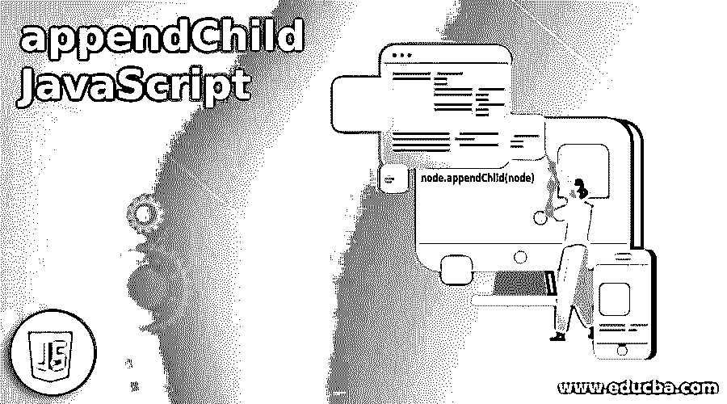
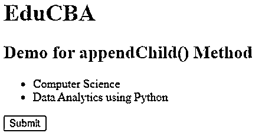
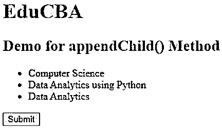
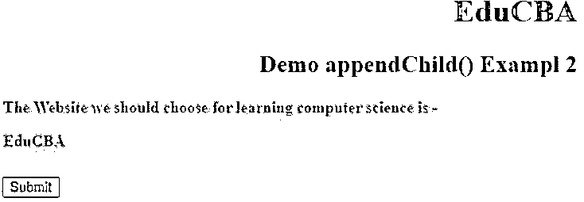
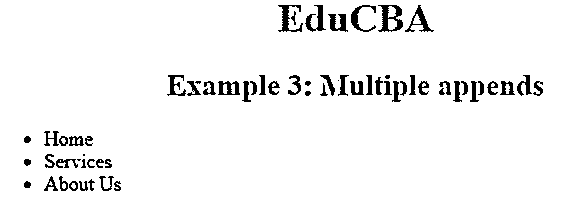

# appendChild JavaScript

> 原文：<https://www.educba.com/appendchild-javascript/>




## appendChild JavaScript 简介

appendChild JavaScript 是一种帮助在现有子节点的末尾添加节点的方法。它有助于创建一个位于最后一个子节点之后的文本节点。它还有助于将元素一个接一个地添加到对象中。这个函数创建一个文本节点，然后将它附加到现有的元素中。添加元素后，它会将整个元素追加到文档中。

### appendChild JavaScript 如何工作？

为了在 JavaScript 工作中使用 appendChild，我们必须首先了解语法。

<small>网页开发、编程语言、软件测试&其他</small>

此方法的语法如下:

```
node.appendChild(node)
```

这个方法只接受一个参数，而且是强制的。这将是要追加的对象或元素。该函数的返回值是子文档将被追加到现有文档中。它将返回带有附加子元素的元素。

```
let ap = document.createElement("ap");
document.body.appendChild(ap);
```

让我们看看这个函数是如何工作的。在上面的代码片段中，我们创建了一个元素“ap”。该元素在文档对象模型中不存在。因此，它将创建元素。现在我们将不得不把这个对象附加到某个元素上。因此，上面的第二个语句将子元素附加到主体上。正文之上的层次是文档。因此，我们遵循等级制度。首先是文档、元素，最后是要追加的对象。因此，上面代码片段中新创建的对象被追加到我们现有的文档中。

### appendChild JavaScript 示例

以下是 appendChild JavaScript 的示例:

#### 示例#1

**代码:**

```
<!DOCTYPE html>
<html>
<head>
<title>Demo for appendChild() Method</title>
<style>
h1,
h2 {
font-weight: italic;
color: blue;
}
body {
margin-left: 150px;
}
</style>
</head>
<body>
<h1>EduCBA</h1>
<h2>Demo for appendChild() Method</h2>
<ul id="edu">
<li>Computer Science</li>
<li>Data Analytics using Python</li>
</ul>
<button onclick="educba()">Submit</button>
<script>
function educba() {
var node = document.createElement("LI");
var textnew =
document.createTextNode("Data Analytics");
node.appendChild(textnew);
document.getElementById("edu").appendChild(node);
}
</script>
</body>
</html>
```

上面的 JavaScript 代码是 appendChild 函数的演示程序。我们已经定义了字体样式和颜色。脚本的主体已经填充了一些与计算机科学相关的主题。有一个节点，我们在那里创建一个元素。这是一个文本节点，我们将把它附加到现有的主题列表中。一旦我们点击提交按钮，这个新的孩子将被追加。用所需的文本创建文本节点。这就是“数据分析”。然后，我们使用 appendChild 函数，并将“textnew”作为参数发送给该函数。追加节点后，我们使用 ElementByID 将这个新创建的对象追加到文档中。我们将这个节点作为参数传递给这个 appendChild 函数。

**输出:**




在两个现有主题的末尾有一个提交按钮。当我们点击这个提交，它将追加我们已经添加的新主题。单击提交时，请查看下面的输出。




数据分析添加在两个现有主题之后。

#### 实施例 2

**代码:**

```
<!DOCTYPE html>
<html>
<head>
<title>Demo appendChild() Exampl 2</title>
<style>
#sudo {
border: 1px solid yellow;
background-color: yellow;
margin-bottom: 10px;
color: red;
font-weight: bold;
}
h1,
h2 {
text-align: right;
color: orange;
font-weight: bold;
}
</style>
</head>
<body>
<h1>EduCBA</h1>
<h2>Demo appendChild() Exampl 2</h2>
<div id="sudo">
The Website we should choose for learning computer science is -
</div>
<button onclick="edu()">Submit</button>
<script>
function edu() {
var node = document.createElement("P");
var t =
document.createTextNode("EduCBA");
node.appendChild(t);
document.getElementById("sudo").appendChild(node);
}
</script>
</body>
</html>
```

让我们看看这段代码中发生了什么。

在这个程序中，我们添加了一个节点。我们已经创建了 JavaScript，可以显示不同的字体。我们在这里创建了一个 sudo id，它帮助我们显示一个特定的节点。这是我们附加的模式。这里我们将节点附加到 sudo id。首先在函数中再次创建节点。我们通过使用 div 选项卡生成的 ID 来追加子元素。因此，在这里，我们使用 getElementById 将元素附加到文档中。

**输出:**


同样，如果您仔细观察，您会看到一个提交按钮。单击 Submit 后，将追加子注释，并触发 appendChild 函数。

这将按如下方式工作:




#### 实施例 3

**代码:**

```
<!DOCTYPE html>
<html>
<head>
<title>Demo for appendChild method Example 3</title>
<style>
#sudo {
border: 1px solid blue;
background-color: blue;
margin-bottom: 15px;
color: white;
font-weight: bold;
}
h1,
h2 {
text-align: center;
color: blue;
font-weight: bold;
}
</style>
</head>
<body>
<h1>EduCBA</h1>
<h2>Example 3: Multiple appends</h2>
<ul id="menu">
</ul>
<script>
function createMultipleAppend(name) {
let li = document.createElement('li');
li.textContent = name;
return li;
}
// get the ul#menu
const menu = document.querySelector('#menu');
// adding multiple items to the menu by using appendChild
menu.appendChild(createMultipleAppend('Home'));
menu.appendChild(createMultipleAppend('Services'));
menu.appendChild(createMultipleAppend('About Us'));
</script>
</body>
</html>
```

上面的程序是在同一个程序中使用多个追加的例子。我们使用了一个在网页上附加多个元素的脚本。我们使用了

**输出:**




如果您选中，我们会利用项目符号显示附加的数据。我们使用了多个附加项，并显示了数据。

### 结论

appendChild 函数帮助我们将 object 追加到当前元素中，然后该元素可以追加到现有的文档中。这有助于我们轻松地向现有元素和文档模型添加新对象。我们可以创建文本节点，并使用它们将它附加到文档中。它还可以用于将任何现有的子节点移动到文档中指定的新位置。

### 推荐文章

这是一个 appendChild JavaScript 的指南。这里我们讨论引言；appendChild JavaScript 如何工作？并附有示例。您也可以看看以下文章，了解更多信息–

1.  [JavaScript 延迟](https://www.educba.com/javascript-delay/)
2.  [JavaScript 浮动](https://www.educba.com/javascript-floating/)
3.  [JavaScript 倒计时](https://www.educba.com/javascript-countdown/)
4.  [JavaScript Minify](https://www.educba.com/javascript-minify/)


