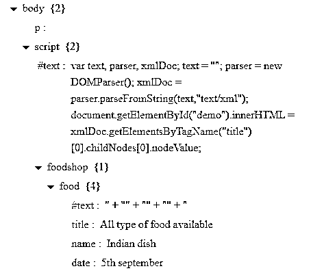
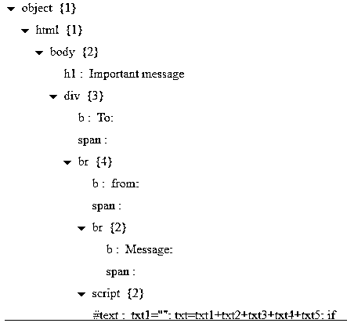
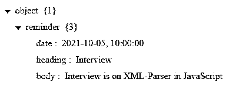

# JavaScript 中的 XML 解析

> 原文：<https://www.educba.com/xml-parsing-in-javascript/>


## JavaScript 中 XML 解析的定义

JavaScript 中的 XML 解析被定义为一种软件包或软件库，它为客户端应用程序提供与 XML 文档一起工作的接口，并在 JavaScript 中用于将 XML 文档转换为可读形式。现在，在许多浏览器中，已经有内置的 XML 解析器，它能够检查 XML 文档的格式并对其进行验证，我们可以说 XML 解析器的主要目的是将 XML 文档转换为人类可读的代码。

### JavaScript 中的 XML 解析是什么？

许多浏览器都有内置的 XML 解析器，可以将 XML 文档转换为人类可读的格式，我们也可以说 XML 解析器是一个软件包，它可以与 XML 文档进行交互，以检查文档的格式并通过客户端应用程序进行验证，因为操作来自 XML 文件的数据非常困难。XML 解析器工作在客户端应用程序和 XML 文档之间，它的工作是验证通过它的文档，它主要是为 XML 文档设计的，它有读取 XML 文档的程序。XML 解析可以在所有浏览器上读写，它有一个简单的 API。因为它有一个 DOM 解析器和 SAX 解析器，可以帮助解析文本、解析字符串以及解析文件。

<small>网页开发、编程语言、软件测试&其他</small>

很久以前，XML 解析器已经被添加到浏览器中，JavaScript 需要为其他语言添加新的解析器，以便为其他语言定义允许数据序列化的数据结构。

JavaScript 中有两种主要的解析器，

#### DOM(文档对象模型)分析器

DOM 解析器以 XML 文档对象的形式包含 XML 文档的所有信息，API 非常简单，用于执行读取和写入操作， 它是由 DOM 解析器实现的，它可以像树结构一样创建，当我们需要以随机方式访问文档时，它是有利的，但它的缺点是它比其他解析器慢，并且它消耗更多的内存，因为它需要将整个文档加载到内存中，因此它需要更多的内存。

#### SAX(XML 的简单 API)解析器

XML 的简单 API 用于实现 API，它是基于事件的，不创建任何内部结构。它的客户不知道哪个方法可以调用它，只知道覆盖方法并把他们自己的代码放在里面。这个 API 的优点是它有一个简单的 API，并且它的内存非常有效，它还可以处理非常快速的大型文档，但是它的缺点是它不太直观，因为它是基于事件的，并且它将数据分成片段，所以客户端不知道关于它的完整信息。

### 例子

JavaScript 中的 XML 解析:

#### 示例#1

**代码:**

```
<html>
<body>
<p id="demo"></p>
<script>
var text, parser, xmlDoc;
text = "<foodshop><food>" +
"<title>All type of food available</title>" +
"<name>Indian dish</name>" +
"<date>5th september</date>" +
"</food></foodshop>";
parser = new DOMParser();
xmlDoc = parser.parseFromString(text,"text/xml");
document.getElementById("demo").innerHTML =
xmlDoc.getElementsByTagName("title")[0].childNodes[0].nodeValue;
</script>
</body>
</html>
```

**输出:**




在上面的代码中，我们看到了一个将文本解析成 XML 文档对象并尝试用 JavaScript 从中提取信息的例子，我们举了一个有标题的食品店的例子，我们使用我们必须通过 XML 文档对象解析文本的方法，获取文本、解析器和 XML 文档，并输出上面给出的内容。

#### 实施例 2

**代码:**

```
<!DOCTYPE html>
<html>
<body>
<h1>Important message</h1>
<div>
<b>To:</b> <br>
<b>from:</b> <br>
<b>Message:</b> 
</div>
<script>
txt1="<note>";
txt2="<to>My Mother</to>";
txt3="<from>Selena</from>";
txt4="<body>Do not forget to meet on this weekend!</body>";
txt5="</note>";
txt=txt1+txt2+txt3+txt4+txt5;
if (window.DOMParser)
{
parser=new DOMParser();
xmlDoc=parser.parseFromString(txt,"text/xml");
}
else // Internet Explorer
{
xmlDoc=new ActiveXObject("Microsoft.XMLDOM");
xmlDoc.async=false;
xmlDoc.loadXML(txt);
}
document.getElementById("to").innerHTML=
xmlDoc.getElementsByTagName("to")[0].childNodes[0].nodeValue;
document.getElementById("from").innerHTML=
xmlDoc.getElementsByTagName("from")[0].childNodes[0].nodeValue;
document.getElementById("message").innerHTML=
xmlDoc.getElementsByTagName("body")[0].childNodes[0].nodeValue;
</script>
</body>
</html>
```

**输出:**




在本例中，我们使用 DOM 解析器提取了 XML 字符串，通过使用文本打印消息。它创建了一个树结构，以便我们编写的文本或字符串将显示在输出中，因为我们尝试为母亲显示消息，因此我们调用了解析器方法，上面给出了用于参考的输出。

**将字符串解析为 XML(编码):**

在本节中，我们将看到如何使用 JavaScript 解析 XML 字符串，在本例中，我们将获取一个包含 XML 的字符串，并尝试将其解析为 XML 文档的一个对象，这样该对象将允许轻松地读取和操作它。

让我们看一个 JavaScript 的例子，

```
var xmlString = '<reminder><date>2021-10-05, 10:00:00</date>
<heading>Interview</heading>
<body>Interview is on XML-Parser in JavaScript</body>
</reminder>';
var domParser = new DOMParser();
var xmlDocument = domParser.parseFromString(xmlString,"text/xml");
console.log(xmlDocument);
```

**输出:**




在上面的代码中，我们创建了一个基本的 XML 文件，在本例中，我们使用 XML 来构成一个提醒，并且我们创建了一个实例 DOMParser，通过使用我们尝试将 XML 字符串解析为 XML 文档的对象的方法，我们还通过将另一个参数 mimeType 转换为 text/XML 来完成此操作，因此我们通过新的 XML 文档实例到达浏览器控制台。

### 结论

在本文中我们已经看到了 JavaScript 中 XML 解析器的介绍与类型和功能，解析文本和字符串的说明，还描述了如何将字符串解析成 XML 文档对象的语法，本文将有助于理解 JavaScript 中 XML 解析器的概念。

### 推荐文章

这是一个用 JavaScript 解析 XML 的指南。这里我们讨论定义，什么是 JavaScript 中的 XML 解析？分别是。您也可以看看以下文章，了解更多信息–

1.  [JavaScript 图像滑块](https://www.educba.com/javascript-image-slider/)
2.  [JavaScript 计算器](https://www.educba.com/javascript-calculator/)
3.  [JavaScript 下划线](https://www.educba.com/javascript-underscore/)
4.  [Sprintf JavaScript](https://www.educba.com/sprintf-javascript/)


