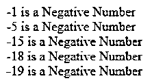
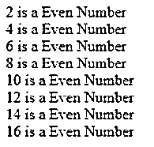
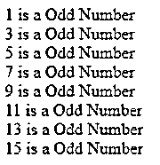

# JavaScript 过滤器列表

> 原文：<https://www.educba.com/javascript-filter-list/>


## JavaScript 过滤器列表简介

JavaScript 中的过滤器列表意味着根据传递给过滤器的条件过滤列表项。当从基于名称、价格、日期、特殊字符等的数组中获取数据时，过滤器数组起着至关重要的作用。开发人员可以创建他们自己的自定义过滤器。列表中的过滤器应用在管道符号(|)后，后跟表达式，如下所示。

**Note:** array and list both are the same in JavaScript.

**优势**

<small>网页开发、编程语言、软件测试&其他</small>

*   通过丢弃不必要的数据来填充准确的数据。
*   易于在 Angular JS 中应用。
*   由如此多的预定义过滤器提供。

### 什么是 JavaScript 过滤器列表？

**实时场景:**当我们从亚马逊网站上购买一件商品时，我们首先搜索的是一件商品。它用不同的价格、品牌、报价、尺寸等填充数以千计的产品。但是因为我们是客户，我们不想要所有这些产品，所以我们简单地对结果集应用了一个过滤器。这种应用需求过滤器列表起着至关重要的作用。

**语法**

```
var outList= list.filter(function());
```

filer 函数可以应用于数组或列表，在 filer 中，我们可以为任何布尔运算调用另一个函数。

*   **list:** 它是应用 filer()方法的实际列表。
*   **function():** 检查 filter()列表中任意条件的函数。
*   **返回值:**filter()的结果给出一组值/带有列表的值。

**注意:**在 JavaScript 中，列表和数组的处理是一样的，因为它们在 JavaScript 中都是自动动态的。JavaScript 文件可以用。或者我们可以通过使用<脚本>标签**包含在 html 文件中。**

### JavaScript 过滤器列表示例

下面提到了不同的例子:

#### 示例 1–检查闰年的列表文件管理器

**代码:**

```
<!DOCTYPE html>
<html>
<body>
<script>
function getLeapYears(year) { //line1
return (((year % 4 == 0) && (year % 100 != 0)) ||
(year % 400 == 0));//line2
}
function myFunction() { //line3
var leapYears = [2010,2017,1400,1600,1800,1700,2000].filter(getLeapYears); //line4
for (var j = 0; j < leapYears.length; j++){//line5
document.write(leapYears[j]+" is a Leap Year <br>"); //line6
}
}
myFunction(); //line7
</script>
</body>
</html>
```

**输出:**


**说明:**

*   第 1 行用于 getLeapYears()函数实现。
*   第 2 行是闰年逻辑。
*   第 3 行 filer()列表的主函数。
*   Line4 Filter()用于过滤列表元素，无论它们是否是闰年。
*   第 5 行列出了分别获取每个元素的迭代。
*   第 6 行显示闰年。

#### 示例 2–用于检查负数的列表过滤器

**代码:**

```
<!DOCTYPE html>
<html>
<body>
<script>
function getNegativeNumbers(number) { //line1
return number<0 //line2
}
function getMyFunction() { //line3
var negativeNumbers = [10,20,30,-1,-5,-15,16,-18,-19].filter(getNegativeNumbers); //line4
for (var j = 0; j < negativeNumbers.length; j++){//line5
document.write(negativeNumbers[j]+" is a Negative Number <br>"); //line6
}
}
getMyFunction(); //line7
</script>
</body>
</html>
```

**输出:**




**说明:**

*   第 1 行是 getNegativeNumbers()函数实现。
*   第 2 行是负数逻辑。
*   第 3 行 filer()列表的主函数。
*   Line4 Filter()用于过滤列表元素，无论它们是否为负数。
*   第 5 行列出了分别获取每个元素的迭代。
*   第 6 行显示负数。

#### 示例# 3-**检查偶数的列表文件**

**代码:**

```
<!DOCTYPE html>
<html>
<body>
<script>
function evenNumbers(number) { //line1
return number%2==0 //line2
}
function mainFunction() { //line3
var evenNumberList = [1,2,3,4,5,6,7,8,9,10,11,12,13,14,15,16].filter(evenNumbers); //line4
for (var j = 0; j < evenNumberList.length; j++){//line5
document.write(evenNumberList[j]+" is a Even Number <br>"); //line6
}
}
mainFunction(); //line7
</script>
</body>
</html>
```

**输出:**




**说明:**

*   第 1 行是 evenNumbers()函数的实现。
*   第 2 行用于偶数逻辑。
*   第 3 行 filer()列表的主函数。
*   Line4 Filter()用于过滤列表元素，无论它们是否为偶数。
*   第 5 行列出了分别获取每个元素的迭代。
*   第 6 行显示偶数。

#### 示例 4–检查奇数的列表文件

**JavaScript 代码:**

```
<!DOCTYPE html>
<html>
<body>
<script>
function getOddNumbers(number) { //line1
return number%2==1 //line2
}
function functionMain() { //line3
var oddNumberList = [1,2,3,4,5,6,7,8,9,10,11,12,13,14,15,16].filter(getOddNumbers); //line4
for (var j = 0; j < oddNumberList.length; j++){//line5
document.write(oddNumberList[j]+" is a Odd Number <br>"); //line6
}
}
functionMain(); //line7
</script>
</body>
</html>
```

**输出:**




**说明:**

*   第 1 行是 getOddNumbers()函数的实现。
*   第 2 行用于奇数逻辑。
*   第 3 行 filer()列表的主函数。
*   Line4 Filter()用于过滤列表元素，无论它们是否为奇数。
*   第 5 行列出了分别获取每个元素的迭代。
*   第 6 行显示奇数。

#### 示例 5–用于检查重复字符串的列表过滤器

**代码:**

```
<!DOCTYPE html>
<html>
<body>
<script>
function getDuplicateNames(string) { //line1
return string=="Paramesh" //line2
}
function showFun() { //line3
var duplicateNamesList = ["Paramesh","Srikanth","Paramesh","Subbu","Srikanth","Paramesh"].filter(getDuplicateNames); //line4
for (var j = 0; j < duplicateNamesList.length; j++){//line5
document.write(duplicateNamesList[j]+" is duplicate name <br>"); //line6
}
}
showFun(); //line7
</script>
</body>
</html>
```

**输出:**


**说明:**

*   第 1 行是 getDuplicateString()函数的实现。
*   第 2 行用于重复字符串名称逻辑。
*   第 3 行 filer()列表的主函数。
*   Line4 Filter()用于过滤列表元素，无论它们是否是重名。
*   第 5 行列出了分别获取每个元素的迭代。
*   第 6 行显示重复的名称。

### 结论

过滤器列表就像一个数组列表过滤器。我们可以根据函数中的条件过滤列表。filter()方法用于过滤列表元素。

### 推荐文章

这是一个 JavaScript 过滤器列表指南。这里我们讨论 JavaScript 过滤器列表的例子以及优点和语法。您也可以看看以下文章，了解更多信息–

1.  [JavaScript 声明数组](https://www.educba.com/javascript-declare-array/)
2.  [JavaScript 风格可见性](https://www.educba.com/javascript-style-visibility/)
3.  [JavaScript 字符串编号](https://www.educba.com/javascript-string-to-number/)
4.  [JavaScript 数组串联](https://www.educba.com/javascript-array-concat/)


