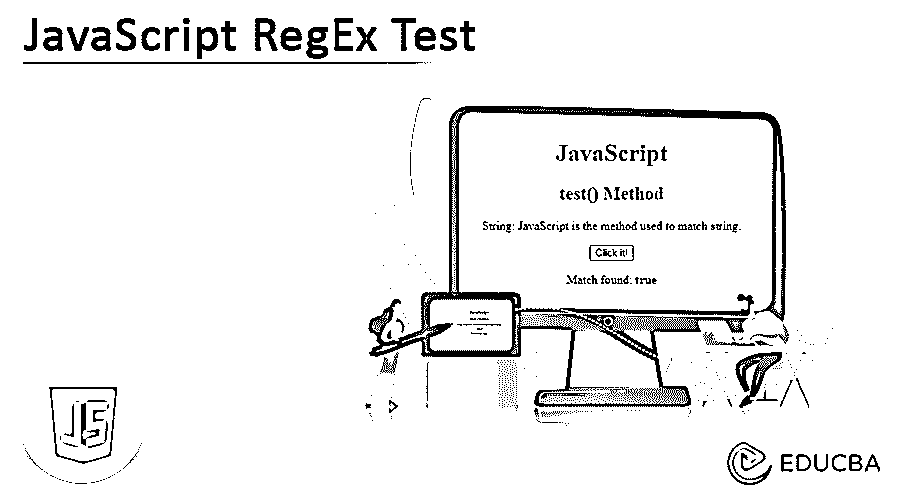
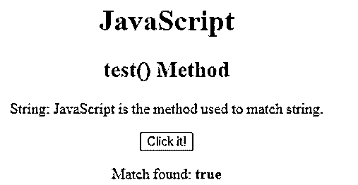
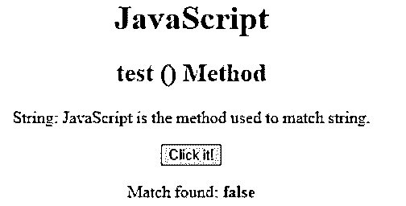

# JavaScript 正则表达式测试

> 原文：<https://www.educba.com/javascript-regex-test/>




## JavaScript 正则表达式测试简介

JavaScript RegEx 测试方法是一种返回包含所有相等组的数组的方法，在该数组中，它可以接收我们需要测试的字符串，而不是正则表达式。并且可以利用它在实际字符串和正则表达式中间寻找等价的字符串，如果找到相等的，正则表达式可以以 true 的形式返回结果，如果没有找到相等的，则以 false 的形式返回结果。RegEx 代表正则表达式，它对于查找文本字符串非常重要，尤其是在过滤文本文件时。

### 关键要点

*   它可以执行搜索操作来查找正则表达式和给定字符串之间的等价项，该等价项可以给出 true 或 false 输出。
*   每当我们希望知道字符串中是否建立了模式时，就使用 test()方法。
*   它以布尔形式给出输出。

### 什么是 JavaScript RegEx 测试？

JavaScript 的 test()方法执行搜索以找到正则表达式和定义的字符串之间的相等值。如果发现相等，则返回“真”，如果不相等，则返回“假”。string 是我们需要作为字符串传递的参数，用于搜索相等的字符串，它的返回类型是 true 或 false 形式的布尔值。regex.test()方法已经被用来对字符串进行等值，该方法可以返回 true 或 false。正则表达式被描述为执行重要的模式匹配，它可以在 next 上搜索和替换函数。

<small>网页开发、编程语言、软件测试&其他</small>

### 如何使用 JavaScript RegEx 测试？

让我们看看这个例子来理解如何使用 RegEx 测试方法:

**例 1:**

```
console.log ("Equal String: ",/map/i.test('Informative')):
```

**例 2:**

```
console.log ("Case Sensitive: ",/MAP/.test(' Informative')):
```

**例 3:**

```
console.log ("Non-equal String: ",/ive2/.test(' Informative'));
```

在上面的三个例子中，我们已经用了测试方法来找出是否有相等的。测试之后，它将在输出中返回布尔值。

我们的结论是“/map/i”是一个正则表达式，“map”是一个可以在搜索中使用的模式，“I”是授权搜索区分大小写的修饰符。

*   在例 1 中,“映射”存在于字符串“信息”中，因此它将返回“真”。
*   在例 2 中，MAP 是存在的，但是我们没有为区分大小写而附加“I”修饰符，因此它将返回“false”。
*   在例 3 中，“ive2”在给定的“informational”字符串中不存在，因此测试将返回“false”。

### JavaScript RegEx test()方法

JavaScript 中的 RegEx test()方法被用来检查字符串以获得相等的字符串。如果这个方法找到了一个相等的值，那么它将返回一个“真”,否则它将返回一个“假”,在 JavaScript 中，搜索测试的正则表达式可以用各种方法来执行，并使用模式作为正则表达式进行搜索

*   **text . match(pattern)–**将是字符串方法 match()
*   **text . search(pattern)–**将是字符串方法搜索()
*   **pattern . exec(text)–**将是 RegExp 方法 exec()
*   **pattern . test(text)–**将是正则表达式方法测试()

### JavaScript RegEx test()语法

下面给出了提到的语法:

```
RegExpObject.test(string)
```

在哪里，

*   **RegExObject:** 是可以使用正则表达式的类。
*   **String 和 RegEx:** 都可以描述利用正则表达式对字符串进行有意义搜索的方法，但 String 是必填字段。

### JavaScript RegEx 测试参数

RegEx 是正则表达式，我们可以在其中定义字符串数据的模式。它授权我们检查一个字符串，如模式的地址或密码，这样我们就可以了解模式是否被描述为能够生成可操作的信息。

正则表达式的 test()方法可以在正则表达式和给定的字符串之间选择一个等号，因此如果找到给定的等号字符串，它将返回真结果，如果没有找到，它将给出假结果，它主要有两个参数，如 string 和正则表达式。

*   **RegEx:** 是正则表达式的名称。
*   **String:** 这是一个可以使用的字符串，与作为必填字段的正则表达式相反。

### JavaScript 正则表达式测试示例

下面是提到的例子:

#### 示例#1

此示例在实际字符串中查找字符串“the”。

**代码:**

```
<!DOCTYPE html>
<html>
<head>
<title>
JavaScript RegExp test() Method
</title>
</head>
<body style="text-align:center">
<h1 style="color:green">
JavaScript
</h1>
<h2>test() Method</h2>
<p>
String: JavaScript is the
method used to match string.
</p>
<button onclick="jmethod()">
Click it!
</button>
<p id="app"></p>
<script>
function jmethod() {
var str="JavaScript is the method used"
+ " to match string.";
var regex = new RegExp("the", );
var rex = regex.test(str);
document.getElementById("app").innerHTML
= " Match " + " found: " + "<b>"
+ rex + "</b>";
}
</script>
</body>
</html>
```

**输出:**




#### 实施例 2

让我们看一个在实际字符串中查看字符串“Method”的例子。

**代码:**

```
<html>
<head>
<title>
JavaScript RegExp test () Method
</title>
</head>
<body style= "text-align:center">
<h1 style= "color:green">
JavaScript
</h1>
<h2>test () Method</h2>
<p>
String: JavaScript is the
method used to match string.
</p>
<button onclick = "jmethod()">
Click it!
</button>
<p id="app"></p>
<script>
function jmethod() {
var str="JavaScript is the method used"
+ " to match string.";
var regex = new RegExp("Method", );
var rex = regex.test(str);
document.getElementById("app").innerHTML
= " Match " + " found: " + "<b>"
+ rex + "</b>";
}
</script>
</body>
</html>
```

**输出:**




### 结论

在本文中，我们得出结论，RegEx test()是可以用来在实际字符串中搜索字符串的方法，我们还讨论了如何使用 RegEx test，什么是 RegEx test()方法，JavaScript RegEX test()方法的语法、参数和示例。

### 推荐文章

这是一个 JavaScript 正则表达式测试指南。这里我们讨论一下入门，如何使用 JavaScript RegEx 测试？方法、示例和常见问题。您也可以看看以下文章，了解更多信息–

1.  [reCAPTCHA Javascript](https://www.educba.com/recaptcha-javascript/)
2.  [WebGL JavaScript](https://www.educba.com/webgl-javascript/)
3.  [JavaScript 数据类型](https://www.educba.com/javascript-data-types/)
4.  [JavaScript 项目示例](https://www.educba.com/javascript-projects-examples/)


