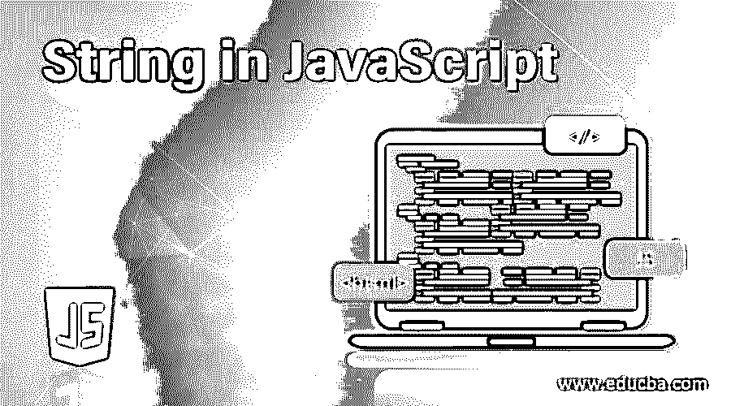
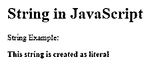
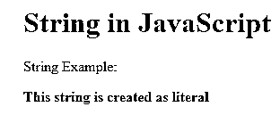

# JavaScript 中的字符串

> 原文：<https://www.educba.com/string-in-javascript/>




## JavaScript 中的字符串介绍

JavaScript 中的字符串是一个由零个或多个字符组成的对象。字符串或者用单引号括起来，或者用双引号括起来，分别作为( ' )和( " )，例如，“some string”或“some string”都是可以接受的，并且是相同的。该字符串可以包含字符、数字、符号甚至特殊字符，如' \b '、' \n '、' \t '、' \r '、' \ '等。字符串的一些示例有“hello”、“hello world”、“123”、“hello”+“world”、“hello\nworld”等。在 javaScript 中，可以用两种方式创建字符串，一种是作为字符串对象(使用 new 关键字)，另一种是字符串文字。

**JavaScript 中的字符串作为字符串对象(使用 new 关键字)–**

<small>网页开发、编程语言、软件测试&其他</small>

字符串可以定义或存储为 String 类的对象，String 对象是使用 new 关键字创建的。其语法如下所示

```
var str = new String( "some string" );
```

如上所述，new 关键字用于创建一个字符串对象。

### JavaScript 中的字符串示例

让我们通过一个使用 new 关键字在 JavaScript 中创建字符串的例子来理解。

#### 示例#1

**代码:**

```
<!DOCTYPE html>
<html>
<head>
<meta charset= "utf-8" >
<title> This is an example for String in JavaScript </title>
</head>
<body>
<h1>String in JavaScript </h1>
<p> String Example: </p>
<b id="s1"></b><br>
<script>
var strobj = new String("This string is created as object");
document.getElementById("s1").innerHTML = strobj;
</script>
</body>
</html>
```

**输出:**




**JavaScript 中作为字符串文字的字符串—**

可以将字符串定义或存储为字符串文字，而不使用 new 关键字。其语法如下所示

```
var str = "some string" ;
```

让我们通过一个在 JavaScript 中创建字符串作为字符串文字的例子来理解。

#### 实施例 2

**代码:**

```
<!DOCTYPE html>
<html>
<head>
<meta charset= "utf-8" >
<title> This is an example for String in JavaScript </title>
</head>
<body>
<h1>String in JavaScript </h1>
<p> String Example: </p>
<b id="s1"></b><br>
<script>
var str ="This string is created as literal";
document.getElementById("s1").innerHTML = str;
</script>
</body>
</html>
```

**输出:**




**在 JavaScript 中定义字符串—**

JavaScript 语言是一种无类型语言，这意味着在 JavaScript 变量中不需要声明任何数据类型，变量可以存储任何数据类型的值。在 javaScript 中声明变量，我们需要使用 var 关键字。var 关键字仅用于声明变量，无论它是字符串还是数字数据类型。

让我们看看如何在 JavaScript 中声明字符串:

```
var name = "John";
var city = "Bangalore";
```

#### 实施例 3

**代码:**

```
<!DOCTYPE html>
<html>
<head>
<meta charset= "utf-8" >
<title> This is an example for String in JavaScript </title>
</head>
<body>
<script>
var name = "John";
var city = "Bangalore";
document.write( name );
document.write( " " );
document.write( city );
</script>
</body>
</html>
```

**输出:**


**在 JavaScript 中初始化字符串—**

正如我们在上面已经讨论过的，它可以作为一个对象或一个文字来创建或初始化。所以可能的初始化方式有:

```
var str1 = new String( "some string" );
var str2 = new String( 'some string' );
var str3 = ' some string ';
var str4 = " some string ";
```

注意 str1 == str2 是假的，单引号和双引号都不是问题，它是假的是因为 new string()返回了一个 String 原语，但是 String 对象和我们知道的两个对象不能相等。而 str3 == str4 为真。

让我们通过一个基于不同初始化方式的字符串比较的例子来理解。

#### 实施例 4

**代码:**

```
<!DOCTYPE html>
<html>
<head>
<meta charset= "utf-8" >
<title> This is an example for String in JavaScript </title>
</head>
<body>
<p> String comparison based on the different way of initialize :</p>
<script>
var str1 = new String( "some string" );
var str2 = new String( 'some string' );
var str3 = 'some string';
var str4 = "some string";
if (str1==str2) {
document.write("str1==str2 is True" );
}
else
{
document.write("str1==str2 is False" );
}
if (str3==str4) {
document.write( "<br> str3==str4 is True" );
}
else
{
document.write("<br> str3==str4 is False" );
}
</script>
</body>
</html>
```

**输出:**


### 规章制度

*   当我们在 JavaScript 中声明和初始化字符串时，我们总是用单引号( ' )或双引号( " )将字符串括起来。它告诉浏览器它正在处理一个字符串。
*   另一个要遵循的规则是，如果我们以单引号开始，以双引号结束，而 JavaScript 不理解它的意思，就不要混淆引号。
*   下一个规则是，如果字符串中有单引号或双引号，并且包含的字符串也使用了相同的引号，那么 JavaScript 会在字符串结束时处理，并且不理解接下来会出现什么，并给出错误消息。所以浏览器把引号当作一个字符，我们需要对单引号进行转义，而不是在字符串结束时处理。通过在单引号前加一个反斜杠\来转义单引号

**举例:**

```
var str = 'Hello, \'Mr. John\'.';
```

或者

```
var str = "Hello, \"Mr. John\".";
```

或者

```
var str = 'Hello, "Mr. John".';
```

或者

```
var str = "Hello, 'Mr. John'.";
```

我们可以在 JavaScript 给定的字符串上使用一些内置函数。

*   concat()
*   匹配()
*   搜索()
*   替换()
*   substr()
*   toString()
*   toLowerCase()
*   toUpperCase()
*   拆分()
*   修剪()

### 结论

它是表示字符串值的重要对象或文字之一。该字符串是零个或多个字符的序列。字符串要么用单引号括起来，要么用双引号括起来。字符串可以通过两种方式初始化，一种是作为字符串的对象，另一种是作为字符串文字。

### 推荐文章

这是 JavaScript 中的字符串指南。这里我们讨论 JavaScript 中字符串的介绍、规则和不同的例子。您也可以看看以下文章，了解更多信息–

1.  [JavaScript 中的 parse float](https://www.educba.com/parsefloat-in-javascript/)
2.  [JavaScript 中的算术](https://www.educba.com/arithmetic-operators-in-javascript/)
3.  [JavaScript 中的表单](https://www.educba.com/forms-in-javascript/)
4.  [JavaScript 日期解析](https://www.educba.com/javascript-date-parse/)


