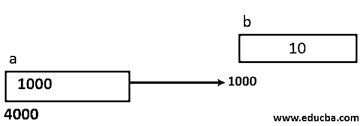
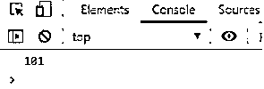
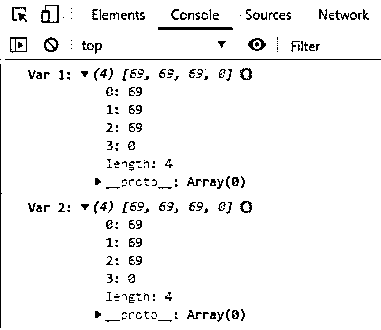
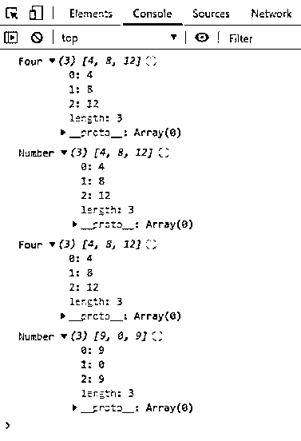

# JavaScript 中的指针

> 原文：<https://www.educba.com/pointers-in-javascript/>


## JavaScript 中的指针简介

以下文章概述了 JavaScript 中的指针。在 JavaScript 中，无论我们考虑数组、函数等等，大多数东西都是对象，因此它被认为是一种面向对象的语言。唯一不是对象的元素是原始数据类型。原始数据类型是不可变的，对象是可变的元素。

### 什么是指针？

指针是一个变量，通过它我们可以访问另一个变量的值。

<small>网页开发、编程语言、软件测试&其他</small>

下图描述了指针在 C 编程语言中是如何工作的。




#### JavaScript 中的引用

*   需要注意的一点是，指针通常用于实现引用调用。
*   但是我们知道 JavaScript 不支持通过引用传递参数。
*   如何在 JavaScript 中实现引用调用特性？
*   这个问题的解决方案是将变量转换成 objector 对象文本。

### JavaScript 中的指针示例

下面是一些例子:

#### 示例#1

创建对象文本。

**代码:**

```
<!DOCTYPE html>
<html>
<body>
<script>
var objREf = {num: 100};
function pointer(obj){
obj.num++;
}
pointer(objREf);
console.log(objREf.num);
</script>
</body>
</html>
```

**输出:**




**说明:**

*   在上面的例子中，objRef 是对一个对象的引用。
*   当 objRef 被传递给函数指针时，该引用被复制到 obj。这样，obj 和 objRef 在内存中指的是同一个东西。
*   更改 obj 的 num 属性会影响 objRef 的 num 属性。

#### 实施例 2

**代码:**

```
<!DOCTYPE html>
<html>
<body>
<h2>Refernces in JavaScript</h2>
<p id="references"></p>
<script>
var sport = {outdoor:"Basketball", indoor:"Carrom"};
document.getElementById("references").innerHTML = sport;
</script>
</body>
</html>
```

**输出:**


**说明:**

当我们更改下面的行时，可以看到上面的输出:

```
from:document.getElementById("references").innerHTML = sport;
```

```
to: document.getElementById("references").innerHTML = sport.outdoor;
```

即我们访问 sportobject 值。

同样，当我们给一个变量赋值时，如下所示:

```
var object=new Object()
```

new Object()是一个对象，变量 Object 是一个指针或者引用(JavaScript 世界里更合适的术语)。所以，从现在开始在这个博客中，我们将称之为“指针”，参考。

#### 实施例 3

创建对象。

**代码:**

```
<!DOCTYPE html>
<html>
<body>
<p id="objDemo"></p>
<script>
var speaker = new Object();
speaker.fullName = "Mike Lewis";
speaker.topic = " How to handle Success & Failures in Life";
document.getElementById("objDemo").innerHTML =
speaker.fullName + " will be speaking on -  " + "<strong>"+speaker.topic+"</strong>";
</script>
</body>
</html>
```

**输出:**


**说明:**

*   JavaScript 中任何不是原始值的东西都自动成为对象。原始值是布尔值、数字、字符串、空值和未定义值之一。如果您试图访问原语上的属性，则原语会隐式提升为对象，如下面的示例 2 所示。此外，正则表达式文字创建一个正则表达式对象。就像对象文字和数组文字一样。
*   在编码过程中，当我们使用 as 赋值操作符" = "和一个原始数据类型变量时，它会创建一个原始变量的副本，而对象会创建引用，因此当我们在新创建的引用中更改一个值时，它会反映在原始对象变量中。
*   当我们对对象使用“=”操作符时，它会创建原始对象的别名，而不会创建新的对象。这就是“通过引用”的意思。

#### 实施例 4

共享价值。

**代码:**

```
<!DOCTYPE html>
<html>
<body>
<script>
var cat = [69,69,69];
//assign-by-reference
var copycat = cat;
cat.push(0);
console.log("Var 1:", cat);
console.log("Var 2:", copycat);
</script>
</body>
</html>
```

**输出:**




**说明:**

*   在上面的例子中，我们声明了指向相同值的数组变量，即共享值。
*   当其中一个变量被修改时，另一个变量将具有修改后的值。

#### 实施例 5

推荐人的重新分配。

**代码:**

```
<!DOCTYPE html>
<html>
<body>
<script>
var four = [4,8,12];
//assign-by-reference
var number = four;
console.log("Four",four);
console.log("Number",number);
//value is reassigned (create new reference)
number = [9,0,9];
console.log("Four",four);
console.log("Number",number);
</script>
</body>
lt;/html>
```

**输出:**




**说明:**

*   在上面的例子中，数组变量被重新分配，即创建了一个新的引用。

### 结论

总之，JavaScript 基本类型总是通过值传递，而对象内部的值是通过引用传递的。理解 JavaScript 中的引用很重要，这可以帮助开发人员避免常见错误并编写更好的执行脚本。要记住的一点是，JavaScript 中的引用只指向包含的值，而不指向其他变量或引用。

### 推荐文章

这是 JavaScript 中的指针指南。这里我们讨论介绍，JavaScript 中的引用和例子。您也可以看看以下文章，了解更多信息–

1.  [JavaScript 中的排序算法](https://www.educba.com/sorting-algorithms-in-javascript/)
2.  [数据结构中的指针](https://www.educba.com/pointers-in-data-structure/)
3.  [Python 中的指针](https://www.educba.com/pointers-in-python/)
4.  [空 C 中的指针](https://www.educba.com/void-pointer-in-c/)


