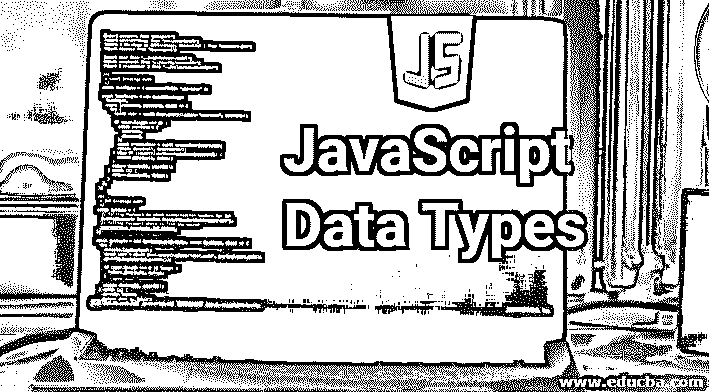

# JavaScript 数据类型

> 原文：<https://www.educba.com/javascript-data-types/>




## JavaScript 数据类型概述

在使用计算机时，我们发现存在许多数据类型。比如数字、字符串、布尔型等等。但是这些数据在编程语言中有什么作用呢？当然，任何编程语言都有预定义的数据类型。例如，JavaScript 也有自己的一套数据类型。

### JavaScript 是什么？

JavaScript 是一种客户端脚本语言。Java 和 JavaScript 是两种不同的编程语言；他们不相似。在学习 JavaScript 之前，我们建议您先学习 HTML 和 CSS，因为这些是学习 web 开发技术的基础。JavaScript 运行在浏览器的客户端。JavaScript 被设计成在浏览器上运行。JavaScript 在前端 web 开发中是最重要的，它让我们的 web 页面变得动态。

<small>网页开发、编程语言、软件测试&其他</small>

### 动态网页是什么意思？

HTML 是一种结构化语言。它本质上是静态的。你在 HTML 上描绘的一切在 web 浏览器上都显示相同的输出。需要让一些事件在客户端发生。比如，如果用户点击一个需要发生某些事情的按钮，就要对表单进行验证，以便通过网络发送正确的数据。JavaScript 用于使网页更具交互性。有可能使网页更加用户友好和易于使用。通过进行表单验证和一些事件，我们间接地减少了服务器的负载，这有助于服务器更快地响应请求。

### 在 JavaScript 中声明变量

在 JavaScript 中，我们如下声明一个变量:

```
var a =10;
```

仔细看看上面的代码。如果你来自其他编程语言，比如 Java，你会发现我们没有提到我们声明的变量类型。而且值一旦赋给变量，就不能更改。

在 Java 中，您可以在声明变量时执行以下操作。

```
int a = 10;
```

//不能将值重新分配给同一个变量

```
int a = 20; // this is not allowed in strictly typed languages.
```

在声明一个变量时，我们告诉编译器这个变量的类型是 integer，但是在 JavaScript 中，情况是不同的。JavaScript 是一种动态类型语言。这意味着先写关键字 var，然后写变量名。之后，JavaScript 引擎在内部将变量值更改为正确的数据类型。

此外，在 JavaScript 中，我们可以将值重新赋给变量，即使我们之前将 t=value 赋给了同一个变量。

JavaScript 的这些特性使得理解起来有些混乱。但如果你仔细看，这是非常容易的。

### Javascript 中的数据类型

javascript 中存在两种数据类型。一个是原语，另一个是用户定义的。

JavaScript 中共有以下五种数据类型:

#### 1.数字

数字是 JavaScript 中的基本数据类型。在 JavaScript for numbers 中，只有一种数据类型。与其他语言不同，JavaScript 没有浮点、十进制或双精度之类的概念。
**Ex。**

```
var n = 10;
var m = 10.20;
```

以上两个变量都是数字，即使变量 m 有小数点。

这两个变量都只能用数字来表示。

#### 2.线

字符串是 JavaScript 中的基本数据类型。字符串只不过是字符的集合。或者一些话。看下面这个例子。

```
var str1 = "Hello World";
```

var str1 的值为“Hello world”

您可以将字符串值写在单引号或双引号中。

例如:

```
var str2 = "Hello World";
```

和

```
var str3 = 'Hello world';
```

两者是一样的。

有时，javascript 不理解嵌套的引号。那一次我们使用转义字符来处理它。

让我们看看下面的例子。这表明我们可以在双引号中使用单引号，反之亦然。

```
var str1 = "it's an ice cream parlor";
```

我们需要小心使用引号。

#### 3.布尔代数学体系的

Boolean 是 JavaScript 中的基本数据类型。布尔有两个值，真和假。在 JavaScript 中，当有我们想要应用的条件时，我们使用布尔值。这在用 JavaScript 验证时检查条件时非常有用。
例如:

```
var isvalide = false;
```

例如:

```
var x = 10;
var y = 10;
x  == y //this will give true.
```

当我们检查条件是真还是假时，布尔是有用的。

#### 4.不明确的

Undefined 是 JavaScript 中的原始数据类型。javascript 中没有值的任何变量。这意味着它已被声明，但没有被赋予任何值，该变量的缺省值在 JavaScript 中没有定义。一种没有给变量赋值的变量。

例如:

```
var a;
```

如果我们保存它并在浏览器控制台中打开它，我们将得到未定义的值。

在控制台中编写以下代码。

```
Console.log(typeof a);
```

这将给出未定义的输出。

#### 5.空

Null 也是 JavaScript 中的一种原始数据类型。如果我们想要一个特定的值故意为空，我们可以给它赋 Null 值。例如，我们可以说当某个条件是我们想在运行时从用户那里获取价值时；那么我们可以使用空数据类型。

例如:

```
var a = null;
```

### JavaScript 的非原始数据类型

对象，数组是非原始数据类型。最后，符号是 ECMAScript 中引入的新数据类型。

#### 目标

对象是 JavaScript 所关心的数据类型。

我们可以用对象字面语法定义对象。一个对象包含一对键值对。看下面这个例子。

```
var person = {
first_name: "abc",
last_name: "xyz",
age:25
}
```

一个对象包含多个值。

#### 数组

数组是在单个变量中存储多个值的容器。

```
Var book =["abc,"" xyz"," pqr"];
```

在 JavaScript 中数组被称为对象。因此，举例来说，如果我们在浏览器控制台中键入以下代码，我们可以获得一个数组类型作为对象。

```
Console.log(typeof book);
```

### **结论**

理解 JavaScript 数据类型非常重要。JavaScript 是一种松散类型的语言。JavaScript 智能引擎以适当的类型为变量赋值。所以在学习 JavaScript 的同时，要了解数据类型。

### 推荐文章

这是 JavaScript 数据类型的指南。这里我们已经讨论了 JavaScript 数据类型的概述和数据类型的概念。您也可以阅读以下文章，了解更多信息——

1.  [JavaScript 封装](https://www.educba.com/encapsulation-in-javascript/)
2.  [JavaScript 中的变量](https://www.educba.com/variables-in-javascript/)
3.  [TypeScript vs JavaScript](https://www.educba.com/typescript-vs-javascript/)
4.  [JavaScript 编译器](https://www.educba.com/javascript-compilers/)


