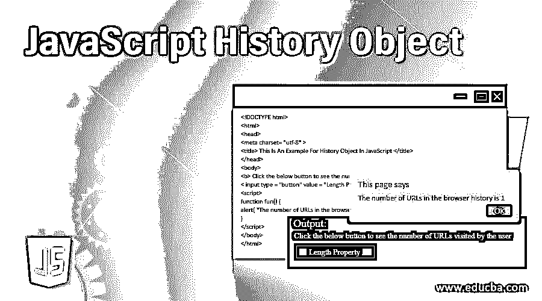

# JavaScript 历史对象

> 原文：<https://www.educba.com/javascript-history-object/>




## JavaScript 历史对象简介

javascript 历史对象包含浏览器的历史。浏览器历史包含用户最近访问过的网页或 URL 的数组。该历史对象可用于转到特定页面或 URL、前一个 URL 或前一个 URL。历史对象可以作为 window.history 在窗口属性上使用，但是如果窗口从它单独移除，历史对象也可以很好地工作。

### 句法

javascript 中历史对象的语法是:

<small>网页开发、编程语言、软件测试&其他</small>

1.  历史
2.  窗口.历史

#### 财产

**length:**length 属性给出了用户最近访问过的历史 URL 的长度。

#### 方法

*   **go():** go()方法在浏览器中加载指定的页码。此方法使用 as go(距离),相当于单击前进或后退按钮到指定页面。
*   **back():** back()方法加载上一页，相当于在浏览器中点击后退按钮。
*   **forward():** forward()方法加载下一页，相当于在浏览器中点击前进按钮。

### 实现 JavaScript 历史对象的示例

下面是提到的例子:

#### 示例#1

接下来，我们编写 html 代码，以便更清楚地理解 history.back()方法的工作原理。下面的示例中，history.back()方法使用 button 元素从历史 URL 加载上一页:

**代码:**

```
<!DOCTYPE html>
<html>
<head>
<meta charset= "utf-8" >
<title> This Is An Example For History Object In JavaScript </title>
</head>
<body>
<b> Click the below button to see the number of URLs visited by the user. </b> </br>
<input type = "button" value = "Length Property" onclick = "fun()">
<script>
function fun() {
alert( "The number of URLs in the browser history is " +window.history.length );
}
</script>
</body>
</html>
```

**输出:**


**输出:**一旦我们点击长度属性按钮，输出是


#### 实施例 2

接下来，我们编写 html 代码，通过下面的例子更清楚地理解 history.back()方法的工作原理，history.back()方法用于从历史 URL 加载上一页。这里我们将创建两个 html 页面 html 和 html，html 将包含 html 的链接，html 将包含调用历史对象 back()方法的代码。所以一旦 back 方法调用了它，就转到之前的 URL，即 h1.html，如下面的代码所示

**代码:**

```
<!-- h1.html -->
<!DOCTYPE html>
<html>
<head>
<meta charset= "utf-8" >
<title> This Is An Example For History Object In JavaScript </title>
</head>
<body>
<b> This Is First Page. </b> </br>
<a href="file:///C:/Users/csc/Desktop/h1.html"> Go to next page </a>
</body>
</html>
<!-- h2.html -->
<!DOCTYPE html>
<html>
<head>
<meta charset= "utf-8" >
<title> This Is Second Page</title>
</head>
<body>
<b> Click the below button to go back prevous page or URLs visited by the user. </b> </br>
<input type = "button" value = "Back Method" onclick = "fun()" >
<script>
function fun() {
window.history.back();
}
</script>
</body>
</html>
```

**输出:**


**输出:**一旦我们点击上面的链接，输出是


**输出:**一旦我们点击上面的后退方法按钮，输出是


#### 实施例 3

接下来，我们编写 html 代码来理解 history.go()的工作原理，history.go()方法用于从历史 URL 加载特定页面(向前或向后)。如果我们将大于 0 的值传递给 go()方法，那么它将加载向前的页面，例如 go(2)向前移动两步，如果我们将小于 0 的值传递给 go()方法，那么它将加载向后的页面，例如 go(-1)向后移动一步。在这里，我们将再次创建两个 html 页面 html 和 html，其中 html 将包含 html 的链接，html 将包含调用历史对象 go(-1)方法的代码，该方法仅后退一步。

**代码:**

```
<!-- h1.html -->
<!DOCTYPE html>
<html>
<head>
<meta charset= "utf-8" >
<title> This Is An Example For History Object In JavaScript </title>
</head>
<body>
<b> This Is First Page. </b> </br>
<a href="file:///C:/Users/csc/Desktop/h2.html"> Go to next page </a>
</body>
</html>
<!-- h2.html -->
<!DOCTYPE html>
<html>
<head>
<meta charset= "utf-8" >
<title> This Is Second Page </title>
</head>
<body>
<b> Click the below button to go back prevous page visited by the user by using go method. </b> </br>
<input type = "button" value = "Go Method" onclick = "fun()" >
<script>
function fun() {
window.history.go(-1);
}
</script>
</body>
</html>
```

**输出:**


**输出:**一旦我们点击上面的链接，输出是


**输出:**一旦我们点击上面的后退方法按钮，输出是


#### 实施例 4

接下来，我们重写上面的 html 代码，看看 history.forward()方法的工作原理。用于从历史 URL 加载转发页面的 history.forward()方法。这里又有两个 html 页面 html 和 html，其中 html 包含 html 和历史对象 forward()方法的链接，html 包含同上。

**代码:**

```
<!-- h1.html -->
<!DOCTYPE html>
<html>
<head>
<meta charset= "utf-8" >
<title> This Is An Example For History Object In JavaScript </title>
</head>
<body>
<b> This Is First Page. </b> </br>
<a href="file:///C:/Users/csc/Desktop/h2.html"> Go to next page </a></br></br>
<input name="action" type="submit" onclick="history.forward()"  value="Forward Method"/>
</body>
</html>
<!-- h2.html -->
<!DOCTYPE html>
<html>
<head>
<meta charset= "utf-8" >
<title> This Is Second Page </title>
</head>
<body>
<b> Click the below button to go back prevous page visited by the user by using go method. </b> </br>
<input type = "button" value = "Go Method" onclick = "fun()">
<script>
function fun() {
window.history.go(-1);
}
</script>
</body>
</html>
```

**输出:**


**输出:**一旦我们点击上面的链接，输出是


**输出:**一旦我们点击上面的后退方法按钮，输出就是


**输出:**一旦我们点击上面的 Forward Method 按钮，输出是


### 结论

browsers history 对象包含用户访问过的所有网页或 URL 的历史。该历史对象可用于使用三种方法(分别为 go()、back()和 forward())转到已访问 URL 中的特定页面或 URL、前一个 URL 或前一个 URL。

### 推荐文章

这是一个 JavaScript 历史对象的指南。这里我们讨论 JavaScript 历史对象的介绍以及相应的例子。您也可以浏览我们的其他相关文章，了解更多信息——

1.  [JavaScript 光标](https://www.educba.com/javascript-cursor/)
2.  [JavaScript 中的关联数组](https://www.educba.com/associative-array-in-javascript/)
3.  [JavaScript 文件阅读器](https://www.educba.com/javascript-filereader/)
4.  JavaScript 中的[对象](https://www.educba.com/object-in-javascript/)


