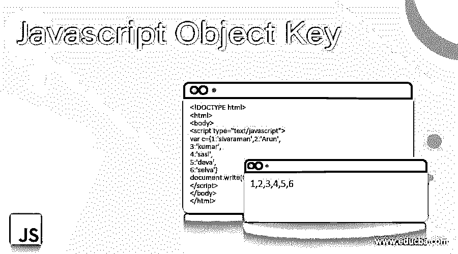

# Javascript 对象键

> 原文：<https://www.educba.com/javascript-object-key/>




## Javascript 对象键的定义

我们已经知道可以使用新的关键字 Object.create()创建对象；我们可以使用构造函数初始化和创建对象。Javascript 是一种灵活的面向对象的语言；它是一种无类语言，方法/函数以相同的方式使用，因此它可以模拟脚本代码中的类。keys()是一个默认方法，它使用自己的可枚举数据类型属性名(使用 for loop 等循环迭代)返回指定对象的数组。，排列顺序相同。让我们看看 object.key()方法在脚本中的各种用法。

**语法:**

<small>网页开发、编程语言、软件测试&其他</small>

javascript 是 HTML 代码中使用它的默认语法，同时我们可以用。js 扩展。

```
<html>
<head>
<script>
var variable name={};
document.write(Object.keys(variablename);
---some logics----
</script>
</head>
<body>
</body>
</html>
```

上面提到的代码是我们在 javascript 中使用 Object.keys()函数的基本语法。通过使用这种方法，我们将很容易地检索这些值。

### Javascript Object Key 是如何工作的？

在 javascript 中，我们可以创建并声明 n 个键，同时我们可以使用 Object.values()方法检索值。如果我们已经向服务器发送了 n 个请求，并在脚本代码中发送了请求的数据，我们就可以编写创建对象的逻辑，返回值将采用数组格式。将使用该特定请求来接收响应；我们可以接收 JSON 格式响应；在这种格式中，数据被安排在键值对中。如果 n 个请求和响应数据以某种其他格式(如字符串转换)返回，则该方法是 stringified()方法，其函数也用于更改字符串处理方法的行为，值是一个字符串数组，计算出的对象数作为对象值的属性包含在 JSON 字符串中。

如果假设服务器响应为空值或不提供任何值作为响应，这可能是一些其他格式，则对象的属性也包含在 JSON 格式中，并接收可以拆分为空格的服务器数据，它也用于字符串和数字。如果 JSON 和返回的字符串格式意味着用户可以轻松阅读和理解数据，则插入并接收空白中的实例。Object.keys()方法将传递参数，或者实参将是 object(obj)，它将返回键的数组。

我们将使用 obj.keys()中唯一没有使用的 Object.keys()，因为它很灵活，而且我们都知道 Object 是所有面向对象编程概念的基础(oops ),所以我们可以声明和使用 object，它有自己的数据实现，称为 data.values()方法，我们还可以在它上面调用 Object.values()。我们使用了 Object。*函数使用 all real 类型的数组对象返回，而不只是像 iterable 接口。该对象将被使用，并且缺少许多方法，这些方法将存在于所有的数组中，如映射、过滤等。如果我们必须使用 Object.entries()来获取一个键/值对数组，请使用 obj 作为参数实参。javascript 对象关键字是字符串格式；即使我们将对象作为键传递，它也将被调用 toString()方法，并且键将被用对象格式字符串化。

javascript object.keys()方法直接与可枚举属性相对应，它直接在对象中找到，我们可以在循环部分中手动对对象进行排序。要使用循环部分手动应用对象的属性，我们将遵循脚本中对象键的排序。主要使用 for 循环，我们可以迭代脚本中的键，并行地，它可以使用 Object.values()方法映射特定键的值。假设我们可以传递一个空对象，它也返回一个空数组；否则，我们可以传递任何空参数，这些空参数也等同于类似于任何空值(键)的未定义值格式；这些情况会引发错误。

### Javascript 对象键的示例

以下是 Javascript 对象键的不同示例:

#### 示例#1

**代码:**

```
<!DOCTYPE html>
<html>
<body>
<h2>Welcome To My Domain</h2>
<p id=*"demo"*></p>
<script>
var user = {
name : "Sivaraman",
age : "31",
city:"chennai",
email:"ramansiva57@gmail.com",
mobile:"8220244056",
}
var r= Object.keys(user).map(function(i) {
return [user[i],+i];
});
document.write(r);
</script>
</body>
</html>
```

**输出:**


#### 实施例 2

**代码:**

```
<!DOCTYPE html>
<html>
<body>
<script type=*"text/javascript"*>
var c={1:'sivaraman',2:'Arun',
3:'kumar',
4:'sasi',
5:'deva',
6:'selva'}
document.write(Object.keys(c));
</script>
</body>
</html>
```

**输出:**


#### 实施例 3

**代码:**

```
<!DOCTYPE html>
<html>
<body>
<script type=*"text/javascript"*>
function first(obj)
{
var k = second(obj);
var l = k.length;
var p = Array(l);
for (var i = 0; i < l; i++)
{
p[i] = [k[i], obj[k[i]]];
}
return p;
}
function second(obj)
{
if (!third(obj)) return [];
if (Object.keys) return Object.keys(obj);
var k1 = [];
for (var k2 in obj) if (_.has(obj, k2)) k1.push(k2);
return k1;
}
function third(obj)
{
var t = typeof obj;
return t === 'function' || t === 'object' && !!obj;
}
var color={Blue: "#0000FF", Yellow: "#FFFF00", Pink: "#FFC0CB"};
document.write(Object.keys(color))
</script>
</body>
</html>
```

**输出:**


在上面的三个示例中，我们在不同的场景中使用了 Object.keys()方法，第一个示例将输出显示为键。尽管如此，它还是会使用+I increment 来增加键的数量；如果假设我将来要增加键，它会自动添加新的键第二个也是最后一个例子我们使用了 Object.keys()的基本功能，它将只返回键。尽管如此，它不会自动增加密钥；我们将在脚本中手动添加键的数量。

### 结论

Javascript 这些默认方法将返回具有不同场景的对象数组，并且它将随着称为 Map 的概念而变化，因为 Map 是有序的和可重复的，它将使用任何数据，而对象是不有序的和不可重复的，仅使用数字、字符串和特殊符号。

### 推荐文章

这是一个 Javascript 对象键的指南。这里我们讨论 Javascript 中 Object Key 的工作原理，以及不同的例子和代码实现。您也可以看看以下文章，了解更多信息–

1.  [JavaScript object.is()](https://www.educba.com/javascript-object-is/)
2.  [JavaScript 绝对值](https://www.educba.com/javascript-absolute-value/)
3.  [JavaScript 转换成 JSON](https://www.educba.com/javascript-convert-to-json/)
4.  [JavaScript 倒计时](https://www.educba.com/javascript-countdown/)


