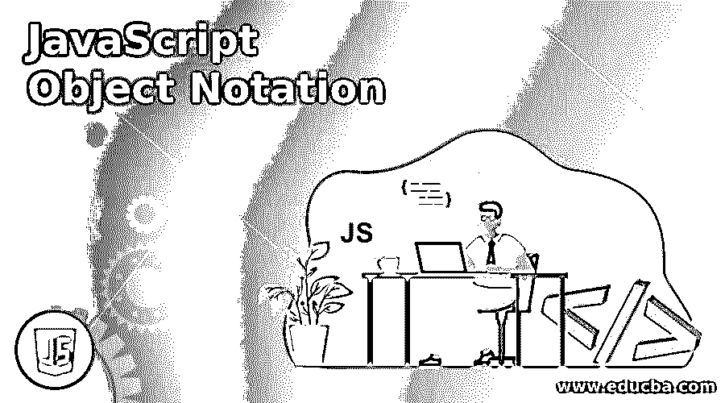

# JavaScript 对象符号

> 原文：<https://www.educba.com/javascript-object-notation/>




## JavaScript 对象符号简介

JavaScript Object Notation 也称为 JSON，JSON 是 JavaScript Object Notation 的缩写形式，是一种共享数据的格式。JSON 源自一种非常著名的语言，即 JavaScript，但也可以用于 Python、Ruby、Java 和 PHP。由于 JSON 用于数据交换，这可能发生在基于不同地理位置的两个计算机应用程序之间。JSON 是一种人类可读的格式，所以应用程序可以很容易地解析数据。JSON 可以包含文本、花括号、方括号、逗号、双引号、冒号和其他一些字符。

JSON 构建在如下两种结构之上:

<small>网页开发、编程语言、软件测试&其他</small>

*   键/值对的集合。它也可以是对象、结构、记录、字典、键列表、数组或哈希表。
*   值的有序列表，它可以是数组、序列或向量。

当您开始使用 JSON 时，JSON 对象用。json 文件，但有时也可以是 JSON 对象或字符串。

**语法:**

JSON 是一个键值对结构。

```
{
"var1" : "value1",
" var2" : "value2",
" var3" : "value3",
" var4_boolean" :value4,
"var5_number" :value5
}
```

JSON 中使用的大部分数据最终被 JSON 对象封装。JSON 键在左边，JSON 值在右边。键需要用双引号括起来，而值可以是 6 种数据类型，如字符串、布尔值、数字、数组和对象以及 NULL。JSON 值可以是 JSON 的复杂数据对象。JSON 对象与 JavaScript 对象不同。

### JavaScript 对象符号的示例

下面是提到的例子:

#### 示例#1

JSON 对象。

**代码:**

```
 "employee": {
"empID":           3088,
"empName":         "Saideep",
"empLocation":     "Canada"
}
}
```

#### 实施例 2

**代码:**

```
 "employees": [
{
"empID":           3088,
"empName":         "Amar",
"empLocation":     "USA"
},
{
"empID":           2089,
"empName":         "User",
"empLocation":     "Canada"
},
{
"empID":           3090,
"empName":         "User2",
"empLocation":     "Canada"
}
]
}
```

我们有像 stringify()、parse()这样的 JSON 方法，还有更多的。

*   **Stringify():**JavaScript 对象到 JSON 字符串的转换。
*   **Parse():**JSON 字符串到 JavaScript 对象的转换。

#### 实施例 3

**代码:**

```
<!DOCTYPE html>
<html>
<body>
<h2>Conversion of JavaScript object into a JSON string.</h2>
<script>
var sample = { empname: "Janu", empage: 31, empcity: "Quebec" };
var JSON = JSON.stringify(sample);
document.write(JSON);
</script>
</body>
</html>
```

**输出:**


#### 实施例 4

**代码:**

```
<!DOCTYPE html>
<html>
<body>
<h2>Converting string written in JSON format to JavaScript object.</h2>
<p id="demo"></p>
<script>
var sample = '{"empname":"Karthick", "empage":39, "empcity":"New York"}';
var parse = JSON.parse(sample);
document.getElementById("demo").innerHTML = parse.empname;
</script>
</body>
</html>
```

**输出:**


JSON 值中的复杂类型是嵌套对象和嵌套数组，这些嵌套数组和对象将作为分配给键的值传递，这些值由键值对组成。

JavaScript 在数组类型的两端使用方括号。数组是有序的集合，可以包含不同的值类型。

**例如:**

**代码:**

```
{
"empName" : "Sammy",
"fatherName" : "Shark",
"location" : "location1",
"weblinks" : [
{
"description" : "work",
"URL" : "https://www.digitalocean.in/"
},
{
"description" : "tutorials",
"URL" : "https://www.tutorials.com/community/tutorials"
}
],
"social_media" : [
{
"description" : "snap",
"link" : "https://snap.com/digitalocean"
},
{
"description" : "facebook",
"link" : "https://www.facebook.com/"
},
{
"description" : "github",
"link" : "https://github.com/digital"
}
]
}
```

### JavaScript 对象符号的用法

下面给出的是 JavaScript 对象符号的用法:

*   因为 JSON 用于从一个应用程序到另一个应用程序的数据传输，所以它也可以在计算机、数据库、程序等等之间传输数据。
*   也用于通过网络传输序列化或反序列化的数据。
*   可以与软件中的主要编程语言一起使用。
*   用于从 web 应用程序到服务器的数据传输。
*   像 REST、SOAP 这样的 Web 服务使用 JSON 来传输数据。

### JavaScript 对象符号的属性

下面给出了这些属性:

*   这是一个轻量级的数据交换格式文本工具。
*   的确如此。json 扩展，并已从 JavaScript 语言扩展而来。
*   用户易于读/写，客户易于理解。
*   它独立于其他编程语言

### 创建 JSON 时要遵循的规则

下面给出了创建 JSON 时要遵循的规则:

*   应以花括号“{ 0 }”开始和结束。
*   关键字段包含在双引号内。
*   值字段用键后的“:”冒号表示。
*   键值对使用'，'逗号分隔。
*   值可以是任何数据类型，可以是字符串、布尔值、数字、对象等。

JSON 很重要，因为它可以用来异步加载数据，即无需渲染。允许克服来自跨域的问题，一个方法 JSONP 一个回调函数将 bac JSON 发送回域。

### 结论

因为 JSON 是最流行的数据转换格式之一，用于数据转换。它是轻量级的，使用户能够轻松地存储、共享和处理数据。JSON 有时被称为 JavaScript 的子类，可以使用任何编程语言读取和修改。我们还有在线的 JSON 格式化工具，比如 JSONLint，它是一个 JSON 验证器，用来验证 JSON 字符串是否有效。另外，JSON 格式化程序将 JSON 字符串格式化为可读格式。

### 推荐文章

这是 JavaScript 对象符号的指南。这里我们讨论 JavaScript 对象符号的介绍，包括例子、用法、属性和规则。您也可以看看以下文章，了解更多信息–

1.  [C#创建 JSON 对象](https://www.educba.com/c-sharp-create-json-object/)
2.  [JSON 是什么？](https://www.educba.com/what-is-json/)
3.  [JavaScript getelement byid()](https://www.educba.com/javascript-getelementbyid/)
4.  [Java 中的 JSON](https://www.educba.com/json-in-java/)


