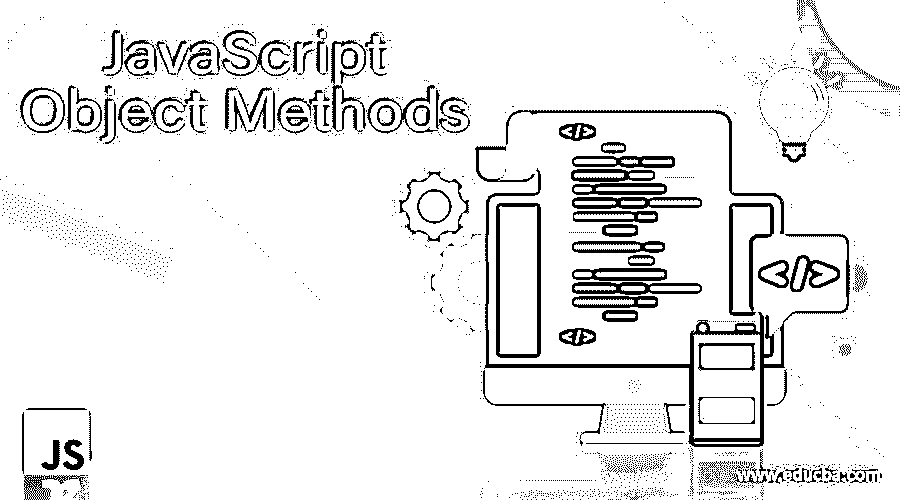
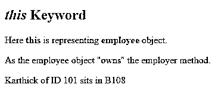
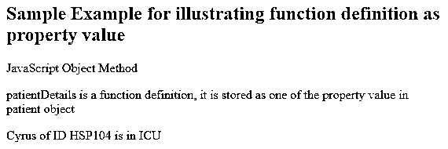

# JavaScript 对象方法

> 原文：<https://www.educba.com/javascript-object-methods/>




## JavaScript 对象方法简介

今天，我们将讨论“JavaScript 对象方法”。因此，让我们首先将文章名称分成 3 个部分，即 JavaScript、对象和方法。分别弄清楚每个单词会让我们对需要讨论的主题有一个清晰的概念。因此，JavaScript 是一种编程或脚本语言，允许在网页上实现复杂的要求，并被设计为简单的基于对象的，其中对象是键值对中的属性的集合；方法是可以在对象上执行的操作。因此 JavaScript 对象方法是 JavaScript 中可以使用函数访问的方法。在这里，JavaScript 中的函数存储为值。这里的对象可以在不使用()括号的情况下调用。

### 句法

下面是提到的语法:

<small>网页开发、编程语言、软件测试&其他</small>

```
objectName.methodName()
```

在方法中，“this”关键字用于引用所有者对象。

*   **objectName:** 这是指为调用其方法而创建的对象的名称。
*   **methodName:** 这是指为特定对象创建的方法名的名称，可以使用 objectName 调用该方法名。

一个函数可以分成不同的属性，然后可以组合并返回这些属性。

让我们考虑一个具有如下一些属性的对象的例子:

雇员是一个函数，它由以下属性组成

*   员工姓名
*   员工 ID
*   员工能力
*   员工部门

这个函数将方法/函数作为对象属性返回

在我们开始解释 JavaScript 对象方法之前，让我们先来看看在这里起主要作用的“this”关键字。

“this”关键字在 JavaScript 中广泛使用，但在 JavaScript 中仍然是一个令人困惑的关键字。这个关键字将指向一个特定的对象。这是由函数的调用方式决定的。让我们考虑上面的雇员例子，看看如何使用“this”关键字访问对象属性。

### JavaScript 对象方法的示例

下面提到了不同的例子:

#### 示例#1

“this”关键字的图示

**代码:**

```
<!DOCTYPE html>
<html>
<body>
<h2><i>this</i> Keyword</h2>
<p>Here <b>this</b> is representing <b>employee</b> object.</p>
<p>As the employee object "owns" the employer method.</p>
<p id="demo"></p>
<script>
var employee = {
employeeName: "Karthick",
employeeId : "101",
employeeCubicle     : "B108",
employeeDivision     : "BCMS",
employer : function() {
return this.employeeName + " of ID " + this.employeeId + " sits in " + this.employeeCubicle;
}
};
document.getElementById("demo").innerHTML = employee.employer();
</script>
</body>
</html>
```

**输出:**




在上面的例子中，“this”是一个 employee 对象，它有一个 employee 函数()。换句话说，this.employeeName 意味着该对象的 employeeName 属性。

#### 实施例 2

**代码:**

```
<!DOCTYPE html>
<html>
<body>
<h2>Sample Example for illustrating function definition as property value</h2>
<p>JavaScript Object Method</p>
<p>patientDetails is a function definition, it is stored as one of the property value in patient object</p>
<p id="demo"></p>
<script>
var patient = {
patientName: "Cyrus",
patientId : "HSP104",
patientSection     : "ICU",
patientDetails : function() {
return this.patientName
+ " of ID " + this.patientId + " is in " + this.patientSection;
}
};
document.getElementById("demo").innerHTML = patient.patientDetails();
</script>
</body>
</html>
```

**输出:**




#### 实施例 3

**代码:**

```
<!DOCTYPE html>
<html>
<head>
</head>
<body>
<h2>JavaScript Object Method</h2>
<p>
childDetails is a function definition stored as a property value.
</p>
<p>
Storing property values and retrieving without using brackets ()
</p>
<p id="demo"></p>
<script>
var children = {
childName: "Rohit",
childAge : "6 months",
childWeight : "1.5KG",
childDetails : function() {
return this.childName + " of " + this.childAge
+ " weighs only " + this.childWeight + " ";
}
};
document.getElementById("demo").innerHTML
= children.childDetails;
</script>
</body>
</html>
```

**输出:**


#### 实施例 4

**代码:**

```
<!DOCTYPE html>
<html>
<head>
</head>
<body>
<h3>JavaScript Object Method</h3>
<p>
patientDetail is a function definition, stored as a property value, accessing with additional details
</p>
<p id="demo"></p>
<script>
var patient = {
patientName: "Cyrus",
patientId : "HSP104",
patientSection     : "ICU",
patientDetails : function() {
return this.patientName
+ " of ID " + this.patientId + " is in " + this.patientSection;
}
};
document.getElementById("demo").innerHTML
= "PATIENT " + patient.patientDetails();
</script>
</body>
</html>
```

**输出:**


我们还有一些其他的对象方法，所以让我们深入研究一下，

*   create(): 它有额外的功能来选择一个新的对象原型。

```
let Obj = Object.create(obj);
```

*   **keys():** 创建一个对象的键数组。

#### 实施例 5

**代码:**

```
<!DOCTYPE html>
<html>
<head>
</head>
<body>
<h3>JavaScript Object.keys() Method</h3>
<script>
const employer = {
boss: 'ABC',
PA: 'XYZ',
salesMan: 'DEF',
consultant: 'GHI'
};
const keys = Object.keys(employer);
document.write(keys);
</script>
</body>
</html>
```

**输出:**


*   **values():** 创建一个包含对象值的数组

#### 实施例 6

**代码:**

```
<!DOCTYPE html>
<html>
<head>
</head>
<body>
<h3>JavaScript Object.values() Method</h3>
<script>
const employer = {
boss: 'ABC',
PA: 'XYZ',
salesMan: 'DEF',
consultant: 'GHI'
};
const values = Object.values(employer);
document.write(values);
</script>
</body>
</html>
```

**输出:**


*   **entries():** 给出了一个嵌套的键:值对数组。

#### 实施例 7

**代码:**

```
<!DOCTYPE html>
<html>
<head>
</head>
<body>
<h3>JavaScript Object.values() Method</h3>
<script>
const employer = {
boss: 'ABC',
PA: 'XYZ',
salesMan: 'DEF',
consultant: 'GHI'
};
const entries = Object.entries(employer);
entries.forEach(entry => {
let key = entry[0];
let value = entry[1];
document.write(`${key}: ${value}` + ", ");
});
</script>
</body>
</html>
```

**输出:**


*   **freeze():** 该方法防止修改对象的值和属性，并防止从对象中添加或删除
*   **seal():** 这个方法防止新的属性被添加到对象中，但是会修改现有的属性。

### 结论

这样，我们就可以结束文章“JavaScript 对象方法”了。举例说明了一些例子，并介绍了 JavaScript 对象方法，如。冻结()，。seal()，。keys()，。values()，。条目()，。创建()。研究了“this”关键字的重要性，这是 JavaScript 检索对象属性的主要因素之一。JavaScript 对象有有用的方法来修改、遍历自身和保护；我们已经给出了一个遍历对象的键/值对的清晰例子。

### 推荐文章

这是 JavaScript 对象方法的指南。这里我们讨论 JavaScript 对象方法的例子以及代码和输出。您也可以看看以下文章，了解更多信息–

1.  [JavaScript 动画](https://www.educba.com/javascript-animation/)
2.  [JavaScript elseIf](https://www.educba.com/javascript-elseif/)
3.  [JavaScript 随机](https://www.educba.com/javascript-random/)
4.  [JavaScript clearTimeout()](https://www.educba.com/javascript-cleartimeout/)


