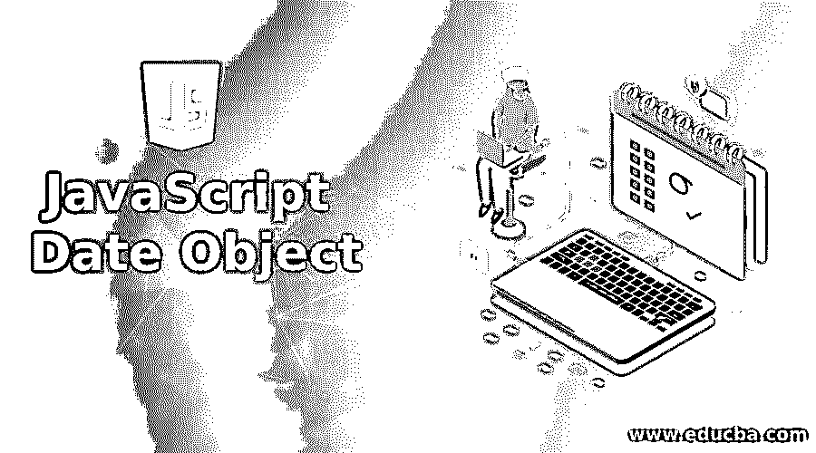
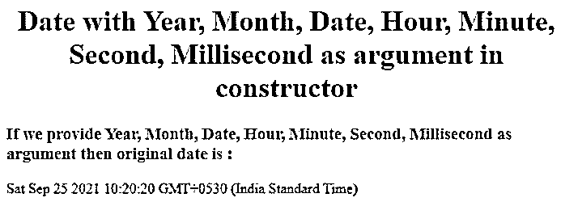

# JavaScript 日期对象

> 原文：<https://www.educba.com/javascript-date-object/>




## JavaScript 日期对象简介

JavaScript 中的日期对象是预定义的数据类型。这个 Date 对象用于获取日期和时间。我们可以使用 new 关键字(newDate())创建日期对象。Date 对象用于 1970 年 1 月 1 日之前或之后 1 亿天范围内的日期和时间，精度为毫秒。通过使用不同的方法，我们可以以 UTC 或 GMT 时间格式获取和设置年、月、日、小时、分钟、秒或毫秒。我们可以用四种方式声明日期对象。

### JavaScript 中的日期对象是如何工作的？

用 JavaScript 创建日期对象。

<small>网页开发、编程语言、软件测试&其他</small>

*   新日期():给出当前日期和时间。
*   **新日期(yyyy，MMM，dd，hh，MM，ss，ms):** 分别给出年(yyyy)，月(MMM)，日(dd)，小时(hh)，分钟(mm)，秒(ss)，毫秒(ms)的日期。
*   **新日期(毫秒):**它给出以毫秒为单位的日期。
*   **新日期(" Date as String"):** 它给出的日期是字符串。

#### JavaScript 日期对象的语法

下面是下面的语法:

**语法 1:**

```
<script>
Date date = new Date();
<script>
```

**语法 2:**

```
<script>
Date dateYMLDHM = new Date(yyyy,MMM,dd,hh,mm,ss,ms);
<script>
```

**语法 3:**

```
<script>
Date dateMSecs = new Date(ms);
<script>
```

**语法 4:**

```
<script>
Date dateString = new Date("Date as String");
<script>
```

### JavaScript 日期对象的示例

下面是一些例子:

#### 示例#1

无参数构造函数的默认日期。

**代码:**

```
<!DOCTYPE html>
<html>
<body>
<font color="brown">
<h1 align="center">Default  Date without any Arguments</h1><!--line1-->
</font>
<script>
function getDefaultDate() {//called function //line2
var date = new Date();//line3
document.write("<h3 style='color:blue'>If we did not provide any argument then Default date is :</h3>"+date);//lin34
}
getDefaultDate();//calling function //line5
</script>
</body>
</html>
```

**输出:**


**说明:**

*   第 1 行定义了默认日期示例的标题。
*   第 2 行是 getDefaultDate()调用的函数，用于创建默认日期。
*   第 3 行是通过使用 new 关键字创建无参数构造函数的默认日期。
*   第 3 行是默认日期，以 IST 格式提供当前日期和时区。
*   第 4 行是 document.write()函数，用于在浏览器中显示用户输出。
*   第 5 行调用 getDefaultDate()的函数。

#### 实施例 2

以毫秒为参数的日期。

**代码:**

```
<!DOCTYPE html>
<html>
<body>
<font color="red">
<h1 align="center">Date with MilliSeocnds as argument in constructor</h1><!--line1-->
</font>
<script>
function getMilliSecondsDate() {//called function //line2
vardateMilliseconds = new Date(10000);//line3
document.write("<h3 style='color:green'>If we provide milliseconds as argument then original date is :</h3>"+dateMilliseconds);//lin34
}
getMilliSecondsDate();//calling function //line5
</script>
</body>
</html>
```

**输出:**


**说明:**

*   第 1 行定义了毫秒日期示例的标题。
*   第 2 行是 getMilliSecondsDate()调用函数，用于创建毫秒日期。
*   第 3 行使用 new 关键字创建以毫秒为参数构造函数的毫秒日期。
*   第 3 行日期以 IST 格式提供 1970 年 1 月 1 日之后的日期和时区，单位为 1 万毫秒。
*   第 4 行是 document.write()函数，用于在浏览器中显示用户输出。
*   第 5 行调用 getMilliSecondsDate()的函数。

#### 实施例 3

以字符串作为参数的日期。

**代码:**

```
<!DOCTYPE html>
<html>
<body>
<font color="blue">
<h1 align="center">Date with MilliSeocnds as argument in constructor</h1><!--line1-->
</font>
<script>
function getDateString() {//called function //line2
vardateString=new Date("December 28 1993 12:12:12");//line3
document.write("<h3 style='color:red'>If we provide string as argument then original date is :</h3>"+dateString);//line4
}
getDateString();//calling function //line5
</script>
</body>
</html>
```

**输出:**


**说明:**

*   第 1 行定义了字符串 date 示例的标题。
*   第 2 行是 getDateString()，调用函数创建字符串日期。
*   第 3 行使用 new 关键字创建以字符串作为参数构造函数的毫秒日期。
*   第 3 行 date 用给定的字符串值以 IST 格式提供日期和时区。
*   第 4 行是 document.write()函数，用于在浏览器中显示用户输出。
*   第 5 行调用 getDateString()的函数。

#### 实施例 4

以年、月、日、小时、分钟、秒、毫秒为参数的日期。

**代码:**

```
<!DOCTYPE html>
<html>
<body>
<font color="maroon">
<h1 align="center">Date with Year, Month, Date, Hour, Minute, Second, Millisecond as argument in constructor</h1><!--line1-->
</font>
<script>
function getTotalDate() {//called function //line2
vardateYMDHSMs=new Date(2020, 20, 25, 10, 20, 20, 20);//line3
document.write("<h3 style='color:navy'>If we provide Year, Month, Date, Hour, Minute, Second, Millisecond as argument then original date is :</h3>"+dateYMDHSMs);//line4
}
getTotalDate();//calling function //line5
</script>
</body>
</html>
```

**输出:**




**说明:**

*   第 1 行定义了年、月、日、小时、分钟、秒、毫秒日期示例的标题。
*   第 2 行是 getTotalDate()调用的函数，用于创建年、月、日、小时、分钟、秒、毫秒日期。
*   第 3 行使用 new 关键字创建日期，以年、月、日、小时、分钟、秒、毫秒作为参数构造函数。
*   第 3 行日期以 IST 格式提供日期和时区，给出年、月、日、时、分、秒、毫秒值。
*   第 4 行是 document.write()函数，用于在浏览器中显示用户输出。
*   第 5 行调用 getTotalDate()的函数。

#### 实施例 5

字符串日期解析。

**代码:**

```
<!DOCTYPE html>
<html>
<body>
<font color="orange">
<h1 align="center">Date parsing with Time (Hours and Minutes Seconds)</h1>
</font>
<script>
function getParseStringDate() {
varstrDate="March 25, 2020 10:10:10 AM";
var parse = Date.parse(strDate);
document.write(strDate+"=string to date is :"+parse+"<br>");
var date = new Date(parse);
document.write("After converting String to date is :"+date.toString());
}
getParseStringDate();
</script>
</body>
</html>
```

**输出:**


**说明:**

*   JavaScript 允许 parse 方法使用包含日期和时间(小时和分钟)的字符串。
*   日期以毫秒为单位显示为 1585111210000。
*   1585111210000 毫秒再次转换为实际日期格式。
*   现在字符串和转换后的字符串值(日期)是相同的。

### 结论

JavaScript 中的 Date 对象可以使用默认构造函数创建，string 作为参数构造函数，毫秒作为参数构造函数，total date 和 time 作为参数构造函数，带有 new 关键字。

### 推荐文章

这是一个 JavaScript 日期对象的指南。这里我们讨论介绍，日期对象如何在 JavaScript 中工作，以及相应的例子。您也可以看看以下文章，了解更多信息–

1.  [JavaScript 风格可见性](https://www.educba.com/javascript-style-visibility/)
2.  [JavaScript 通过类获取元素](https://www.educba.com/javascript-get-element-by-class/)
3.  [JavaScript 字符串到 int](https://www.educba.com/javascript-string-to-int/)
4.  [JavaScript 消息框](https://www.educba.com/javascript-message-box/)


