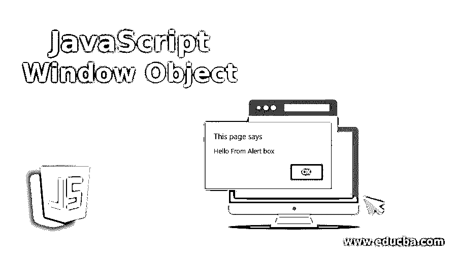
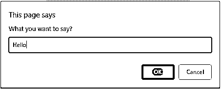

# JavaScript 窗口对象

> 原文：<https://www.educba.com/javascript-window-object/>




## JavaScript 窗口对象简介

JavaScript Window 对象是一个已经可用的全局对象，它代表浏览器中当前打开的窗口选项卡。可以说，窗口对象只不过是在浏览器中打开的浏览器窗口。这个窗口对象不同于普通对象，窗口是浏览器的一个对象。浏览器中打开的每个选项卡都有与之相关联的窗口对象，并且由于它是全局的，因此在应用程序的每个部分都可用。它有多个值和可用的方法，我们可以直接调用这些方法在浏览器窗口上执行多个操作。

### JavaScript 窗口对象的方法

让我们看看窗口对象可用的不同方法。因为它引用了使用它的同一个窗口，所以我们可以直接调用它的方法，而不需要使用窗口对象引用。

<small>网页开发、编程语言、软件测试&其他</small>

#### 方法 1–警报()

该方法将在浏览器窗口上显示一个警告框。

**代码**:

```
<!DOCTYPE html>
<html>
<head>
<title>
JavaScript window object
</title>
<style>
.results {
border : #81D4FA 2px solid;
background-color : #03a9f436;
text-align : left;
padding-left : 20px;
height : 140px;
width : 95%;
}
</style>
</head>
<body>
<div class = "results">
<h2> JavaScript window object </h2>
<input type = "button" value = "Click Here" onclick = "alertFunction()">
</div>
<script type = "text/javascript">
function alertFunction() {
window.alert( "Hello From Alert box" );
}
</script>
</body>
</html>
```

**输出**:


单击该按钮时，将会显示一条警告消息，如下所示:


**Note:** Here in code that, we have used window object to call the alert method and this Window object is available without the need for a declaration.

#### 方法 2–确认()

此方法将显示一个对话框以及“确定”和“取消”按钮。我们可以将消息传递给它，它会将消息显示在对话框中。

**代码:**

```
<!DOCTYPE html>
<html>
<head>
<title>
JavaScript window object
</title>
<style>
.results {
border : #81D4FA 2px solid;
background-color : #03a9f436;
text-align : left;
padding-left : 20px;
height : 140px;
width : 95%;
}
</style>
</head>
<body>
<div class = "results">
<h2> JavaScript window object </h2>
<input type = "button" value = "Click Here" onclick = "confirmFromUser()">
</div>
<script type = "text/javascript">
function confirmFromUser() {
confirm("We can ask for User permission");
}
</script>
</body>
</html>
```

**输出:**


单击该按钮时，将显示一个确认框，消息如下:


#### 方法 3–提示()

这个方法显示一个带有用户输入字段的对话框，我们也可以传递消息给它，它会在对话框上显示它。

**代码:**

```
<!DOCTYPE html>
<html>
<head>
<title>
JavaScript window object
</title>
<style>
.results {
border : #81D4FA 2px solid;
background-color : #03a9f436;
text-align : left;
padding-left : 20px;
height : 140px;
width : 95%;
}
.resultText {
font-size : 20px;
font-style : normal;
color : blue;
}
</style>
</head>
<body>
<div class = "results">
<h2> JavaScript window object </h2>
<input type = "button" value = "Click Here" onclick = "promptFromUser()">
<div class = "resultText">
<p id = "result"> </p>
</div>
</div>
<script type = "text/javascript">
function promptFromUser() {
userInput = prompt("What you want to say?");
document.getElementById("result").innerHTML = " User Says, " + userInput;
}
</script>
</body>
</html>
```

**输出:**





输入输入后，


#### 方法 4–开放式()

此方法将打开具有指定 URL 地址的新窗口。

**代码:**

```
<!DOCTYPE html>
<html>
<head>
<title>
JavaScript window object
</title>
<style>
.results {
border : #81D4FA 2px solid;
background-color : #03a9f436;
text-align : left;
padding-left : 20px;
height : 140px;
width : 95%;
}
</style>
</head>
<body>
<div class = "results">
<h2> JavaScript window object </h2>
<input type = "button" value = "Click Here to open new window" onclick = "openTheWindow()">
</div>
<script type = "text/javascript">
function openTheWindow() {
open("https://www.educba.com/");
}
</script>
</body>
</html>
```

**输出:**


在这里，点击按钮后，浏览器将打开新窗口。

#### 方法 5–关闭()

这个方法将关闭由 window 对象打开的窗口。

**代码:**

```
<!DOCTYPE html>
<html>
<head>
<title>
JavaScript window object
</title>
<style>
.results {
border : #81D4FA 2px solid;
background-color : #03a9f436;
text-align : left;
padding-left : 20px;
height : 140px;
width : 95%;
}
</style>
</head>
<body>
<div class = "results">
<h2> JavaScript window object </h2>
<input type = "button" value = "Click Here to open new window" onclick = "openTheWindow()">
</br> </br>
<input type = "button" value = "Click Here to close new window" onclick = "closeTheWindow()">
</div>
<script type = "text/javascript">
let newWindow;
function openTheWindow() {
newWindow = open("https://www.educba.com/");
}
function closeTheWindow() {
newWindow.close();
}
</script>
</body>
</html>
```

**输出:**


第二个按钮将关闭打开的窗口。

**Note:** The close method may not close the browser tab which is not opened by the open method.

#### 方法 6–setTimeout()

此方法将在调用它时指定的时间间隔后执行指定的操作。我们可以用这种方式进行任何活动。

**代码:**

```
<!DOCTYPE html>
<html>
<head>
<title>
JavaScript window object
</title>
<style>
.results {
border : #81D4FA 2px solid;
background-color : #03a9f436;
text-align : left;
padding-left : 20px;
height : 140px;
width : 95%;
}
</style>
</head>
<body>
<div class = "results">
<h2> JavaScript window object </h2>
<input type = "button" value = "Click Here to open new window" onclick = "openTheWindow()">
</br> </br>
<input type = "button" value = "close window after some time automatically" onclick = "executeTimeout()">
</div>
<script type = "text/javascript">
let newWindow;
function openTheWindow() {
newWindow = open("https://www.educba.com/");
}
function closeTheWindow() {
newWindow.close();
}
function executeTimeout(){
setTimeout(function(){ closeTheWindow()},2500);
}
</script>
</body>
</html>
```

**输出:**


在代码中，我们将关闭窗口的功能传递给了 setTimeout()方法。因此，在指定的时间后，关闭窗口的功能将被调用，窗口将自动关闭。当我们想在执行任何活动之前给用户一些时间时，这是很有用的。

### 结论

它代表浏览器窗口本身，默认情况下可供使用。我们可以使用窗口对象执行多种操作。我们已经看到了各种各样的方法以及它们是如何在开发中使用的。

### 推荐文章

这是一个 JavaScript 窗口对象的指南。在这里，我们讨论 JavaScript 窗口对象的不同方法以及编程示例。您也可以浏览我们推荐的其他文章，了解更多信息——

1.  [JavaScript 延迟](https://www.educba.com/javascript-defer/)
2.  [JavaScript 睡眠](https://www.educba.com/javascript-sleep/)
3.  [JavaScript WeakMap](https://www.educba.com/javascript-weakmap/)
4.  [JavaScript 模块](https://www.educba.com/javascript-modules/)


