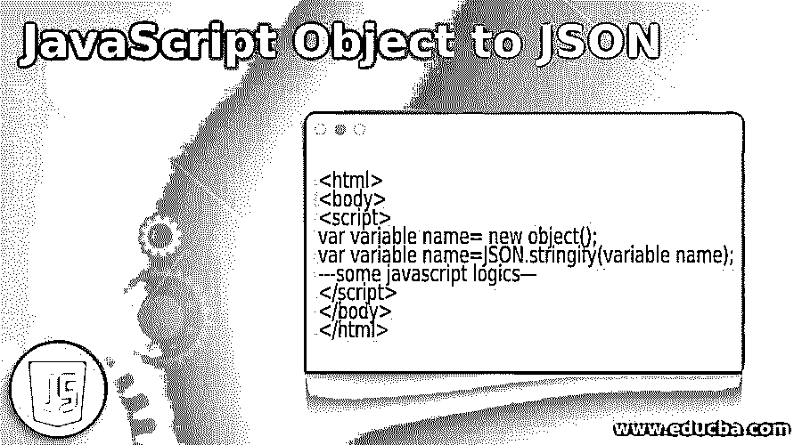
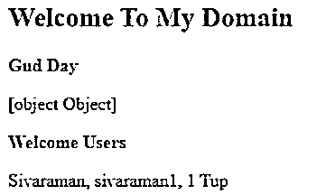

# JSON 的 JavaScript 对象

> 原文：<https://www.educba.com/javascript-object-to-json/>




## JSON 的 JavaScript 对象介绍

JavaScript 是一种客户端编程语言，主要设计用于开发网页和向服务器发送请求的简单的基于对象的场景。UI 在 html 中主要是与 JavaScript 配合使用

**语法:**

<small>网页开发、编程语言、软件测试&其他</small>

我们可以创建 JavaScript 实例或者使用 JSON.stringify()方法将任何值转换成 JSON 格式，再使用 JSON.parse()方法将其重新转换成 object。我们最有可能使用这两种方法，因为无论我们在 UI 字符串数据类型中看到什么，都是在用户屏幕中显示它的最佳示例。

```
<html>
<body>
<script>
var variable name= new object();
var variable name=JSON.stringify(variable name);
---some javascript logics—
</script>
</body>
</html>
```

JSON.stringify 方法主要用于将 JavaScript 对象实例转换成 JSON 字符串格式。以上代码是在 JSON 中实现 JavaScript 实例的基本语法。

### JavaScript Object to JSON 是如何工作的？

*   JavaScript 实例有它们自己的属性，并且属性与它们相关联。对象属性的主要作用用已经附加到脚本的特定对象的变量来解释。对象的属性与普通 JavaScript 变量基本相同，除了我们已经附加到对象中的附件与变量不常见之外。它与脚本的不同用法和目的。对象的每个属性都是用 javascript 对象自己的特征定义的，我们可以在访问对象的属性时使用点符号。json 主要是基于标准文本的格式，用于基于 JavaScript 对象符号及其语法的数据的结构化表示。
*   JSON 的主要作用是在基于 web 的应用程序中传输数据。它可以发送 n 个数据到服务器，它将与网页，浏览器一起显示，反之亦然。json 是独立于 JavaScript 的，这不仅是因为它与许多 web 编程环境相同，而且它还具有读取解析数据和生成 JSON 文本格式的功能。JSON 也有字符串类型，它对于通过万维网传输数据非常有用。如果我们想从整个网络中访问数据，就用它来转换 javascript 对象的本地格式。
*   此外，这不是一个大的问题，因为 javascript 具有这一特性，并且将变量声明为全局级别类型的变量，用于创建全局对象的方法主要用于转换它们。一般来说，编程对象被转换为字符串类型的格式，同时也在整个全局范围内传输。对于脚本的访问被称为序列化过程，在 JSON 中，对象被创建并存储在自己的文件中，基本上看起来就像是文本类型的文件。json 扩展和 MIME 是应用程序的类型，也是 json 格式的类型。JavaScript 对象的属性可以使用括号类型的符号来访问，对象也被称为关联类型的数组，因此每个 JavaScript 对象属性都与字符串值相关联，因此很容易用于访问数据。
*   属性名的对象应该在字符串数据类型中有效，否则任何值都将转换为字符串格式，包括空字符串值。如果有任何无效的属性名，如空格或连字符等，可以用数字格式开始，也可以使用方括号符号访问。这些类型的对象符号用于标识动态环境中的属性名称，直到符号标识了对象属性名称，它才可以被执行。JSON 格式非常相似，JavaScript 对象是文字类型的格式，我们使用基本的数据类型，而且可以是标准类型的格式，如字符串、数字、布尔、数组等。这些数据类型用于在 web 浏览器中构建 JSON 数据层次结构。

### JSON 的 JavaScript 对象示例

下面给出了 JSON 的 JavaScript 对象的例子:

#### 示例#1

**代码:**

```
<html>
<head>
<script language = *"javascript"* >
document.writeln("<h2>Welcome To My Domain</h2>");
var b = { "First" : [
{ "Name"  : "Sivaraman", "Id" : 2 },
{ "Name"  : "Arun", "Id" : 3 }],
"Second"  : [
{ "Name"  : "Kumar", "Id" : 4 },
{ "Name"  : "Saran", "Id" : 5 }]
}
var i = 0
document.writeln("<table border = '3'><tr>");
for(i = 0;i<b.First.length;i++) {
document.writeln("<td>");
document.writeln("<table border = '2' width = 37 >");
document.writeln("<tr><td><b>Name</b></td><td width = 27>" + b.First[i].Name+"</td></tr>");
document.writeln("<tr><td><b>Id</b></td><td width = 57>" + b.First[i].Id +"</td></tr>");
document.writeln("</table>");
document.writeln("</td>");
}
for(i = 0;i<b.Second.length;i++) {
document.writeln("<td>");
document.writeln("<table border = '4' width = 67 >");
document.writeln("<tr><td><b>Name</b></td><td width = 50>" + b.Second[i].Name+"</td></tr>");
document.writeln("<tr><td><b>Id</b></td><td width = 50>" + b.Second[i].Id+"</td></tr>");
document.writeln("</table>");
document.writeln("</td>");
}
document.writeln("</tr></table>");
</script>
</head>
<body>
</body>
</html>
```

**输出:**


#### 实施例 2

**代码:**

```
<!DOCTYPE html>
<html>
<body>
<h2>Welcome To My Domain.</h2>
<p id=*"demo"*></p>
<script>
var o = { name: "Sivaraman", age: 31, city: "Tup" };
var m = JSON.stringify(o);
document.getElementById("demo").innerHTML = m;
</script>
</body>
</html>
```

**输出:**


#### 实施例 3

**代码:**

```
<html>
<body>
<h2>Welcome To My Domain</h2>
<b><u>Gud</u> Day</b>
<p id=*"d"*></p>
<b>Welcome Users</b>
<p id=*"d1"*></p>
<script>
var j ='{ "name":"Sivaraman","id":"1","city":"Tup" }';
var o = JSON.parse(j);
document.getElementById("d1").innerHTML =
o.name + ", sivaraman"
+ o.id + ", 1 "
+ o.city;
document.getElementById("d").innerHTML =o;
</script>
</body>
</html>
```

**输出:**




### 结论

我们可以看到 JavaScript 概念，如将 JavaScript 对象转换为 JSON 类型，基本上它以文本格式转换和显示，但我们使用一些默认方法，如 JSON.stringify()方法将 JSON 对象转换为字符串，并再次使用 JSON.parse()将数据重新转换为对象。我们使用其他数据类型转换也适用。

### 推荐文章

这是一个 JavaScript 对象到 JSON 的指南。这里我们讨论一下入门，JavaScript object to JSON 是如何工作的？还有例子。您也可以看看以下文章，了解更多信息–

1.  [JavaScript 动画](https://www.educba.com/javascript-animation/)
2.  [JavaScript 数组切片](https://www.educba.com/javascript-array-slice/)
3.  [JavaScript 转换成 JSON](https://www.educba.com/javascript-convert-to-json/)
4.  [JavaScript 复制数组](https://www.educba.com/javascript-copy-array/)


