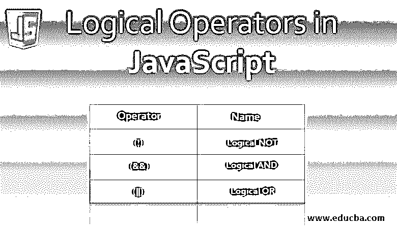
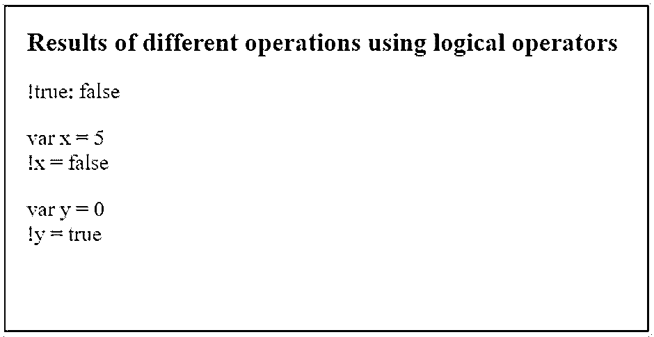
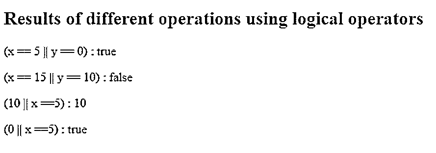

# JavaScript 中的逻辑运算符

> 原文：<https://www.educba.com/logical-operators-in-javascript/>




## JavaScript 中的逻辑运算符简介

就像其他编程或[脚本语言一样，JavaScript](https://www.educba.com/what-is-javascript/) 也有逻辑运算符。逻辑运算符用于对值执行逻辑运算，它们通常与比较运算符一起使用。一般来说，在其他语言中，[逻辑运算符与布尔值一起使用](https://www.educba.com/logical-operators-in-python/)，但是在 JavaScript 中，[逻辑运算符可以与布尔值一起应用于任何类型的值。在 JavaScript 中，根据处理的值，这些运算符的行为会有所不同。在本文中，我们将看到 JavaScript 中不同的逻辑运算符，以及它们在不同类型的值中的表现。](https://www.educba.com/logical-operators-in-php/)

### JavaScript 中逻辑运算符的示例

JavaScript 中可用的逻辑运算符有逻辑 AND (&&)、逻辑 OR (||)和逻辑 NOT(！).这些运算符用于任何原始值或对象。这些操作符的结果可以是任何类型的，尤其是在 JavaScript 的情况下，包括布尔类型。运算符(&&)和(||)的行为比平常更多，它们不是每次都返回布尔值，而是返回传递的操作数的值。这里的操作数可以是布尔类型或非布尔类型的值。这一特性可以有效地用于实现更好的结果。

<small>网页开发、编程语言、软件测试&其他</small>

#### 1.逻辑 NOT(！)运算符

逻辑运算符 NOT 用于反转它所作用的值。它用感叹号(！)符号。

| **输入** | **操作** |
| 真实的 | 错误的 |
| 错误的 | 真实的 |

根据该表，not 运算符将把值从 true 改为 false，反之亦然。这种操作也称为否定。NOT 运算符也可以用于非布尔值。JavaScript 会将该值转换为布尔值，并返回它的倒数。

##### 例子

**代码**:

```
<!DOCTYPE html>
<html>
<head>
<title>
Logical operators in JavaScript
</title>
<style>
.results {
border: green 1px solid;
background-color: aliceblue;
text-align: left;
padding-left: 20px;
height: 300px;
width: 95%;
}
.resultText {
font-size : 20px;
font-style : normal;
color : blue;
}
</style>
</head>
<body>
<div class = "results">
<h2> Results of different operations using logical operators </h2>
<div class = "resultText">
<p id = "result1"> </p>
<p id = "result2"> </p>
<p id = "result3"> </p>
</div>
</div>
<script>
document.getElementById("result1").innerHTML = " !true: " + !true;
var x = 5;
document.getElementById("result2").innerHTML = " var x = 5 </br> !x = " + !x;
var y = 0;
document.getElementById("result3").innerHTML = " var y = 0 </br> !y = " + !y;
</script>
</body>
</html>
```

**输出:**




这里，我们使用 NOT 操作执行了三个操作。第一个是布尔值 true，它返回 false；第二个是整数值，它被转换为布尔值 true，NOT 操作返回 false；第三个是值 0，它被视为 false，并返回 false。

#### 2.逻辑 AND (&&)运算符

逻辑 AND 运算符用于计算表达式中的所有值。它用两个&符号来表示。如果表达式中的所有条件都为真，AND 运算符将返回 true。如前所述，当传递非布尔值时，AND 运算符返回操作数值。

##### 例子

**代码**:

```
<!DOCTYPE html>
<html>
<head>
<title>
Logical operators in JavaScript
</title>
</head>
<body>
<div class = "results">
<h2> Results of different operations using logical operators </h2>
<div class = "resultText">
<p id = "result1"> </p>
<p id = "result2"> </p>
<p id = "result3"> </p>
<p id = "result4"> </p>
</div>
</div>
<script>
var x = 5;
var y = 0;
document.getElementById("result1").innerHTML = " (x == 5 && y == 0) : " + (x == 5 && y == 0);
document.getElementById("result2").innerHTML = " (x == 5 && 10) : " + (x == 5 && 10);
document.getElementById("result3").innerHTML = " (10 && x ==5) : " + (10 && x ==5);
document.getElementById("result4").innerHTML = " (0 && x ==5) : " + (0 && x ==5);
</script>
</body>
</html>
```

**输出:**


在第一个示例中，两个表达式都将返回 true，条件将被评估为 true。在第二个示例中，我们有一个非布尔值被转换为 True，返回值本身也是相同的值。在第三个示例中，我们将两个表达式在转换后都设为 true，并将 true 作为输出。在最后一个示例中，零被视为 false，and 运算符不返回布尔值，而是按原样返回值零。

#### 3.逻辑 OR (||)运算符

逻辑运算符返回 true。如果表达式中的任何值为 true，则不必将所有值都设为 true。它用两条垂直线来表示。or 运算符的工作方式类似于 JavaScript 中的 AND 运算符，只需遵循 OR 运算即可。

##### 例子

**代码:**

```
<!DOCTYPE html>
<html>
<head>
<title>
Logical operators in JavaScript
</title>
</head>
<body>
<div class = "results">
<h2> Results of different operations using logical operators </h2>
<div class = "resultText">
<p id = "result1"> </p>
<p id = "result2"> </p>
<p id = "result3"> </p>
<p id = "result4"> </p>
</div>
</div>
<script>
var x = 5;
var y = 0;
document.getElementById("result1").innerHTML = " (x == 5 || y == 0) : " + (x == 5 || y == 0);
document.getElementById("result2").innerHTML = " (x == 15 || y == 10) : " + (x == 15 || y == 10);
document.getElementById("result3").innerHTML = " (10 || x ==5) : " + (10 || x ==5);
document.getElementById("result4").innerHTML = " (0 || x ==5) : " + (0 || x ==5);
</script>
</body>
</html>
```

**输出:**




输出可以类似于一个运算符示例。当任何一个语句为真时，OR 运算符返回真或非布尔值，否则返回假。

### 结论

JavaScript 中的逻辑运算符是 AND、OR 和 NOT。在 JavaScript 中，这些操作符也可以用于非布尔值。在这种情况下，它们将返回操作数值。

### 推荐文章

这是 JavaScript 中逻辑运算符的指南。在这里，我们讨论了 JavaScript 中逻辑操作符的介绍、例子以及代码和输出。您也可以看看以下文章，了解更多信息–

1.  [JavaScript 中的赋值运算符](https://www.educba.com/assignment-operator-in-javascript/)
2.  [PostgreSQL 运算符](https://www.educba.com/postgresql-operators/)
3.  [JavaScript 中的按位运算符](https://www.educba.com/bitwise-operators-in-javascript/)
4.  [SQL 逻辑运算符](https://www.educba.com/sql-logical-operators/)


