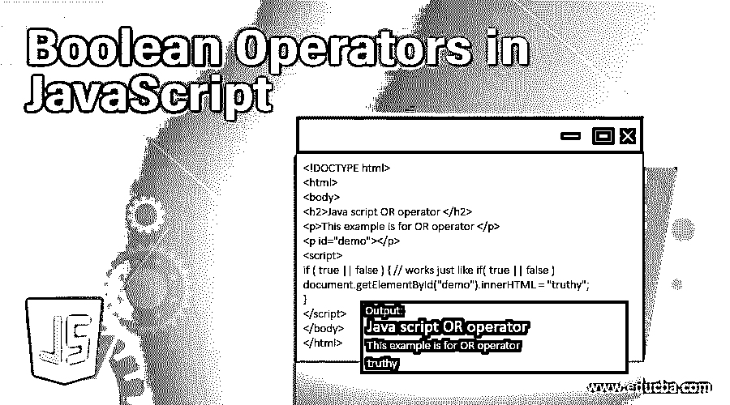
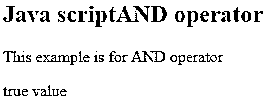
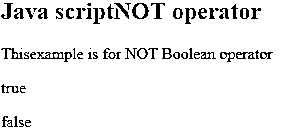

# JavaScript 中的布尔运算符

> 原文：<https://www.educba.com/boolean-operators-in-javascript/>




## JavaScript 中布尔运算符的介绍

Java script 是一种前端开发语言，已经在网站中使用了很长时间。虽然程序员有几种后端语言可供选择，但还没有开发出替代 Java 脚本的语言。这是因为它能够管理 HTML 组件、CSS 样式和所有数据。

**理解布尔运算符**

<small>网页开发、编程语言、软件测试&其他</small>

有三种运算符:AND、OR 和 NOT。它们可以用在数据库或编码中，并且在构建复杂逻辑或流程的组件时非常方便开发人员。

### 如何在 JavaScript 中实现布尔运算符？

让我们更详细地了解用 Javascript 实现的每一项。

#### 1.JavaScript 中的 OR 运算符

Javascript 中的 OR 运算符以符号形式用两条垂直线表示。例如，让我们考虑下面的例子:

**语法**

```
result = x || y; // same as x OR y
```

*   在典型的编程语言中，布尔或逻辑或运算符仅用于计算多个布尔变量。如果提供的任何变量为真，则表达式求值并返回真，否则将返回假值。
*   Java script 有一个非常强大的 OR 运算符实现。让我们借助一个例子来更好地理解 OR 逻辑运算符的应用。

基本上，下面列出了布尔值的四种逻辑组合:

1.  True | | True 即 True "或" True//结果将为真
2.  假||真即假或“真//结果将为真
3.  True || False i.eTrue "或" False//结果将为真
4.  False || False i.eFalse "或" False//结果将为真

如上所示，除非其中一个操作数为假，否则该操作的结果将始终为真。让我们在下面的示例中看看 OR 运算符的实现:

**代码:**

```
<!DOCTYPE html>
<html>
<body>
<h2>Java script OR operator </h2>
<p>This example is for OR operator </p>
<p id="demo"></p>
<script>
if ( true || false ) { // works just like if( true || false )
document.getElementById("demo").innerHTML = "truthy";
}
</script>
</body>
</html>
```

**输出:**


#### 2.Javascript 中的 AND 运算符用&&表示

Javascript 中的 AND 运算符用两个&符号表示。

**语法**

```
var result = x && y; // equivalent to x AND y
```

像 or 运算符一样，布尔 OR 逻辑 AND 运算符用于计算多个布尔操作数。如果提供的任何变量为 false，则表达式计算并返回 false，否则将返回 true 值。让我们借助一个例子来更好地理解 and 逻辑运算符的应用。

基本上，使用 AND 运算符，将有四种逻辑组合的布尔值，如下所示:

1.  True || True 即 True "或" True //结果将为 True
2.  False || True 即 False“或”True //结果将为 False
3.  真||假，即“真”或“假//结果将为假
4.  False || False 即 False“或”False //结果将为 False

如上所示，除非两个操作数都为真，否则该操作的结果将始终为假。让我们在下面的示例中看看 AND 运算符的实现:

**代码:**

```
<!DOCTYPE html>
<html>
<body>
<h2>Java scriptAND operator </h2>
<p>This example is for AND operator </p>
<p id="demo1"></p>
<p id="demo2"></p>
<script>
if ( true && false ) {
document.getElementById("demo1").innerHTML = "false value";
}
if ( true && true ) {
document.getElementById("demo2").innerHTML = "true value";
}
</script>
</body>
</html>
```

**输出:**




#### 3.JavaScript 中的 NOT 运算符符号化为！

Javascript 中的 NOT 操作符是用感叹号&&表示的符号形式。

**语法**

```
var result = ! y;
```

与 or 和 and 运算符一样，布尔 OR 逻辑 AND 运算符仅用于计算多个布尔操作数。它用于反转操作数的值，因为它返回提供给它的操作数的相反值。让我们借助一个例子来更好地理解非逻辑运算符的应用。

基本上，使用 NOT 运算符，布尔值有两种逻辑可能性，如下所示:

1.  !True，即等价于 NOT True //最终结果将是一个 False 布尔值，因为它与 True 相反
2.  !False，即相当于 NOT False //最终结果将是一个真布尔值，因为它与 False 相反

如上所示，该运算的结果总是与应用该运算的操作数相反。让我们看看下面示例中 NOT 运算符的实现:

**代码:**

```
<!DOCTYPE html>
<html>
<body>
<h2>Java scriptNOT operator </h2>
<p>Thisexample is for NOT Boolean operator </p>
<p id="demo1"></p>
<p id="demo2"></p>
<script>
if ( true || false ) {
var result = false; // defining variable as false
document.getElementById("demo1").innerHTML = ! result ; //variable output here would be true
}
if ( true && true ) {
var result = true; // defining variable as true
document.getElementById("demo2").innerHTML = ! result ; //variable output here would be false
}</script>
</body>
</html>
```

**输出:**




### 结论

从上面的描述中，我们可以理解布尔运算符在编程语言中的意义。我们可以在数据库查询中使用 AND、OR 和 NOT 操作符，也可以在开发需要条件验证和用 if 或 while 实现的条件行为的复杂逻辑时使用。

### 推荐文章

这是 JavaScript 中布尔运算符的指南。这里我们通过使用 AND、OR 和 NOT 运算符来讨论布尔运算符的重要性。您也可以浏览我们的其他相关文章，了解更多信息——

1.  [JavaScript 字符串编号](https://www.educba.com/javascript-string-to-number/)
2.  [JavaScript 通过类获取元素](https://www.educba.com/javascript-get-element-by-class/)
3.  [JavaScript 风格可见性](https://www.educba.com/javascript-style-visibility/)
4.  [要浮动的 JavaScript 字符串](https://www.educba.com/javascript-string-to-float/)


