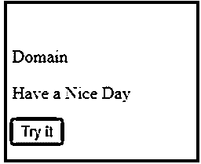

# 表单 JavaScript

> 原文：<https://www.educba.com/javascript-modulo/>


## JavaScript 模数简介

javascript 模数(%) 是一个运算符，它有助于给出余数，当两个数相除后，余数应该是正数和负数，很可能是负数余数模块是一个运算符，它给出余数，其行为类似于余数运算，结果显示为负数，然后返回一个操作数被除后剩下的余数 如果假设第一个操作数是负值，则返回值也是负值，反之亦然。

### 语法和参数

在 javascript 中，每个属性和元素都有自己的语法和规则，以便在应用程序中使用。

<small>网页开发、编程语言、软件测试&其他</small>

```
<html>
<body>
<script>
var v1=10; //any value will be given above value is example
var v2=4 // any value will be given above value is example
var result=v1 % v2;
print the result using dom object;
---other script logics---
</script>
</body></html>
```

在上面的例子中，我们在两个变量中使用了模(%)运算符，当我们将两个操作数相除时，余数为 2，该值为正，因此它返回正值作为结果。

### JavaScript 中的模运算是如何完成的？

每当我们在脚本中使用操作符时，它都会执行应用程序中使用的自己的表达式和函数。我们可以在选择初始数的同时开始运算，这是在我们可以在脚本中执行模运算之前。我们选择除数，它可以是正值，也可以是负值。将它一个接一个地除以其他数，可以计算出舍入值，这已经产生了变量值。然后我们必须用商来计算除数值，同时从初始数中减去这个数，这个数可能是被除数。模运算就像时钟一样，它是如此的直观，以至于我们在应用程序中甚至注意不到它们。当我们使用数学运算时，它可能是许多类型的更精细的模块运算，可能需要更多的思考。模数(%)运算符只返回余数，因此如果两种类型的值(如正整数和负整数)以及字符串类型的值，则尝试将字符串转换为数字格式。

因此，操作数只不过是它可以执行常规算术除法运算的数字，并且返回该除法的余数。如果假设被除数是无穷大或者除数类型值是 0，那么结果总是作为 NaN 操作数。如果无穷大类型是除数，则无穷大数和结果是被除数度量，因此被除数为 0，则结果也为 0。如果%运算符使用并执行了 JavaScript web 应用程序中的运算，它首先将操作数的左侧值相除，然后计算操作数的右侧值，最后返回结果。结果不是除法的商类型，而是余数的值，它的模在代码中是相同的。通常，当模运算是使用除法运算确定余数值的方式时，模运算符更精确。不是像除法那样返回输出，而是像余数那样返回整数的模运算。在 javascript 中，我们得到的整数是给定整数传递给另一个操作数的次数。模数运算符的基本用例是确定数字是偶数还是奇数，因为操作数%值是可能的。

### JavaScript 模的例子

下面是一些例子:

#### 示例#1

**代码:**

```
<!DOCTYPE html>
<html>
<body>
<h1 style="color: green">
Welcome To My Domains
</h1>
<b>
Have a Nice Day
</b>
<p>
We have calculate the UNIX Timestamp is: 10636284
</p>
<p>The TimeStamp is: 

</p>
<button onclick="demo()">
Get the time from above timestamp
</button>
<script type="text/javascript">
function demo() {
unix = 10636284;
d = new Date(unix * 1000);
u = d.toUTCString();
t = u.slice(-11, -4);
document.querySelector(
'.first').textContent = t;
}
</script><br/><br/>
<script>
for(var i=0; i<10; i+=1)
{
document.write( i % 4 );
}
</script>
</body>
</html>
```

**输出:**


#### 实施例 2

**代码:**

```
<!DOCTYPE html>
<html>
<body>
<p>Welcome To My Domain</p>
<p>Have a Nice Day</p>
<button onclick="demo()">Try it</button>
<p id="first"></p>
<script>
function demo()
{
Number.prototype.mod = function(b) {
return ((this % b) + b) % b;
}
var a = -23;
var b = 3;
var output = a.mod(b);
document.write("The result is: " + output + "</br>");
a = -34;
b = 6;
output = a.mod(b);
document.write("The output is: " + output);
}
</script>
</body>
</html>
```

**输出:**


单击“尝试”按钮后，输出将是:


#### 实施例 3

**代码:**

```
<!DOCTYPE html>
<html>
<head>
<style>
.first>div {
display: inline-block;
height: 103px;
width: 102px;
background: red;
}
div.second {
opacity: 0;
}
div.third {
opacity: 0.1;
}
div.four {
opacity: 0.2;
}
</style>
</head>
<body bgcolor="blue">
<div class="second"><marquee>Welcome</marquee></div>
<div class="third">To</div>
<div class="four">My</div>
<div class="five">Domain</div>
<p>Have a Nice Day</p>
<button onclick="demo()">Try it</button>
<p id="first"></p>
<script>
function demo()
{
Number.prototype.mod = function(b) {
return ((this % b) + b) % b;
}
var a = -23;
var b = 3;
var output = a.mod(b);
document.write("The result is: " + output + "</br>");
a = -34;
b = 6;
output = a.mod(b);
document.write("The output is: " + output);
const even = x => {
if (x % 2 === 0) {
returntrue;
}
returnfalse;
}
even(12);
}
</script>
</body>
</html>
```

**输出:**




单击“尝试”按钮后，输出将是:


上述三个示例中，我们在不同的段中使用了模运算符，当我们同时使用(%)和 mod 关键字时，会返回相同的结果。

### 结论

在 javascript 中，像%和 mod 关键字这样的模运算符都返回相同的结果，它包括许多熟悉的数学运算和一些可以在编程语言中指定的东西。我们可以在 JavaScript 中组合所有其他的操作符和操作。

### 推荐 ed 文章

这是一个 JavaScript 模数指南。在这里，我们还讨论了 javascript 中的介绍和 modulo 是如何完成的？以及不同的示例及其代码实现。您也可以看看以下文章，了解更多信息–

1.  [JavaScript Onkeydown](https://www.educba.com/javascript-onkeydown/)
2.  [JavaScript 克隆对象](https://www.educba.com/javascript-clone-object/)
3.  [JavaScript exec()](https://www.educba.com/javascript-exec/)
4.  [JavaScript 鼠标按下](https://www.educba.com/javascript-mousedown/)


