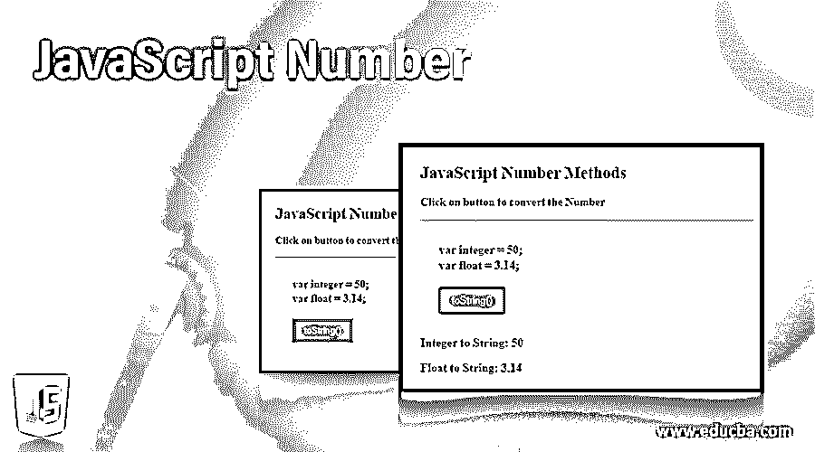
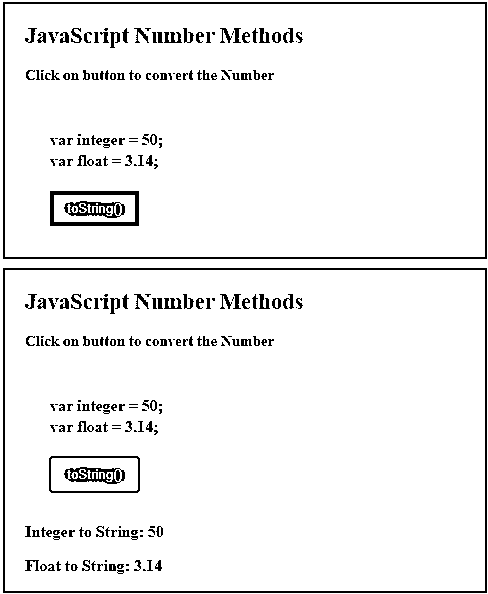
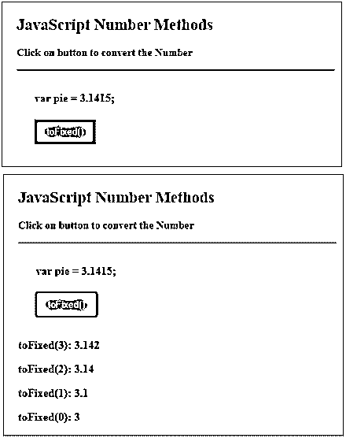
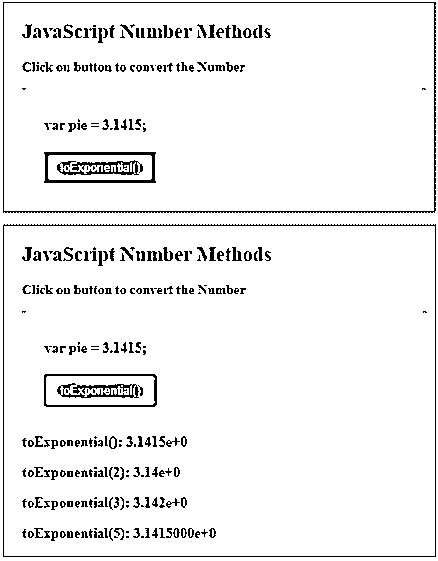
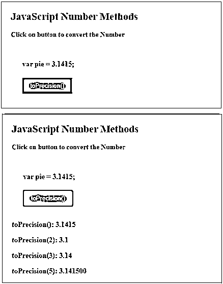
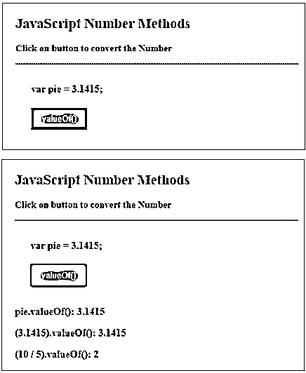
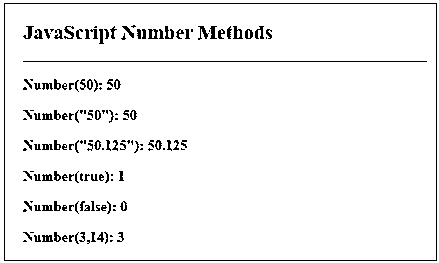
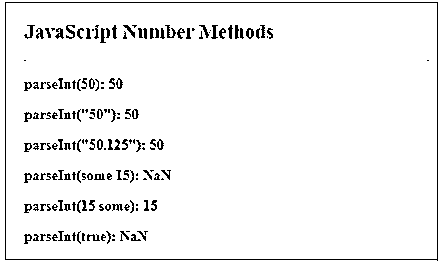
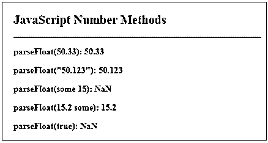

# JavaScript 编号

> 原文：<https://www.educba.com/javascript-number/>




## JavaScript 数字简介

数字是 JavaScript 中的包装对象，它允许我们存储不同类型的数值。它是 JavaScript 中可用的原始数据类型，可以表示多种类型的值，如整数、小数、浮点、八进制或指数值。所有的数值都在一个对象中表示，这些对象以 64 位格式存储，这种格式被称为遵循国际 IEEE 754 标准的“双精度浮点”数。以这种方式存储数字，63 位置的 1 位是符号位，52 到 62 位用于指数，0 到 51 用于存储实际数字。

### 句法

由于 Number 是 JavaScript 中的一个对象，所以它提供了一个 Number()构造函数来创建对象。原始数字数据类型是使用 number()函数创建的。使用或不使用构造函数都可以创建数字对象。

<small>网页开发、编程语言、软件测试&其他</small>

**1。文字语法**

```
var integer = 50;
var float = 50.15;
var exponential = 3.14e2;
var hexadecimal = 0xcdf;
var octal = 051;
```

**2。构造函数语法**

```
var integer = new Number(50);
var float = new Number(50.15);
var exponential = new Number(3.14e2);
var hexadecimal = new Number(0xcdf);
var octal = new Number(051);
```

可以使用 new 关键字创建 number 对象。Number 对象可用于类型转换。如果参数不能转换成数字，它将返回 NaN。

### JavaScript 数字方法和示例

以下是 javascript 编号的方法和示例:

#### 1.toString()

此方法将数字转换为字符串并返回它。

**代码:**

```
<!DOCTYPE html>
<html>
<head>
<meta charset = "UTF-8">
<title>
JavaScript Number Methods
</title>
<style>
.body-data {
border : #81D4FA 2px solid;
background-color : #03a9f400;
text-align : left;
padding-left : 20px;
height : auto;
width : auto;
}
.list {
margin:5px auto;
max-width: 700px;
padding: 25px 15px 15px 25px;
}
.list p, .resultText {
margin: 0 0 3px 0;
padding: 0px;
display: block;
font-weight: bold;
}
.heading {
font-weight: bold;
border-bottom: 2px solid #ddd;
font-size: 15px;
width: 98%;
}
.list button[ type = submit] {
background: #2196F3;
padding: 10px 17px 10px 17px;
margin-right: 10px;
color: #fff;
border: none;
}
.list button[ type = submit]:hover {
background: #2173f3;
}
</style>
</head>
<body>
<div class = "body-data" >
<div class = "heading" >
<h2> JavaScript Number Methods </h2>
<p> Click on button to convert the Number </p>
</div>
<div class = "list" >
<p> var integer = 50; </p>
<p> var float = 3.14; </p>
</br>
<button type = "submit" value = "submit" onclick = "convertNumber()"> toString() </button>
</div>
<div class = "resultText">
<p id = "result1"> </p>
<p id = "result2"> </p>
</div>
</div>
<script type = "text/javascript">
var integer = 50;
var float = 3.14;
function convertNumber() {
var intString = integer.toString();
var floatString = float.toString();
document.getElementById("result1").innerHTML = "Integer to String:" + " " + intString;
document.getElementById("result2").innerHTML = "Float to String:" + " " + floatString;
}
</script>
</body>
</html>
```

**输出:**




#### 2\. toFixed()

此方法将数字舍入到给定的位数，并返回一个字符串。

**代码:**

```
<!DOCTYPE html>
<html>
<head>
<meta charset = "UTF-8">
<title>
JavaScript Number Methods
</title>
<style>
.body-data {
border : #81D4FA 2px solid;
background-color : #03a9f400;
text-align : left;
padding-left : 20px;
height : auto;
width : auto;
}
.list {
margin:5px auto;
max-width: 700px;
padding: 25px 15px 15px 25px;
}
.list p, .resultText {
margin: 0 0 3px 0;
padding: 0px;
display: block;
font-weight: bold;
}
.heading {
font-weight: bold;
border-bottom: 2px solid #ddd;
font-size: 15px;
width: 98%;
}
.list button[ type = submit] {
background: #2196F3;
padding: 10px 17px 10px 17px;
margin-right: 10px;
color: #fff;
border: none;
}
.list button[ type = submit]:hover {
background: #2173f3;
}
</style>
</head>
<body>
<div class = "body-data" >
<div class = "heading" >
<h2> JavaScript Number Methods </h2>
<p> Click on button to convert the Number </p>
</div>
<div class = "list" >
<p> var pie = 3.1415; </p>
</br>
<button type = "submit" value = "submit" onclick = "convertNumber()"> toFixed() </button>
</div>
<div class = "resultText">
<p id = "result1"> </p>
<p id = "result2"> </p>
<p id = "result3"> </p>
<p id = "result4"> </p>
</div>
</div>
<script type = "text/javascript">
var pie = 3.1415;
function convertNumber() {
document.getElementById("result1").innerHTML = "toFixed(3): " + pie.toFixed(3);
document.getElementById("result2").innerHTML = "toFixed(2): " + pie.toFixed(2);
document.getElementById("result3").innerHTML = "toFixed(1): " + pie.toFixed(1);
document.getElementById("result4").innerHTML = "toFixed(0): " + pie.toFixed(0);
}
</script>
</body>
</html>
```

**输出:**




#### 3.toExponential()

此方法将数字舍入到给定的位数，并返回一个带有指数表示法数字的字符串。

**代码:**

```
<!DOCTYPE html>
<html>
<head>
<meta charset = "UTF-8">
<title>
JavaScript Number Methods
</title>
<style>
.body-data {
border : #81D4FA 2px solid;
background-color : #03a9f400;
text-align : left;
padding-left : 20px;
height : auto;
width : auto;
}
.list {
margin:5px auto;
max-width: 700px;
padding: 25px 15px 15px 25px;
}
.list p, .resultText {
margin: 0 0 3px 0;
padding: 0px;
display: block;
font-weight: bold;
}
.heading {
font-weight: bold;
border-bottom: 2px solid #ddd;
font-size: 15px;
width: 98%;
}
.list button[ type = submit] {
background: #2196F3;
padding: 10px 17px 10px 17px;
margin-right: 10px;
color: #fff;
border: none;
}
.list button[ type = submit]:hover {
background: #2173f3;
}
</style>
</head>
<body>
<div class = "body-data" >
<div class = "heading" >
<h2> JavaScript Number Methods </h2>
<p> Click on button to convert the Number </p>
</div>
<div class = "list" >
<p> var pie = 3.1415; </p>
</br>
<button type = "submit" value = "submit" onclick = "convertNumber()"> toExponential() </button>
</div>
<div class = "resultText">
<p id = "result1"> </p>
<p id = "result2"> </p>
<p id = "result3"> </p>
<p id = "result4"> </p>
</div>
</div>
<script type = "text/javascript">
var pie = 3.1415;
function convertNumber() {
document.getElementById("result1").innerHTML = "toExponential(): " + pie.toExponential();
document.getElementById("result2").innerHTML = "toExponential(2): " + pie.toExponential(2);
document.getElementById("result3").innerHTML = "toExponential(3): " + pie.toExponential(3);
document.getElementById("result4").innerHTML = "toExponential(5): " + pie.toExponential(7);
}
</script>
</body>
</html>
```

**输出:**




#### 4.最高精度()

此方法将数字转换为字符串，并返回给定长度的字符串。

**代码:**

```
<!DOCTYPE html>
<html>
<head>
<meta charset = "UTF-8">
<title>
JavaScript Number Methods
</title>
<style>
.body-data {
border : #81D4FA 2px solid;
background-color : #03a9f400;
text-align : left;
padding-left : 20px;
height : auto;
width : auto;
}
.list {
margin:5px auto;
max-width: 700px;
padding: 25px 15px 15px 25px;
}
.list p, .resultText {
margin: 0 0 3px 0;
padding: 0px;
display: block;
font-weight: bold;
}
.heading {
font-weight: bold;
border-bottom: 2px solid #ddd;
font-size: 15px;
width: 98%;
}
.list button[ type = submit] {
background: #2196F3;
padding: 10px 17px 10px 17px;
margin-right: 10px;
color: #fff;
border: none;
}
.list button[ type = submit]:hover {
background: #2173f3;
}
</style>
</head>
<body>
<div class = "body-data" >
<div class = "heading" >
<h2> JavaScript Number Methods </h2>
<p> Click on button to convert the Number </p>
</div>
<div class = "list" >
<p> var pie = 3.1415; </p>
</br>
<button type = "submit" value = "submit" onclick = "convertNumber()"> toPrecision() </button>
</div>
<div class = "resultText">
<p id = "result1"> </p>
<p id = "result2"> </p>
<p id = "result3"> </p>
<p id = "result4"> </p>
</div>
</div>
<script type = "text/javascript">
var pie = 3.1415;
function convertNumber() {
document.getElementById("result1").innerHTML = "toPrecision(): " + pie.toPrecision();
document.getElementById("result2").innerHTML = "toPrecision(2): " + pie.toPrecision(2);
document.getElementById("result3").innerHTML = "toPrecision(3): " + pie.toPrecision(3);
document.getElementById("result4").innerHTML = "toPrecision(5): " + pie.toPrecision(7);
}
</script>
</body>
</html>
```

**输出:**




#### 5.的值()

此方法以数字形式返回数字。

**代码:**

```
<!DOCTYPE html>
<html>
<head>
<meta charset = "UTF-8">
<title>
JavaScript Number Methods
</title>
<style>
.body-data {
border : #81D4FA 2px solid;
background-color : #03a9f400;
text-align : left;
padding-left : 20px;
height : auto;
width : auto;
}
.list {
margin:5px auto;
max-width: 700px;
padding: 25px 15px 15px 25px;
}
.list p, .resultText {
margin: 0 0 3px 0;
padding: 0px;
display: block;
font-weight: bold;
}
.heading {
font-weight: bold;
border-bottom: 2px solid #ddd;
font-size: 15px;
width: 98%;
}
.list button[ type = submit] {
background: #2196F3;
padding: 10px 17px 10px 17px;
margin-right: 10px;
color: #fff;
border: none;
}
.list button[ type = submit]:hover {
background: #2173f3;
}
</style>
</head>
<body>
<div class = "body-data" >
<div class = "heading" >
<h2> JavaScript Number Methods </h2>
<p> Click on button to convert the Number </p>
</div>
<div class = "list" >
<p> var pie = 3.1415; </p>
</br>
<button type = "submit" value = "submit" onclick = "convertNumber()"> valueOf() </button>
</div>
<div class = "resultText">
<p id = "result1"> </p>
<p id = "result2"> </p>
<p id = "result3"> </p>
</div>
</div>
<script type = "text/javascript">
var pie = 3.1415;
function convertNumber() {
document.getElementById("result1").innerHTML = "pie.valueOf(): " + pie.valueOf();
document.getElementById("result2").innerHTML = "(3.1415).valueOf(): " + (3.1415).valueOf();
document.getElementById("result3").innerHTML = "(10 / 5).valueOf(): " + (10 / 5).valueOf();
}
</script>
</body>
</html>
```

**输出:**




#### 6.数字()

该方法用于将 JavaScript 变量转换为数字。如果无法转换指定的参数，则返回 NaN。

**代码:**

```
<!DOCTYPE html>
<html>
<head>
<meta charset = "UTF-8">
<title>
JavaScript Number Methods
</title>
<style>
.body-data {
border : #81D4FA 2px solid;
background-color : #03a9f400;
text-align : left;
padding-left : 20px;
height : auto;
width : auto;
}
.resultText {
margin: 0 0 3px 0;
padding: 0px;
display: block;
font-weight: bold;
}
.heading {
font-weight: bold;
border-bottom: 2px solid #ddd;
font-size: 15px;
width: 98%;
}
</style>
</head>
<body>
<div class = "body-data" >
<div class = "heading" >
<h2> JavaScript Number Methods </h2>
</div>
<div class = "resultText">
<p id = "result1"> </p>
<p id = "result2"> </p>
<p id = "result3"> </p>
<p id = "result4"> </p>
<p id = "result5"> </p>
<p id = "result6"> </p>
</div>
</div>
<script type = "text/javascript">
document.getElementById("result1").innerHTML = "Number(50): " + Number(50);
document.getElementById("result2").innerHTML = "Number(\"50\"): " + Number("50");
document.getElementById("result3").innerHTML = "Number(\"50.125\"): " + Number("50.125");
document.getElementById("result4").innerHTML = "Number(true): " + Number(true);
document.getElementById("result5").innerHTML = "Number(false): " + Number(false);
document.getElementById("result6").innerHTML = "Number(3,14): " + Number(3,14);
</script>
</body>
</html>
```

**输出:**




#### 7.parseInt()

此方法解析其参数，并将其作为整数返回。

**代码:**

```
<!DOCTYPE html>
<html>
<head>
<meta charset = "UTF-8">
<title>
JavaScript Number Methods
</title>
<style>
.body-data {
border : #81D4FA 2px solid;
background-color : #03a9f400;
text-align : left;
padding-left : 20px;
height : auto;
width : auto;
}
.resultText {
margin: 0 0 3px 0;
padding: 0px;
display: block;
font-weight: bold;
}
.heading {
font-weight: bold;
border-bottom: 2px solid #ddd;
font-size: 15px;
width: 98%;
}
</style>
</head>
<body>
<div class = "body-data" >
<div class = "heading" >
<h2> JavaScript Number Methods </h2>
</div>
<div class = "resultText">
<p id = "result1"> </p>
<p id = "result2"> </p>
<p id = "result3"> </p>
<p id = "result4"> </p>
<p id = "result5"> </p>
<p id = "result6"> </p>
</div>
</div>
<script type = "text/javascript">
document.getElementById("result1").innerHTML = "parseInt(50): " + parseInt(50);
document.getElementById("result2").innerHTML = "parseInt(\"50\"): " + parseInt("50");
document.getElementById("result3").innerHTML = "parseInt(\"50.125\"): " + parseInt("50.125");
document.getElementById("result4").innerHTML = "parseInt(some 15): " + parseInt("some 15");
document.getElementById("result5").innerHTML = "parseInt(15 some): " + parseInt("15 some");
document.getElementById("result6").innerHTML = "parseInt(true): " + parseInt(true);
</script>
</body>
</html>
```

**输出:**




#### 8.解析浮点()

这个方法解析它的参数并以浮点数的形式返回。

**代码:**

```
<!DOCTYPE html>
<html>
<head>
<meta charset = "UTF-8">
<title>
JavaScript Number Methods
</title>
<style>
.body-data {
border : #81D4FA 2px solid;
background-color : #03a9f400;
text-align : left;
padding-left : 20px;
height : auto;
width : auto;
}
.resultText {
margin: 0 0 3px 0;
padding: 0px;
display: block;
font-weight: bold;
}
.heading {
font-weight: bold;
border-bottom: 2px solid #ddd;
font-size: 15px;
width: 98%;
}
</style>
</head>
<body>
<div class = "body-data" >
<div class = "heading" >
<h2> JavaScript Number Methods </h2>
</div>
<div class = "resultText">
<p id = "result1"> </p>
<p id = "result2"> </p>
<p id = "result3"> </p>
<p id = "result4"> </p>
<p id = "result5"> </p>
</div>
</div>
<script type = "text/javascript">
document.getElementById("result1").innerHTML = "parseFloat(50.33): " + parseFloat(50.33);
document.getElementById("result2").innerHTML = "parseFloat(\"50.123\"): " + parseFloat("50.123");
document.getElementById("result3").innerHTML = "parseFloat(some 15): " + parseFloat("some 15");
document.getElementById("result4").innerHTML = "parseFloat(15.2 some): " + parseFloat("15.2 some");
document.getElementById("result5").innerHTML = "parseFloat(true): " + parseFloat(true);
</script>
</body>
</html>
```

**输出:**




### 结论

JavaScript 中的数字是存储数值的原始数据类型。它是一个单一的对象，允许我们存储所有类型的数值。正如我们所看到的，有多种方法可以对数字执行操作。

### 推荐文章

这是一个 JavaScript 数字指南。在这里，我们讨论一个介绍，语法，方法和例子，以实现适当的编码。您也可以浏览我们的其他相关文章，了解更多信息——

1.  [禁用 JavaScript](https://www.educba.com/disable-javascript/?source=leftnav)
2.  [设置属性 JavaScript](https://www.educba.com/setattribute-javascript/?source=leftnav)
3.  [JavaScript 光标](https://www.educba.com/javascript-cursor/?source=leftnav)
4.  [JavaScript 中的 linked list](https://www.educba.com/linkedlist-in-javascript/?source=leftnav)


