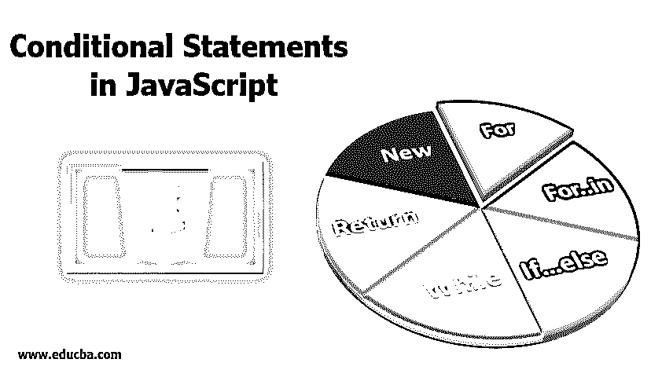

# JavaScript 中的条件语句

> 原文：<https://www.educba.com/conditional-statements-in-javascript/>




## JavaScript 中条件语句的介绍

Javascript 是一种常用的轻量级开源[计算机编程语言](https://www.educba.com/computer-programming-language/)，用于设计部分网页，用于客户端到服务器或者从服务器到客户端的交互。它主要用于操作、验证和计算数据。不仅如此，它还被用来操纵 html 和 css。常用的 javascript 变量有数字、字符串、对象、数组和函数。在函数变量下面是 javascript 中的条件语句。它还具有面向对象的能力。早期的 javascript 被称为 LiveScript。Javascript 还可以创建以网络为中心的应用程序。

围绕我们的话题，条件语句是编程语言语法中非常重要的一部分。这对于根据我们的程序做出有条件的决策非常有用。语句是 JavaScript 引擎可以执行的任何命令或句子，以使某事发生或产生某些副作用。条件语句也用于维护 javascript 中的数据流或程序流。条件语句被设计为独立工作，而不考虑依赖关系，如方法、对象和属性。

<small>网页开发、编程语言、软件测试&其他</small>

### JavaScript 中不同的条件语句

下面列出了 javascript 中常用的一些条件语句。

*   破裂
*   继续
*   为
*   为..在
*   如果…否则
*   新的
*   返回
*   定义变量
*   在…期间
*   随着

因此，让我们简单地讨论一下它们，并找出每个 javascript 条件语句之间的主要和边缘差异。

#### 1.破裂

break 语句指示 javascript 立即退出受控结构，并在结构的该点之后继续执行过程。它用于条件语句中，符合以下命令，如 for、for..在，同时。它还用于在特定时间完全停止 for 循环或中断执行点。

**例如**

```
for (Count=1; Count<=10; Count++) {
if (Count == 8)
break;
document.write ("<h1>Loop: " + Count + "</h1>");
}
```

#### 2.继续

Continue 条件语句告诉 javascript，要立即跳过或保留 for、fon 中的当前迭代..in 或 while 循环，它可以在下一次迭代中处理程序。连续条件语句的主要用途是可以跳过循环中指令的一部分，但不能像 break 语句那样完全退出循环。

**例如**

```
for (Count=1; Count<=10; Count++) {
if (Count == 7)
continue;
document.write ("<h1>Loop: " + Count + "</h1>");
}
```

#### 3.为

对于条件语句，在循环中重复一段代码一次或多次。for 循环中的迭代次数由我们作为参数提供的值来处理。for 语句的正式语法是:

**for(InitVal；测试；增量)**

在哪里，

*   **InitVal:** 一个循环的起始值往往是 0 或 1，但根据需要可以是任意数量的选择。可以写成 I = 1 或者 0。
*   **测试:**用于处理循环的迭代次数；只要循环得到真表达式，当测试表达式变为假时，循环立即结束。这是一个像伯爵<一样的条件。
*   **Increment:** 该语句告诉 javascript 循环如何在迭代中进行递增或递减。写的像 count++或者 i++。

**例如**

```
for (Count=1; Count<=10; Count++) {
document.write ("Iteration: "+Count+"<BR>");
}
```

#### 4.为..在

与 for 语句不同，for..语句中不使用测试或其他表达式。

**对于..在语法上是**

```
for (var in object) {
statements
}  ;
```

在哪里，

*   var 是变量的名称
*   对象是您希望检查的对象
*   语句是一个或多个 JavaScript 指令

**例如**

```
function test() {
for (temp in document.myform) {
alert (temp);
}
}
```

#### 5.如果…否则

它用于创建 if 条件语句及其可选的 else 语句。它只测试一个特定的条件，即如果程序中的表达式为真，该条件将执行保留 if 语句的脚本。如果条件为假，则条件语句跳转到脚本中的 else 表达式。if 语句中的表达式不限于==相等运算符。

**例如**

```
if (ExampleVar == 10) {
Count = 1;
Start();
} else {
Count = 0;
Stop();
}
```

#### 6.在…期间

while 条件语句创建一个独特的重复循环，使程序中的脚本能够重复指令集。循环继续进行，直到条件语句为真。当遇到假表达式时，循环中断，后期脚本继续。

**while 语句的语法是**

```
while (Expression)  {
// stuff to repeat
}
```

**例如**

```
Count=0;
Response = prompt ("Please enter a number greater than 1");
Count = 1;
while (Count <= Response) {
document.write ("Count: "+ Count + "<BR>");
Count++;
}
```

**带有 while 条件的 If 语句**

```
Response = prompt ("Please enter a number greater than 1");
Count = 1;
Response = "";
while ((right== "") || (right == "<undefined>")){
right =prompt ("Please enter your surname", "");
}
if (right != null)
alert ("Hello, " + right);
```

#### 7.返回

它用于标记函数的结束。它可以在有返回值或没有返回值的情况下使用。如果该值包含在语句或函数中，则脚本返回该值，否则返回空值。

**例如**

```
function myFunc() {
var OutString = "This is a test";
return (OutString);
}
function myFunc() {
OutString = "This is a test";
return;
}
```

#### 8.新的

它创建现有对象的副本。它通过两种方式创建:

*   date 是一个内置的 JavaScript 对象，因此它用于定义一个新的 date 对象。
*   创建新的用户定义对象。

**例如**

```
now = new Date();
HourNow = now.getHours();
```

到目前为止，我们已经介绍了 javascript 中使用的所有重要的条件语句。因此，我们可以说条件语句就像胶水一样把 javascript 程序粘在一起。

### 推荐文章

这是 JavaScript 中条件语句的指南。这里我们讨论 javaScript 中不同的条件语句，包括 break、continue、For..in 和 If…else 等等。您也可以阅读以下文章，了解更多信息——

1.  [JavaScript 中的 Switch 语句](https://www.educba.com/switch-statement-in-javascript/)
2.  [Matlab 中的 Switch 语句](https://www.educba.com/switch-statement-in-matlab/)
3.  [Java 算术异常](https://www.educba.com/java-arithmeticexception/)
4.  [JavaScript 职业](https://www.educba.com/careers-in-javascript/)


