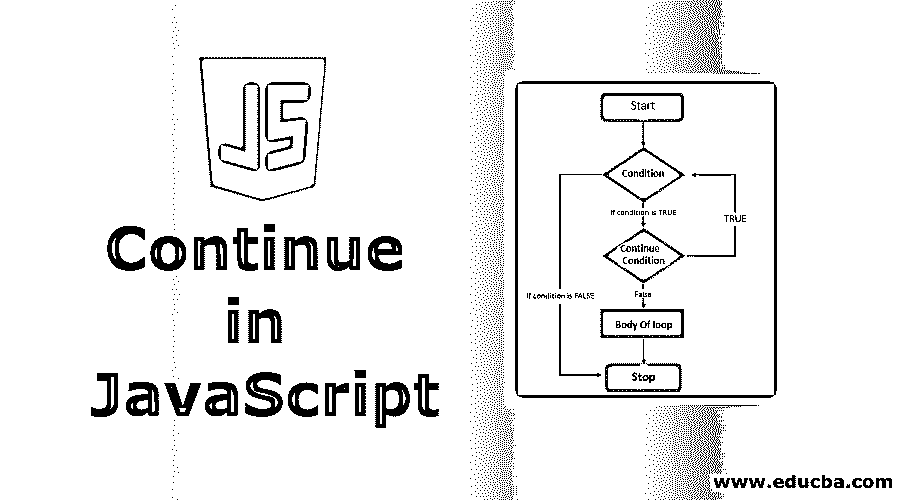
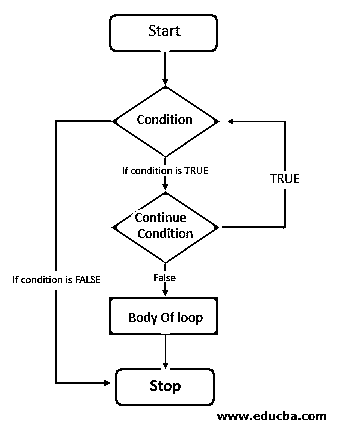
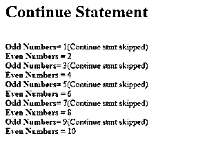
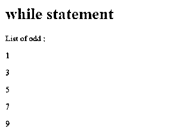
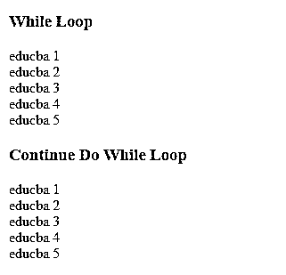
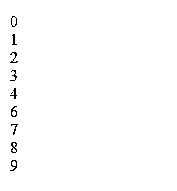
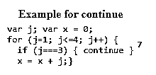
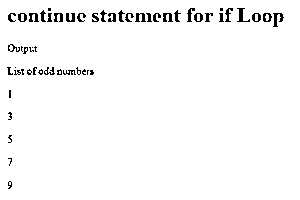

# 继续使用 JavaScript

> 原文：<https://www.educba.com/continue-in-javascript/>




## JavaScript 中的继续介绍

下面的文章提供了 JavaScript 中 Continue 的概要。continue 语句结束标记循环中当前迭代的执行。它跳过循环中的一次迭代。Continue 语句控制循环流。它用在 While 循环、Do While 循环和 For 循环中。当执行程序时，如果 continue 语句存在，则在编译时，循环在当前迭代处停止，并开始新的迭代。

**语法:**

<small>网页开发、编程语言、软件测试&其他</small>

```
Continue;
```

**使用标签引用的另一种方法**

```
Continue labelname;
```

**流程图**




### Continue 语句在 JScript 中是如何工作的？

continue 语句跳过一次迭代。如果循环中提到的某个条件发生，那么它会中断该条件并继续下一次迭代。不带或带引用标签的 continue 语句将只跳转一次循环迭代。

当我们在 for 循环、if 条件、while 和 do while 循环中给出具体条件时。continue 语句将跳过循环中提到的条件，并执行下一次迭代。

#### 1.使用 For 和 If 循环

**例 1:**

**代码:**

```
<html>
<body>
<script type = "text1/jscript">
<!--  document.write("Enter loop!<br /> ");
outloop:
for (var i = 0; i < 3; i++)
{
document.write("Outloop: " + i + "<br />");
for (var j = 0; j < 5; j++)
{
if (j == 3){
continue outloop;
}
document.write("loop: " + j + "<br />");
}
}
document.write("Exit the loop!<br /> ");
//-->
</script>
</body>
</html>
```

**输出:**


**例 2**

**代码:**

```
<!DOCTYPE html>
<html>
<head>
<title> Continue statement </title>
</head>
<body>
<h1> Continue Statement </h1>
<script>
var j;
for(j = 1; j <= 10; j++)
{
if (j % 2 !== 0)
{
document.write("<br \ ><b>Odd Numbers</b>= " + j +"(Continue stmt skipped)");
continue;
}
document.write("<br \ ><b> Even Numbers </b>= " + j);
}
</script>
</body>
</html>
```

**输出:**




在上面的例子中，我们编写了一个程序，在 continue 语句的帮助下只打印偶数。上面的代码将使用 continue 语句忽略奇数，只打印偶数。

#### 2.使用 While 循环列出奇数

**代码:**

```
<!DOCTYPE html>
<html>
<head>
<meta charset=utf-8>
<title>JavaScript while statement:  Example-1</title>
</head>
<body>
<body>
<h1 style="color: red"> while statement</h1>
<p id="result">List of odd  numbers </p>
<script>
var x = 1;
var y = 0;
var z = 0;
document.getElementById("result").innerHTML = "List of odd  : ";
while (x <=10 )
{
z = x %  2;
if (z !== 0)
{
var newParagraph1 = document.createElement("p");
var newText1 = document.createTextNode(x);
newParagraph1.appendChild(newText1);
document.body.appendChild(newParagraph1);
y=y+x;
}
x++;
}
</script>
</body>
</html>
```

**输出:**




#### 3.Do While 循环中的 Continue 语句

**代码:**

```
<!DOCTYPE html>
<html
<head>
<title>
continue statement in Loop
</title>
</head>
<body style="text-align:left;">
<div>
<h1 style="color:blue;">
</h1>
</div>
<h3>While Loop</h3>
<p id="ghr"></p>
<script>
var text = "";
var i = 1;
while (i < 6) {
text += "educba " + i+"<br>";
i++;
}
document.getElementById("ghr").innerHTML
= text;
</script>
<h3>Continue Do While Loop</h3>
<p id="GF1"></p>
<script>
var text = ""
var i = 1;
do {
text += "educba " + i+"<br>";
i++;
}
while (i < 6);
document.getElementById("GF1").innerHTML = text;
</script>
</body>
</html>
```

**输出:**




#### 4.使用 If 条件

**代码:**

```
<!DOCTYPE html>
<html>
<head>
<title>If condition</title>
</head>
<body>
<p id="continue if condition"></p>
<script>
var text = "";
var j;
for(j = 0; j < 10; j++)
{
if(j === 5)
{
continue;
}
text += + j + "<br>";
}
document.getElementById("continue if condition").innerHTML = text;
</script>
</body>
</html>
```

**输出:**




在上面的例子中，我们在 if 条件中使用了 continue 语句。当我们执行从 0 到 9 的程序时，只有 5 会被省略。剩余的所有数字都将打印在输出中。

#### 5.JavaScript 继续标签语句

**代码:**

```
<!DOCTYPE html>
<html>
<head>
<title>Continue Label Statement</title>
</head>
<body>
<p id="continue label statement"></p>
<script>
for(var j = 1; j < 5; j++){
inner:
for (var k = 0; k < 5; k++){
if (k == 2){
document.writeln("skip");
continue inner;
}
document.writeln("j : " + j + ", k :" + k);
}
document.writeln();
}
</script>
</body>
</html>
```

**输出:**


#### 6.无条件继续语句

**代码:**

```
<!DOCTYPE html>
<html> <!-- Continue Statement-->
<head>
</head>
<body>
<table>
<tr>
<th>Example for continue</th>
<th>Resulting value <code>y</code></th>
</tr>
<tr>
<td><code id="Example for continue"></code></td>
<td><code id="Results"></code></td>
</tr>
</table>
<script>
document.getElementById("Example for continue").innerHTML =
'var j; var x = 0;<br>' +
'for (j=1; j&lt;=4; j++) {<br>' +
'&nbsp;&nbsp;if (j===3) { continue }<br>' +
'&nbsp;&nbsp;x = x + j;<br>' +
'}';
var j;
var y = 0;
for (j=1; j<=4; j++) {
if (j===3)
{ continue
}
y = y + i;
}
document.getElementById("Results").innerHTML = y;
</script>
</body>
</html>
```

**输出:**




在上面的程序中，结果是 7。

#### 7.用 For，If 循环继续语句

**代码:**

```
<!DOCTYPE html>
<html>
<head>
</head>
<h1>continue statement for if Loop</h1>
<p id="result">Output</p>
<p id="result"></p>
<body>
<p id="continue if condition"></p>
<script>
var newPara = document.createElement("p");
var newText = document.createTextNode('List of odd numbers');
newPara.appendChild(newText);
document.body.appendChild(newPara);
var z = 0;
var y = 0;
for(y=1; y<=10; y++)
{
if(y%2===0)
{
continue;
}
var newPara = document.createElement("p");
var newText1 = document.createTextNode(y);
newPara.appendChild(newText1);
document.body.appendChild(newPara);
}
</script>
</body>
</html>
```

**输出:**




### 结论–继续使用 JavaScript

continue 可用于从一个条件或迭代跳转到所需的输出。在程序中使用“continue”语句有多种方式。我们可以在循环中给出某些条件，并使用 continue 语句仅在特定时间跳过这些条件。这里可以使用 continue 语句来修改输出。想象一下，如果你只想打印偶数。然后，continue 语句可以用来只打印上述程序中的偶数。在每次迭代中，我们需要检查 j 是否是奇数。如果 j 是奇数，我们应该使用“continue”语句来中断迭代。如果 j 是偶数，那么我们继续迭代，只取偶数。

### 推荐文章

这是一个继续使用 JavaScript 的指南。这里我们讨论语法、流程图以及 Continue 语句在 JavaScript 中是如何工作的？您也可以看看以下文章，了解更多信息–

1.  [JavaScript 关键字](https://www.educba.com/javascript-keywords/)
2.  [继续 C++中的语句](https://www.educba.com/continue-statement-in-c-plus-plus/)
3.  [JavaScript 中的 Case 语句](https://www.educba.com/case-statement-in-javascript/)
4.  [在 PHP 中继续](https://www.educba.com/continue-in-php/)


