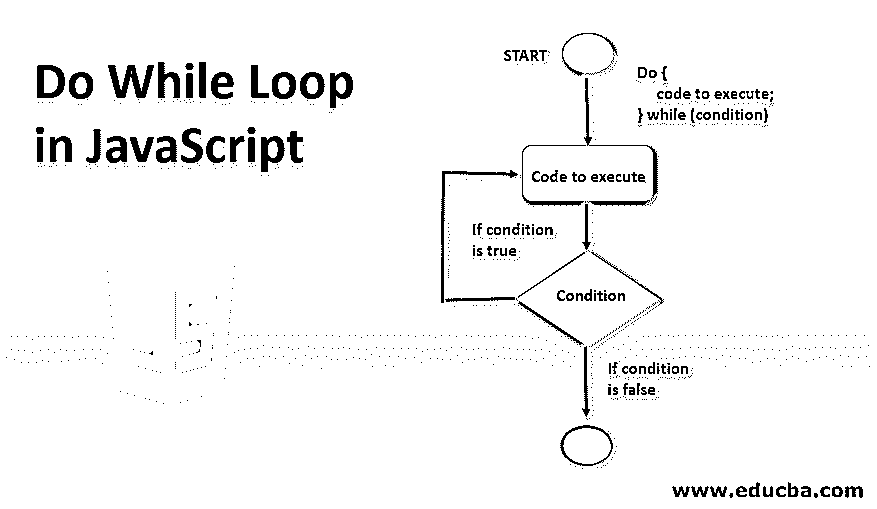
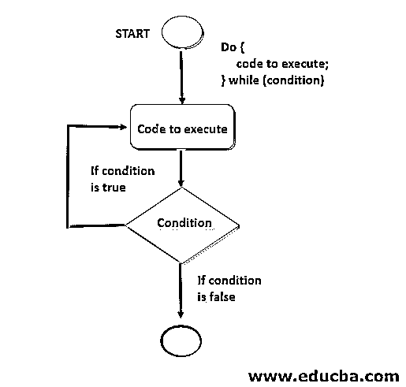

# JavaScript 中的 Do While 循环

> 原文：<https://www.educba.com/do-while-loop-in-javascript/>




## JavaScript 中的 Do While 循环简介

任何编程语言中的 Do while 循环都用作退出控制的条件循环，其中循环至少执行一次，直到 while 条件没有返回 true 值为止。例如，javascript 中 do while 循环的语法是‘do {…} while (condition)，其中在读取“while”内部的条件之前，将执行一次“{ 0 }”和“}”之间的代码段。循环将持续执行，直到控件读取 while 条件，返回值为 false，这将结束 do while 循环处理。

**语法**

<small>网页开发、编程语言、软件测试&其他</small>

JavaScript 中 Do while 循环的语法如下:

```
do {
//code to be executed
} while (condition);
```

上述语法清楚地表明，放置在 do 块中的语句集将在满足条件之前执行一次。因此，这些语句在没有进行条件测试的情况下运行。一旦这个代码块运行，它将作为一个正常的 while 循环进行测试。为了检查这一点，我们可以设置一个变量为 0。这可以在 do 语句中递增，然后将条件设置为 false。

让我们举一个如下的例子:

```
//setup variable as 0
let a=0;
do{
a++;
console.log(a);
} while(false);
```

这里的输出是 1。代码执行时，代码开始执行，循环从 0 开始运行一次，直到不满足条件。循环创建后，即使不满足指定的条件，也会至少运行一次。

### JavaScript 中的 while 循环是如何工作的？

*   do while 循环是 while 循环的变体，它执行一组语句，直到提到的条件评估为 false。在 do while 中，所发现的区别是，循环中的语句集至少执行一次，即使不满足所提到的条件。while 和 do while 循环的主要区别在于，while 循环在每次迭代开始时对条件进行评估。
*   如果指定条件的计算结果为 false，则该条件所遵循的循环将永远不会执行。然而，当 do while 出现时，循环至少执行一次。虽然条件不满足，但它会被执行一次。这是因为条件是在 do while 循环中的循环结束时指定的。因此，循环中的条件只执行一次。

### 边做边流程图

让我们通过流程图来理解这个循环的工作原理。




*   这里的流程图解释了 JavaScript 中 do while 循环的完整工作过程。 [do while 循环的工作方式](https://www.educba.com/do-while-loop-in-c-plus-plus/)类似于 while 循环，其中有一组要执行的条件，直到满足某个条件。
*   一旦流程开始，上图中的进程框说明代码将开始执行。一旦代码被执行，它将检查条件是否满足。这显示在评估条件的决策框中。如果该条件为真，则再次执行代码。它将返回到图中的流程框，并执行给定的一组语句。
*   如果给定的条件为假，那么代码将停止执行，循环将退出。这里，while 和 do while 之间的主要区别在于，即使条件不为真，进程块的语句也会执行一次，甚至是在条件被评估之前。流程图也表明了这一点。如果条件为真，循环将在第一次执行后继续运行，如果条件为假，循环将退出。

### 例子

**代码:**

```
<!DOCTYPE html>
<html>
<head>
<title> Do While Loop in JavaScript</title>
</head>
<body>
<h1> Do While </h1>
<script>
var num = 10, total=0;
do
{
total = total + num;
document.write("<br\>Number = " + num);
document.write("<br\>Total Value is = " + total);
num++;
}while (number < 15);
document.write("<br\>Total Value from outside the Loop is = ", total);
</script>
</body>
</html>
```

在上面的代码中，我们声明了一个变量 number，它的值初始化为 10。总变量被初始化为 0。该变量将在循环运行时计算总数。当循环开始时，该数字被加到总数中。下一步将 num 变量的值增加 1。然后测试 while 条件，该条件为真，即 10 < 15。该循环将再次运行，如下所示:

```
0= 0 + 10
21= 10+11
33= 21+12
46= 33+13
60= 46+14
```

总数达到 60 后，num 将增加到 15。这里，条件变为 15 <15\. This is not satisfactory. The [do，而循环退出](https://www.educba.com/do-while-loop-in-matlab/)，因为条件不满足。

**输出:**

数量= 10

总值= 10

数量= 11

总值= 21

数量= 12

总值= 33

数量= 13

总值= 46

14 号

总值= 60

来自循环外部的总值= 60

这就是 do while 循环的工作方式。循环将一直执行，直到满足条件。一旦不满足条件，循环将退出，执行后面的语句。

### 结论——在 JavaScript 中执行 While 循环

do while 循环类似于 while 循环，其中执行一组给定的语句。这里的区别在于，即使不满足条件，do while 循环也会完全执行。do while 循环一直执行到指定的条件为真，如果条件不满足，则立即退出。要完成需要在迭代中执行的任务，可以使用 do while 循环。因此，在 Javascript 中，当要执行迭代任务时，do while 循环会很有用。Javascript 支持这种循环，需要时可以随时使用。

### 推荐文章

这是 JavaScript 中 While 循环的指南。这里我们讨论语法、流程图和例子，以及它在 JavaScript 中是如何工作的。您也可以阅读以下文章，了解更多信息——

1.  [JavaScript 中的 For 循环](https://www.educba.com/for-loop-in-javascript/)
2.  [JavaScript 中的模式](https://www.educba.com/patterns-in-javascript/)
3.  [JavaScript 中的 While 循环](https://www.educba.com/while-loop-in-javascript/)
4.  [JavaScript 的特性](https://www.educba.com/features-of-javascript/)


