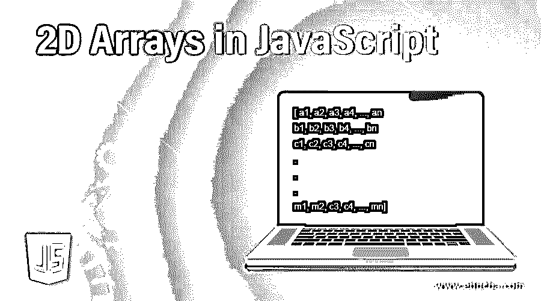
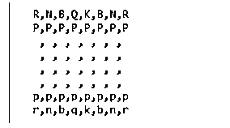
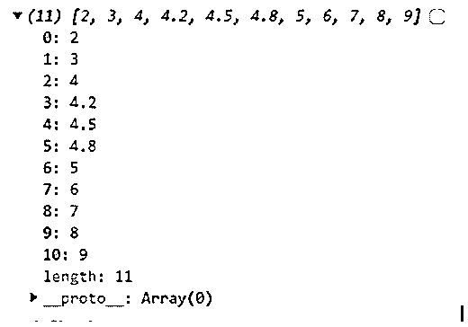
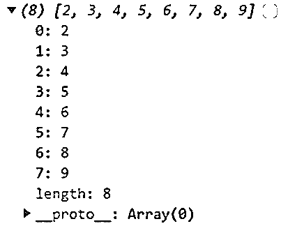

# JavaScript 中的 2D 数组

> 原文：<https://www.educba.com/2d-arrays-in-javascript/>




## JavaScript 中的 2D 数组简介

二维数组是跨越多行和多列的同质元素的集合，采用矩阵的形式。下面是一个 2D 数组的例子，它有 m 行和 n 列，因此创建了一个 mxn 配置的矩阵。在这个主题中，我们将学习 JavaScript 中的 2D 数组。

```
[ a1, a2, a3, a4, ..., an
b1, b2, b3, b4, ..., bn
c1, c2, c3, c4, ..., cn
.
.
.
m1, m2, m3, m4, ..., mn]
```

### 交错数组的概念

从技术上讲，JavaScript 中没有二维数组。JavaScript 通过交错数组(数组的数组)支持 2D 数组。交错数组本质上是多个数组交错在一起形成一个多维数组。

<small>网页开发、编程语言、软件测试&其他</small>

JavaScript 中的二维数组是多个一维数组的交错数组。因此，交错数组可能看起来像这样:

```
[ [ a1, a2, a3, a4, ..., an ],
[ b1, b2, b3, b4, ..., bn ],
[ c1, c2, c3, c4, ..., cn ],
.
.
.
[ m1, m2, m3, m4, ..., mn ] ]
```

### 真实 2D 阵列与交错阵列

编程语言在多维数组的实现上有所不同。一些编程语言像 C，C++，C#，Fortran 等。支持真正的 2D 阵列。而其他人则用数组的数组(也称为交错数组)来模拟这种行为。那么，真正的二维数组和交错数组有什么不同呢？

多维数组的两种实现在存储消耗方面是不同的。虽然真正的 2D 阵列将具有 m 行 n 个元素，但是交错阵列可以具有 m 行，每一行具有不同数量的元素。这导致数据集的空间浪费最小。因此，下面的交错数组非常好:

```
int[][] jaggedArray = [ [1, 2, 3, 4],
[5, 6, 7],
[8, 9] ]
```

如果在真正的 2D 阵列中实施相同的数据集，它将如下所示:

```
int[,] multiDimArray = [ 1, 2, 3, 4
5, 6, 7, 0
8, 9, 0, 0 ]
```

### 如何用 JavaScript 创建 2D 数组？

注意——在本文的所有例子中，我们将使用浏览器的开发人员控制台。只需打开浏览器开发者工具(Ctrl/Cmd + Shift + C)并转到开发者工具窗口中的控制台选项卡。

在 Chrome 中看起来是这样的:


这是大多数 JavaScript 相关概念的游乐场。在整篇文章中，我们都会用到这个操场。

#### 使用方括号

如果元素数量有限，可以用下面的语法在 JavaScript 中创建一个 2D 数组:

```
var varName = [
[ elements ],
[ elements ],
[ elements ] ... ];
```

**例子**

下面的例子用 2D 数组实现创建了一个棋盘。

```
var chessBoard = [
['R','N','B','Q','K','B','N','R'],
['P','P','P','P','P','P','P','P'],
[' ',' ',' ',' ',' ',' ',' ',' '],
[' ',' ',' ',' ',' ',' ',' ',' '],
[' ',' ',' ',' ',' ',' ',' ',' '],
[' ',' ',' ',' ',' ',' ',' ',' '],
['p','p','p','p','p','p','p','p'],
['r','n','b','q','k','b','n','r'] ];
console.log(board.join('\n'));
```

**输出**




#### 使用 new()构造函数

当您事先不知道元素时，您可以简单地使用 for 循环和一个新的构造函数创建一个数组。JavaScript 将用未定义的值初始化每个元素。

**例子**

```
var array2D = new Array(8);
for(var i = 0; i< array2D.length; i++){
array2D[i] = new Array(8);
};
console.log(array2D);
```

**输出**


这将创建一个包含 8 个空数组的空数组。

**避免使用 new()运算符。**

注意–建议使用方括号方法在 JavaScript 中创建数组。这是因为使用新方法告诉解释器调用数组构造函数。这是解释器的额外工作，因为它必须全局搜索数组构造函数，然后调用它。

此外，如果您用自己的自定义定义覆盖数组构造函数，解释器将调用您的自定义构造函数，而不是全局数组构造函数。这可能导致整个应用程序的混乱和不一致。

### JavaScript 中对 2D 数组的操作

现在我们已经用 JavaScript 创建了 2D 数组，让我们学习一下可以在这个数组上执行什么操作。我们将看看如何访问、插入、删除和更新数组中的元素。

因此，我们创建一个数组，并用如下值初始化它:

```
var array2D = new Array(8);
for(var i = 0; i< array2D.length; i++){
array2D[i] = new Array(i, i+1, i+2, i+3, i+4, i+5, i+6,
i+7);
};
console.log(array2D);
```

**输出:**


#### 访问元素

为了访问数组中的元素，我们使用方括号符号。注意，JavaScript 只支持数组中基于整数的索引。基于字符串的索引将变量的类型从数组更改为对象，并导致它丢失一些作为数组的属性。

```
array2D[2][4] // this is right
array2D['abc']['xyz'] //this is no longer an Array
```

因此，为了访问数组的元素，我们将使用基于整数的索引。

**访问第一个和最后一个元素**

```
// This gives us the first element
console.log("First Element : " + array2D[0][0]);
// This gives us the last element
console.log("Last Element : " + array2D[array2D.length -
1][(array2D[array2D.length -1]).length - 1]);
```

**输出:**


访问最后一个元素非常简单。我们知道第一个元素的索引是[0，0]。但是，我们不知道最后一个元素的索引。因此，为了访问最后一个元素，我们使用了数组的 length 属性。

因为索引从 0 开始，所以最后一个索引总是比数组长度小 1。因此，我们确定了外部数组的长度和最后一个交错数组的长度，以获得 x 和 y 索引。

**遍历所有元素**

我们可以使用 for 循环或 forEach 循环遍历数组中的所有元素。当我们创建和初始化数组时，我们已经看到了 for 循环。现在让我们尝试使用 forEach 循环获得数组中所有元素的总和。

```
var sum = 0;
array2D.forEach((x) => {
x.forEach((y) => {
sum += y;
})
})
console.log("The sum of all elements in the array is :" +sum);
```

**输出:**


#### 插入/移除元素–推动和弹出

**在数组的末尾插入**

我们可以使用 push()方法在数组中插入新元素。push()方法在数组末尾插入元素。

```
var newLength = array2D[array2D.length - 1].push(111);
console.log("Element added : " + array2D[array2D.length - 1]
[newLength - 1]);
```

**输出:**


push()方法返回数组的更新长度。我们可以在变量中捕获新的长度，并在我们的应用程序中进一步使用它。

**从数组末尾移除**

我们可以使用 pop()方法移除数组中的元素。此方法从数组中移除最后一个元素。

```
var ele = array2D[array2D.length - 1].pop();
console.log("Element removed : " + ele);
```

**输出:**


pop()方法返回从数组中移除的元素。

#### 插入/移除元素-拼接

splice()方法用于通过添加、移除或替换数组中的元素来修改数组内容。

splice()方法的语法是:

```
array.splice(start, deleteCount, ...items)
```

**在给定索引处插入**

我们可以使用 splice()方法在数组中插入新元素。为此，我们在 splice 方法中将 deleteCount 属性指定为 0。然后，我们提到的作为参数的项被插入到数组中由 start 参数指定的索引处。

```
array2D[2].splice(3, 0, 4.2, 4.5, 4.8);
console.log(array2D[2]);
```

**输出:**




**从给定索引中删除**

同样，我们可以使用 splice()方法从给定的索引中删除元素。为此，我们在 start 参数中指定索引，然后在 deleteCount 参数中指定要删除的元素数量。如果未指定 deleteCount，则删除数组开头到结尾的所有元素。

```
array2D[2].splice(3, 3);
console.log(array2D[2]);
```

**输出:**




#### 更新元素

就像访问数组中的元素一样，我们也可以更新元素。我们需要知道的只是要更新的元素的正确索引。

下面的代码更新了数组中的所有元素，并对它们求平方。

```
for(var i = 0; i < array2D.length; i++){
for(var j = 0; j < array2D[i].length; j++){
array2D[i][j] *= array2D[i][j];
}
}
console.log(array2D);
```

**输出:**


### 结论

我们已经看到 JavaScript 中的数组是交错的数组。这在开始时可能有点难以理解和适应，但是一旦理解了交错数组的概念，使用 JavaScript 数组就变得容易了。

我们已经介绍了 JavaScript 数组的基础知识——创建、插入、移除和更新元素。JavaScript 数组中还有许多其他方法，对于开发优秀且健壮的 JavaScript 应用程序非常有益。建议更深入地研究数组，并探索其他方法，使数组的使用更加方便。

### 推荐文章

这是 JavaScript 中 2D 数组的指南。这里我们讨论如何用 JavaScript 创建 2D 数组，以及交错数组的操作和概念。您也可以看看以下文章，了解更多信息–

1.  [JavaScript 地图对象](https://www.educba.com/javascript-map-object/)
2.  [JavaScript 文件阅读器](https://www.educba.com/javascript-filereader/)
3.  [JavaScript 字符串编号](https://www.educba.com/javascript-string-to-number/)
4.  [JavaScript 中的动态数组](https://www.educba.com/dynamic-array-in-javascript/)


