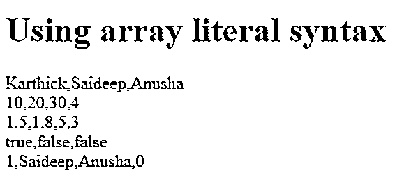
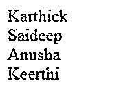

# JavaScript 声明数组

> 原文：<https://www.educba.com/javascript-declare-array/>


## JavaScript 声明数组简介

Javascript 数组是一个包含元素列表的全局对象。它类似于其他变量，它们根据数据类型声明保存任何类型的数据，但不同之处在于数组可以一次保存多个项。Javascript 允许以多种方式声明数组。其中最重要和最常见的是“使用数组构造函数”和“使用文字符号”。

**语法:**

<small>网页开发、编程语言、软件测试&其他</small>

该数组接受由逗号分隔并用方括号括起来的项目列表。

```
var <array_name> = [element0, element1, element2, element3, ….. ];
```

数组中的元素可以是任何数据类型，如字符串、数字、布尔值、对象等，这意味着数组可以由第一个位置的字符串数据类型、第二个位置的数字、第三个位置的布尔值等组成。javascript 中的数组从索引 0 开始，因此被称为从零开始。


在这里，我们可以看到索引 0 和索引 1 有字符串值，而索引 2 有数字

### 如何在 JavaScript 中声明数组？

让我们通过例子来了解在 javascript 中声明数组的各种方法。

#### 示例#1

这是用方括号中的逗号分隔的值列表创建数组的最简单方法。

**代码:**

```
<!DOCTYPE html>
<html>
<body>
<h1>Using array literal syntax</h1>
<script>
var sArray = ["Karthick", "Saideep", "Anusha"];
var nArray = [10, 20, 30, 4];
var dArray = [1.5, 1.8, 5.3];
var bArray = [true, false, false];
var Array = [1, "Saideep", "Anusha", 0];
document.write(sArray);
document.write('</br>');
document.write(nArray);
document.write('</br>');
document.write(dArray);
document.write('</br>');
document.write(bArray);
document.write('</br>');
document.write(Array);
</script>
</body>
</html>
```

**输出:**




#### 实施例 2

用户可以使用 new 关键字通过数组构造函数初始化数组。如果我们事先知道数组将包含多少个元素，那么元素的计数可以传递给数组构造函数，因此数组将使用指定的计数来创建，而值将是未定义的

**代码:**

```
<!DOCTYPE html>
<html>
<body>
<h1>Using array constructor syntax 'new' keyword</h1>
<script>
var sArray = new Array();
sArray[0] = "Karthick";
sArray[1] = "Saideep";
sArray[2] = "Anusha";
sArray[3] = "Sam";
var nArray = new Array(3);
nArray[0] = 10;
nArray[1] = 20;
nArray[2] = 35;
var hybridArray = new Array(1, "Saideep", 35, "Anusha");
document.write(sArray);
document.write('</br>');
document.write(nArray);
document.write('</br>');
document.write(hybridArray);
</script>
</body>
</html>
```

**输出:**


这些数组只能有数字索引，不像 javascript 中的[关联数组](https://www.educba.com/associative-array-in-javascript/)如下所示是 javascript 中普通数组的错误声明方式，

**代码:**

```
var sArray = new Array();
sArray["zero"] = "Karthick";
sArray["one"] = "Saideep";
sArray["two"] = "Anusha";
sArray["three"] = "Sam";
```

如上所述，数组元素也可以是对象，由于这个优点，用户可以在同一个数组中拥有不同类型的数据、函数以及数组内部的数组。

**代码:**

```
dateArray[0] = Date.now;
funcArray[1] = myFunction;
employeeArray[2] = infyEmployee;
```

#### 实施例 3

**代码:**

```
<!DOCTYPE html>
<html>
<body>
<script>
var houseArray = ["1BHK", 250000, "2BHK", 500000, "3BHK", 750000, "Sale", true];
document.write(houseArray[2]+" cost= "+houseArray[3]);
var cost_2BHK = houseArray[3];
var is_for_sale= houseArray[1];
document.write('</br>');
document.write("Cost of 2BHK = "+ cost_2BHK);
document.write('</br>');
document.write("Cost of 1BHK = "+ is_for_sale+ " is for sale");
</script>
</body>
</html>
```

**输出:**


在创建数组之后，作为 javascript 开发人员，我们需要知道数组方法，比如对 javascript 数组方法执行的长度、原型、反转、排序、弹出、移位和推送方法

现在让我们来看看 javascript 中数组的一些优点。

*   缓存友好
*   易于调试
*   节省内存
*   优于变量和数据结构
*   代码的可重用性
*   多维数组

*使用数组文字语法，如果我们将一个数字放在方括号中，javascript array 会返回 number，但使用关键字' new '，如果我们将 number 传递给数组构造函数，它会返回数组的长度。

#### 实施例 4

**代码:**

```
<!DOCTYPE html>
<html>
<body>
<script>
var sArray = new Array("Karthick", "Saideep", "Anusha", "Keerthi");
for (var i = 0; i < sArray.length ; i++)
{
document.write(sArray[i]);
document.write('</br>');
}
</script>
</body>
</html>
```

**输出:**




如果我们用两个或两个以上的参数调用构造函数，这些参数初始化数组元素。由于插入和删除操作，以及由于数组长度固定而造成的内存浪费，时间复杂度增加，即一旦数组被声明，数组大小就不能被修改。

### 推荐文章

这是一个 JavaScript 声明数组的指南。在这里，我们讨论了在 javascript 中声明数组的介绍和各种方法，以及相应的例子。您也可以阅读以下文章，了解更多信息——

1.  [JavaScript 调用函数](https://www.educba.com/javascript-call-function/)
2.  [JavaScript 尝试捕捉](https://www.educba.com/javascript-try-catch/)
3.  [JavaScript 设置类](https://www.educba.com/javascript-set-class/)
4.  [JavaScript 未定义](https://www.educba.com/javascript-undefined/)


