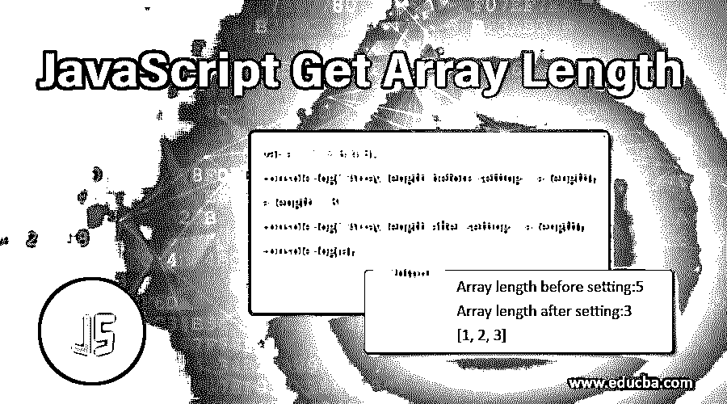

# JavaScript 获取数组长度

> 原文：<https://www.educba.com/javascript-get-array-length/>




## JavaScript 获取数组长度简介

JavaScript 中的 Get Array Length 是一种方法，用于以无符号 32 位整数的形式检索特定数组中的数据/元素的数量。此方法的语法是“Array_name.length”，其中 Array_name 将被替换为实际的数组名，length 用于返回指定数组中元素总数的计数。通过使用语法“Array_name.length = N”，该方法也可用于限制或设置数组的长度，其中 N 表示用户希望设置为数组长度的数字。

****语法:****

<small>网页开发、编程语言、软件测试&其他</small>

```
Array_name.length   //returns the length of an array
OR
Array_name.length = N  //sets the length of an array with the specified N number
```

### JavaScript 获取数组长度的例子

下面是 JavaScript 获取数组长度的详细解释的例子。

#### 示例#1

在这个例子中，我们将看到如何在 JavaScript 中使用数组对象的 length 属性来查找它的长度。

**代码:**

```
var a = [1,2,3,4,5];
console.log(a.length);
```

**输出:**


在上面的示例中，我们学习了如何使用密集数组(即所有索引都被一个元素占用的数组)的 length 属性来查找数组中存在的元素总数。

**Note:** The length of a dense array equals to the total number of elements present in the array.

#### 实施例 2

在这个例子中，我们将使用另一种方法来定义数组对象。在第一种情况下，我们只是给数组中的第 10 个<sup>索引赋值。在第二种情况下，我们创建一个新的长度等于变量值的数组。</sup>

**代码:**

```
var a = [];
a[10] = 10;
console.log(a.length);
```

**输出:**


在上面的例子中，我们学习了如何在一个稀疏数组上使用 length 属性(例如，一个带有未定义元素的数组)来寻找数组的长度。

**Note:** The length of a sparse array equals to the sum of its highest index with one.

运筹学

**代码:**

```
var length = 10;
var a = new Array(length);
console.log(a.length);
```

**输出:**


上面的例子解释了如何使用 JavaScript 的一个新的 array 对象来创建一个指定长度的数组。这里，数组的长度将与传递给对象的变量值相同。

#### 实施例 3

在本例中，我们将在 for 循环中使用数组的 length 属性来查找数组中值不等于 undefined 的实际元素的总数。

**代码:**

```
var a = [1,2,3,4,5];
a[10] = 10;
var counter = 0;
for (var i = 0; i < a.length; i += 1) {
if (i in a) {
counter = counter + 1;
}
}
console.log(counter);
```

**输出:**


在上面的例子中，我们将学习如何截断数组中未定义的值，同时生成数组中存在的元素总数。

#### 实施例 4

在本例中，我们将遍历数组，并使用 length 属性打印数组的所有元素。

**代码:**

```
var a = [1,2,3,4,5];
a[10] = 10;
var b = '';
for (var i=0; i < a.length; i++){
b += a[i] + ", ";
}
console.log(b);
```

**输出:**


在这里，我们将了解到，如果在初始化数组时一些索引为空，这些索引值将被打印为未定义。

#### 实施例 5

在下面的例子中，我们将了解如何设置一个数组对象的长度属性。

**代码:**

```
var a = [1,2,3,4,5];
console.log("Array length before setting:",a.length);
a.length = 3;
console.log("Array length after setting:",a.length);
console.log(a);
```

**输出:**


上面的例子解释了如何使用 length 属性改变一个已定义数组的长度。

#### 实施例 6

在下面的例子中，我们将了解长度属性的动态行为。

**代码:**

```
var a = [1,2,3,4,5];
console.log("Array length:",a.length);
var j = 10;
for(var i=0 ; i< 5 ; i++){
a.push(j);
j = j+5;
}
console.log("Array length after modification:",a.length);
```

**输出:**


上面的例子简要地解释了长度属性的动态行为，因为在定义的数组中插入一个新元素后，数组的长度会相应地自动改变。

### JavaScript 中 Array.length 的属性特性

Array.length 有三个属性，即可写、可配置和可枚举。

*   ******可写:**** 默认情况下，该属性设置为 true。通过将其更改为 false，该属性不允许对 length 属性进行进一步的修改。**
***   ******可配置:**** 默认情况下，该属性被设置为 false 含义，我们既不能删除该属性也不能进一步改变其任何属性(即可写、可配置、可枚举)。*****   ******可枚举:**** 默认情况下，该属性设置为 false。如果将它更改为 true，则该属性将在 for 或 for-in 循环中迭代。******

 ****#### 示例#1

在这个例子中，我们将了解 array.length 值的默认属性。

**代码:**

```
var a = [];
a.length = 10;
console.log("Before:",a.length);
console.log(Object.getOwnPropertyDescriptor(a,'length'));
```

**输出:**


#### 实施例 2

在这个例子中，我们将 writable 属性修改为 false，这进一步不允许我们更改数组的 length 属性。

**代码:**

```
var a = [];
a.length = 10;
console.log("Before:",a.length);
Object.defineProperty(a, 'length', { writable: false });
a.length = 5;
console.log("After:",a.length);
```

**输出:**


#### 实施例 3

在这个例子中，我们知道 array.length 属性的可枚举属性不能被修改，因为默认的可配置值被设置为 false。

**代码:**

```
var a = [];
a.length = 10;
console.log(a.length);
Object.defineProperty(a, 'length', { enumerable: true });
console.log(Object.getOwnPropertyDescriptor(a,'length'));
```

**输出:**


#### 实施例 4

在本例中，我们知道 array.length 属性的可配置属性不能修改，因为默认的可配置值设置为 false。

**代码:**

```
var a = [];
a.length = 10;
console.log(a.length);
Object.defineProperty(a, 'length', { configurable: true });
console.log(Object.getOwnPropertyDescriptor(a,'length'));
```

**输出:**


### 结论

我们从迄今为止的长度属性中总结出以下几点:

*   在密集数组的情况下，数组的长度属性返回数组中存在的元素总数，而在稀疏数组的情况下，它返回数组的最高索引与 1 的和。
*   我们无法修改 array.length 属性的可配置和可枚举特性，但是可以修改可写特性。
*   length 属性用于设置数组的长度，也可用于截断已定义数组的长度。

### 推荐文章

这是一个 JavaScript 获取数组长度的指南。这里我们讨论 JavaScript Get Array Length 的例子以及 Array.Length 的属性

1.  [JavaScript 未定义](https://www.educba.com/javascript-undefined/)
2.  [JavaScript 确认](https://www.educba.com/javascript-confirm/)
3.  [JavaScript 自定义事件](https://www.educba.com/javascript-custom-events/)
4.  [JavaScript 字符串替换](https://www.educba.com/javascript-string-replace/)


****