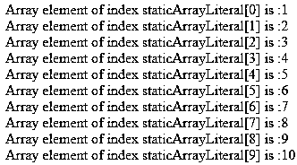
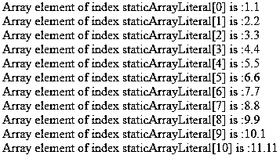
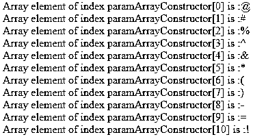
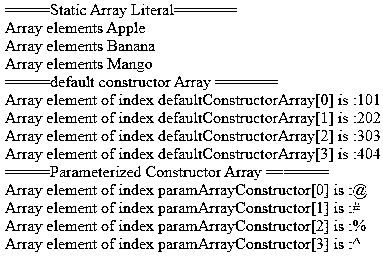
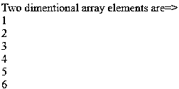

# JavaScript 中的动态数组

> 原文：<https://www.educba.com/dynamic-array-in-javascript/>


## JavaScript 中的动态数组简介

JavaScript 中的动态数组意味着自动增加或减少数组的大小。JavaScript 不是类型依赖的，所以没有静态数组。JavaScript 直接只允许动态数组。我们可以根据索引值添加和删除元素。我们不需要编写额外的逻辑来执行这些操作。当从数组中移除元素时，数组大小必须减小，如果将元素添加到数组中，则数组大小变大。数组用于存储同质元素，这意味着同一时间可以存储相同类型的元素。示例:我们可以存储整数、浮点数、双精度数、字符串、字符、对象等。但每次只限于任何特定类型。

### 如何在 JavaScript 中声明动态数组？

在 Javascript 中，动态数组有三种声明方式:

<small>网页开发、编程语言、软件测试&其他</small>

**1。通过使用文字**

```
var array= ["Hi", "Hello", "How"];
```

**2。通过使用默认的构造函数**

```
var array= new Array();
```

**3。通过使用参数化构造函数**

```
var array= new Array("Hi", "Hello", "How");
```

### JavaScript 数组元素是如何迭代的？

使用以下方法迭代数组元素:

*   For 循环
*   While 循环
*   对于每个循环

**优点:**在 JavaScript 数组中可以根据用户需求增加(拉伸)或减少(收缩)数组大小。

### JavaScript 中动态数组是如何工作的？

以下几点解释了 JavaScript 中数组的工作原理:

它基于文字数组和构造函数数组元素工作。

**1:文字数组**

```
var array = [give some elements];
```

**2:默认构造函数**

```
var array=new Array();
```

**Note:** Array() is a predefined constructor in JavaScript, which creates a dynamic array by default.

**3:** **参数化构造器**

```
var arra=new Array(Give some elements);
```

### JavaScript 中的数组函数

下面是解释数组函数的几点:

**1。push():** push()函数用于向数组中添加元素。

```
Array.push(element)
```

**2。length:** length 用于获取数组的大小。

```
Array.length
```

**3。slice():** slice()函数用于根据索引从数组中移除元素。

```
Array.slice()
```

*   **JavaScript 中的多维数组:**数组在 JavaScript 中作为一个项目添加到另一个数组中，使得数组变成多维的。

```
var a=new Array(new Array(elements), new Array(elements), new Array(elements),……);
```

*   **可以在 JavaScript 中直接给变量赋值数组吗:**可以，JavaScript 允许给变量赋值数组。

```
var a=[1,2,3,4]//if we write this syntax in Java it will shows compilation error.
```

### 例子

以下是用 JavaScript 实现的示例:

#### 示例#1

带有 for 循环的数组文字。

**代码:**

```
//creating an array literal with static values
var staticArrayLiteral=[1,2,3,4,5,6,7,8,9,10];
//iterating array elements with for loop
for (var i = 0; i < staticArrayLiteral.length; i++) {
document.write("Array element of index staticArrayLiteral["+i+"] is :"+staticArrayLiteral[i]+"<br>");
}
```

**输出:**




#### 实施例 2

带有 while 循环的数组文本。

**代码:**

```
//creating an array literal with static values
var staticArrayLiteral=[1.1,2.2,3.3,4.4,5.5,6.6,7.7,8.8,9.9,10.10,11.11];
//iterating array elements with while loop
var temp=0;
while (temp<staticArrayLiteral.length) {
document.write("Array element of index staticArrayLiteral["+temp+"] is :"+staticArrayLiteral[temp]+"<br>");
temp++;
}
```

**输出:**




#### 实施例 3

带有 while 循环的数组文本。

**代码:**

```
//creating an array literal with static values
var staticArrayLiteral=["20-03-1995","2-2-2000","2-03-2001","2-12-2010","21-03-2000"];
//iterating array elements with forEach loop
staticArrayLiteral.forEach(element => document.write("Array elements "+element+"<br>"));
```

**输出:**


#### 实施例 4

带有 for 循环的默认构造函数数组。

**代码:**

```
//creating a default Array constructor
var defaultConstructorArray=new Array();
//adding elements to default constructor with push() function
defaultConstructorArray.push("Ramesh");
defaultConstructorArray.push("Paramesh");
defaultConstructorArray.push("Venkatesh");
defaultConstructorArray.push("Amardeep");
defaultConstructorArray.push("Venkatachalam");
defaultConstructorArray.push("Sachin");
defaultConstructorArray.push("Mahesh");
defaultConstructorArray.push("Dravid");
//iterating array elements with for loop
for (var i = 0; i < defaultConstructorArray.length; i++) {
document.write("Array element of index defaultConstructorArray["+i+"] is :"+defaultConstructorArray[i]+"<br>");
}
```

**输出**:


#### 实施例 5

带有 for 循环的默认构造函数数组

**代码:**

```
//creating a default Array constructor
var defaultConstructorArray=new Array();
//adding elements to default constructor with push() function
defaultConstructorArray.push(10);
defaultConstructorArray.push(20);
defaultConstructorArray.push(30);
defaultConstructorArray.push(40);
defaultConstructorArray.push(50);
defaultConstructorArray.push(60);
//iterating array elements with while loop
var temp=0;
while (temp < defaultConstructorArray.length) {
document.write("Array element of index defaultConstructorArray["+temp+"] is :"+defaultConstructorArray[temp]+"<br>");
temp++;
}
```

**输出:**


#### 实施例 6

带有 for 循环的参数化数组构造函数。

**代码:**

```
//creating parameterized array constructor
var paramArrayConstructor=new Array('A','M','A','R','D','E','E','P');
//iterating array elements with for loop
for (var i = 0; i < paramArrayConstructor.length; i++) {
document.write("Array element of index paramArrayConstructor["+i+"] is :"+paramArrayConstructor[i]+"<br>");
}
```

**输出**:


#### 实施例 7

带 for 循环的参数化数组构造函数

**代码:**

```
//creating parameterized array constructor
var paramArrayConstructor=new Array('@','#','%','^','&','*','(',')','-','=','!');
//iterating array elements with while loop
var temp=0;
while (temp< paramArrayConstructor.length) {
document.write("Array element of index paramArrayConstructor["+temp+"] is :"+paramArrayConstructor[temp]+"<br>");
temp++;
}
```

**输出:**




#### 实施例 8

将数组赋给变量。

**代码:**

```
//creating an array literal and assign it to variable
var staticArrayLiteral=["Apple","Banana","Mango"];
document.write("=====Static Array Literal======="+"<br>");
//iterating array elements with forEach loop
staticArrayLiteral.forEach(element => document.write("Array elements "+element+"<br>"));
//creating a default Array constructor and assign it to variable
var defaultConstructorArray=new Array();
//adding elements to default constructor with push() function
defaultConstructorArray.push(101);
defaultConstructorArray.push(202);
defaultConstructorArray.push(303);
defaultConstructorArray.push(404);
document.write("=====default constructor Array ======="+"<br>");
//iterating array elements with for loop
for (var i = 0; i < defaultConstructorArray.length; i++) {
document.write("Array element of index defaultConstructorArray["+i+"] is :"+defaultConstructorArray[i]+"<br>");
}
//creating parameterized array constructor and assign it to variable
var paramArrayConstructor=new Array('@','#','%','^');
//iterating array elements with while loop
var temp=0;
document.write("=====Parameterized Constructor Array ======="+"<br>");
while (temp< paramArrayConstructor.length) {
document.write("Array element of index paramArrayConstructor["+temp+"] is :"+paramArrayConstructor[temp]+"<br>");
temp++;
}
```

**输出**:




**解释**:在 Java 的情况下，数组值不能直接赋给变量，但我们只能把它赋给数组([]数组类型)，而在 JavaScript 中，我们可以把数组赋给变量。

#### 实施例 9

二维数组。

**代码:**

```
//creating two dimentional array
var a = new Array(new Array(1, 2, 3),new Array(4, 5, 6));
document.write("Two dimentional array elements are=>"+"<br>");
for(var i=0;i<2;i++)
{
for(var j=0;j<3;j++)
{
document.write(a[i][j]+"<br>");
}
}
```

**输出:**




#### 实施例#10

用 splice()函数删除元素。

**代码:**

```
var array = ["Hi","Hello","How","are","you?"];
document.write("Array elements before removing are => <br>"+array+"<br>");
var indexValue = array.indexOf("How");
if (indexValue > -1) {
array.splice(indexValue, 1);
}
document.write("Array elements after removing are => <br>"+array);
```

**输出:**


### 结论

默认情况下，JavaScript 使用预定义的函数动态地给出数组。JavaScript 中的数组可以通过使用数组文字和数组构造函数来创建。

### 推荐文章

这是 JavaScript 中动态数组的指南。这里我们讨论如何读写数组元素，如何声明函数，用构造函数的例子来实现。您也可以浏览我们的其他相关文章，了解更多信息——

1.  [JavaScript 设置类](https://www.educba.com/javascript-set-class/)
2.  [Javascript 地图功能](https://www.educba.com/javascript-map-function/)
3.  [Java 中的动态数组](https://www.educba.com/dynamic-array-in-java/)
4.  [Java 数组迭代器](https://www.educba.com/java-array-iterator/)


