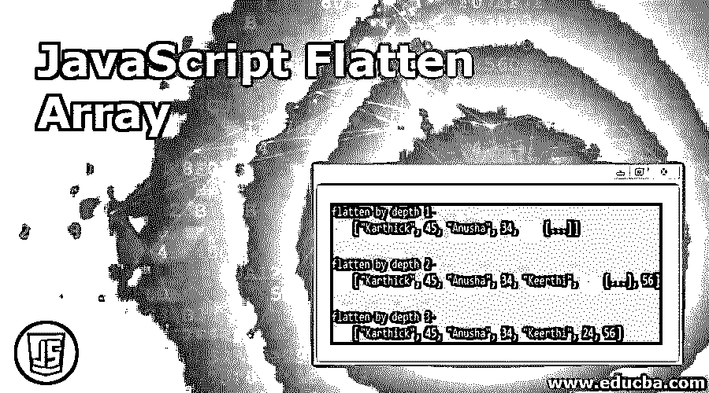

# JavaScript 展平数组

> 原文：<https://www.educba.com/javascript-flatten-array/>




## JavaScript Flatten 数组简介

Flatten 表示嵌套到一定深度的数组。在 Javascript 中，数组可以嵌套任意深度，这些数组可以重组为单个数组，即创建一个新的数组，其中所有子数组元素连接到指定深度。

**语法:**

<small>网页开发、编程语言、软件测试&其他</small>

```
var flatten_array = arr.flat([depth]);
```

### JavaScript 展平数组的参数

以下是 JavaScript Flatten 数组的参数:

*   **【depth】:**depth 指定嵌套数组结构有多深，哪些应该展平。默认情况下，深度为 1。
*   根据子数组元素串联指定的深度返回新数组。
*   flat()还不是 ECMAScript 标准的一部分，它是 javascript 的下划线. js 库中的内置函数，用于展平嵌套数组，结果数组将被完全展平，即没有深度

### JavaScript Flatten 数组示例

以下是 JavaScript Flatten 数组的示例:

#### 示例#1

**代码:**

```
const array = [10, 25, [32, 41]];
array.flat();
console.log(array.flat());
```

**输出:**


这里，数组中嵌套了值。flat()是一个函数，用于分解嵌套值并将其连接到其他值。由于没有传递给 flat()的参数，深度被视为 1。

#### 实施例 2

**代码:**

```
const array_string = [['Karthick', 45], ['Anusha', 34, ['Keerthi', [24], 56]]];
console.log('flatten by depth 1:', array_string.flat());
document.write('<br/>');
console.log('flatten by depth 2:', array_string.flat(2));
document.write('<br/>');
console.log('flatten by depth 3:', array_string.flat(3));
```

**输出:**

这里，数组由各种数据类型组成，深度为 1:


#### 实施例 3

无限嵌套数组。

**代码:**

```
const array_string = [1,2,[3,[4,[5,6,7,[8],9]]]];
console.log('flatten by depth infinity:', array_string.flat(Infinity));
```

**输出:**

无限深度是指数组内部可以展平的无限深度。


#### 实施例 4

展平阵列孔，即部分空的阵列也可以在这里展平。

**代码:**

```
const array_string = [1,2, ,4, 5, , 8];
console.log('flatten by depth infinity:', array_string.flat());
```

**输出:**

在上面的 array_string 中发现了空值，但是该数组被展平，空数组从 array_string 中删除。


在 javascript 中，ES2019 引入了 flat 和 flatMap 数组原型，两者都用于展平数组。相当新的浏览器支持以上内容，但是旧的浏览器不支持，因此我们使用 Babel 来支持。我们可以利用 Lodash 提供的 flatten()、flattenDeep()和 flattenDepth()函数，而不是使用 babel 将代码重新构建到 ES 的较低版本。

我们需要导入整个 Lodash 库，这些功能可以单独使用软件包。

#### 实施例 5

使用 flatMap()，它将每个值映射到一个新值，得到的数组被展平到最大深度 1。

**代码:**

```
const employee = ['Karthick', 'Saideep', 'Anusha', 'Keerthi'];
const client = ['Westpac', 'Sysco', 'Telco', 'Metlife'];
const mappedOnly = employee.map((employee, index) => [employee, client[index]]);
const mappedAndFlatten = employee.flatMap((employee, index) => [employee, client[index]]);
console.log(mappedOnly);
// [['Karthick', 'Westpac'], ['Saideep', 'Sysco'], ['Anusha', 'Telco'], ['Keerthi', 'Metlife']]
console.log(mappedAndFlatten);
```

**输出:**

 Example 5")


flatMap()是 Map()和 flat()的组合，在调用函数返回 map()中的数组且结果数组为平面时非常有用。

让我们看看一些方法来平坦多维数组。

#### 实施例 6

**代码:**

```
var myArray = [[16, 62],[35, 45, 57], [66, 7, 88]];
var flattenedArray = [].concat.apply([], myArray);
console.log(flattenedArray);
```

**输出:**

给你，不用。flat()函数，多维数组已被展平。


#### 实施例 7

**代码:**

```
var myArray = [[41, 24],[33, 42, 56], [66, 72, 82]];
var flattened_Array = [];
for (var i = 0; i < myArray.length; ++i) {
for (var j = 0; j < myArray[i].length; ++j)
flattened_Array.push(myArray[i][j]);
}
console.log(flattened_Array);
```

**输出:**

使用 simple for 循环，多维数组也可以展平。


#### 实施例 8

使用 ES6 扩展运算符，它仅适用于深度为 1 的数组

**代码:**

```
var myArray = [[41, 24],[33, 42, 56], [66, 72, 82]];
var flattened_array = [].concat(...myArray);
console.log(flattened_array);
```

**输出:**


让我们看看扁平化数组的迭代。

#### 实施例 9

**代码:**

```
function flatten(*arr*) {
var flattened_array = [];
while(arr.length) {
var value = arr.shift();
if(Array.isArray(value)) {
// this line preserve the order
arr = value.concat(arr);
} else {
flattened_array.push(value);
}
}
console.log(flattened_array);
}
flatten([13,[23,[38]],[4, 7, 90]]);
```

**输出:**


#### 实施例#10

**代码:**

```
let initialArray = [[0, 1], [2, 3]];
let flattenedArray = initialArray.reduce((*a*, *b*) => {
console.log(a.concat(b));
});
```

**输出:**


每当库添加一些额外的数据或数组包装，用户喜欢摆脱它，因为它是发送到服务器的 JSON，因为代码可能会崩溃。在这种情况下，拼合非常有用，因为它可以节省时间。扁平数据比处理嵌套数组/数据更容易读取。

使用生成器函数，对于 javascript 数组的深度扁平化，我们可以使用一个生成器函数，即 Array.isArray()

#### 实施例 11

**代码:**

```
function* flatten(*array*)
{
for (const val of array) {
Array.isArray(val) ? yield* flatten(val) : yield val;
}
}
const array = [[16,21],[39,[41,[60]]]];
const flattened_array = [...flatten(array)];
console.log(flattened_array);
```

**输出:**


### 结论

至此，我们结束了这篇关于“Javascript 扁平化数组”的文章。我们已经看到了 Javascript flatten array 含义，它的各种示例提供了不同深度的函数 flat()、生成器函数、spread 运算符、reduce、迭代、使用 for 循环等等。我们还看到了 Javascript 及其用途中为什么需要这种数组扁平化。使用 Lodash、flatten()、flattenDeep()和 flattenDepth()将嵌套数组展平为一维数组还有许多其他方法，这些方法使用它们的包单独工作。

### 推荐文章

这是一个 JavaScript 扁平数组的指南。这里我们讨论 JavaScript Flatten Array 及其参数的介绍，以及示例和代码实现。您也可以浏览我们推荐的其他文章，了解更多信息——

1.  [Javascript 嵌套函数](https://www.educba.com/javascript-nested-functions/)
2.  [JavaScript 日期函数](https://www.educba.com/javascript-date-function/)
3.  [JavaScript 子数组()](https://www.educba.com/javascript-subarray/)
4.  [JavaScript 数组过滤器](https://www.educba.com/javascript-array-filter/)


