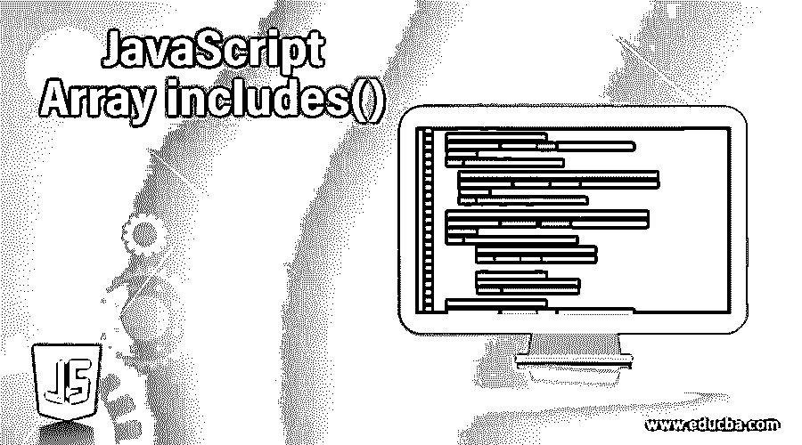

# JavaScript 数组包括()

> 原文：<https://www.educba.com/javascript-array-includes/>




## JavaScript 数组介绍包括()

JavaScript array includes()函数帮助我们获取数组是否包含任何指定的元素。这是一个内置函数，有助于查找数组中的特定元素。它返回一个布尔值，根据结果可以是真或假。如果我们要寻找的元素出现在数组中，结果为真；否则，如果我们要寻找的元素不在数组中，结果为假。它是一种找到元素并相应地提供结果的方法。

### 语法和参数

让我们来看看这个函数的语法。其语法格式如下所示

<small>网页开发、编程语言、软件测试&其他</small>

```
array.includes(element, start)
```

**参数**

该语法中的参数包括:

*   **元素:**这是数组中需要查找的值。
*   **start:** 这是一个可选参数。它表示 includes()方法应该开始搜索的索引。在这种情况下，默认值为 0。
*   **返回值**:当元素存在时，该函数的返回值为 true，当元素不在被搜索的数组中时，返回值为 false。

### JavaScript 数组 includes()方法是如何工作的？

为了了解 array.includes()函数是如何工作的，让我们以数组 a 为例。

```
var A = [ 1, 2, 3, 4, 5 ];
```

该阵列具有如上定义的五个元素。我们可以搜索以检查这个数组中是否存在任何元素。

```
checkInclude= A.includes(2);
```

该语句中使用了 checkInclude 变量。这个变量用于存储 include()方法的结果。它将检查数组是否包含整数 2。这里没有提到起点。这意味着它将直接开始在数组 a 中查找 2。它遍历数组并在其中查找整数 2。它在索引位置 1 找到 2。它将返回值 true，该值将存储在用户定义的变量 checkInclude 中。

如果提到了带有起始位置的可选参数，那么方法 includes()将从该位置开始，而不是遍历整个数组。它将从提到的索引位置开始查找数字或元素，并遍历数组直到结束。如果找到了元素，那么它必须返回 true，否则函数将返回 false。

### 实现 JavaScript 数组的例子包括()

下面是提到的例子:

#### 示例 1–数字数组

**代码:**

```
<script>
var A = [ 1, 2, 3, 4, 5 ];
a = A.includes(2)
document.write(a);
</script>
```

**输出:**


**说明:**上面的脚本首先创建一个数组。一旦创建了这个数组，它就使用 includes()方法来检查 2 是否在提到的数组中。这里的第二个语句服务于这个目的。找到结果后，我们可以打印出来，并得到它是真是假。True 表示该元素存在于数组中，false 表示它不存在于数组中。第三条语句适用于此目。

如果您查看上面的屏幕截图，上面代码片段的结果为真，因为 includes()方法在数组中找到 2。因此，显示的结果为真。

#### 示例 2–字符串数组

**代码:**

```
<script>
var animals = [ 'dog', 'rat', 'elephant', 'camel' ];
checkArray = name.includes('cat')
document.write(checkArray);
</script>
```

**输出:**


**解释:**上面的代码片段使用了一个字符串数组。这里我们创建了一个名为“animals”的数组。通过使用 includes()方法，我们检查数组中是否有“cat”。第二条语句将 includes()的结果存储在 checkArray 变量中。一旦这个结果存储在提到的变量中，您就可以使用 document.write()来显示结果。第三条语句帮助我们显示结果。这里的数组不是由猫组成的。因此，存储在变量中的结果将为假。

上面截图的结果是假的，这是意料之中的。

#### 示例 3–可选参数

**代码:**

```
<script>
var arr=["We","will","learn","JavaScript"]
var result=arr.includes("JavaScript",2);
document.writeln(result);
</script>
```

**输出:**


**解释:**上面的代码片段声明了一个包含字符串值的数组。在结果变量中，我们将像往常一样存储结果，不管它是否存在。在 includes()方法中，我们添加了可选参数。这是我们希望开始搜索的起始索引。在上面的例子中，我们选择了起始位置 2。当我们 2 点开始时，我们在开始时有“学习”呈现。下一个词是被搜索的 JavaScript。因此，这个查询的结果应该为真。第三条语句显示结果。

上面的截图显示的结果是真实的，这是意料之中的。

#### 示例 4–变化

让我们在这个例子中做一个变化。我们现在将要搜索的单词改为“will”。位置保持与 2 相同。让我们运行并看看下面代码的结果。

**代码:**

```
<script>
var arr=["We","will","learn","JavaScript"]
var result=arr.includes("will",2);
document.writeln(result);
</script>
```

**输出:**


**解释:**上面的脚本从位置 2 开始在数组中查找单词‘will’。索引从 0 开始，因此搜索的起始位置将从单词“learn”开始。在索引 2 位置之后，没有“意愿”存在。这意味着当它从索引位置 2 开始时，它将永远找不到单词 will，尽管它出现在数组中。这将使 include 函数在结果中返回 false。

尽管数组中存在“will ”,但上面的屏幕截图给出的结果为 false。如上所述，由于起点的原因，这是预期的结果。

### 结论

JavaScript 中的 array.includes()方法用于查找数组中的任何元素。可能你想在一个数组中搜索一个特定的元素，而这个数组有很多元素。这个函数因此来拯救我们，让我们知道它是否存在于数组中。您可以在 JavaScript 代码的任何地方使用它。

### 推荐文章

这是一个 JavaScript 数组指南，包括()。在这里，我们讨论 JavaScript 的语法、参数以及它如何与编程示例一起工作的介绍。您也可以浏览我们的其他相关文章，了解更多信息——

1.  [JavaScript 中的 push()](https://www.educba.com/push-in-javascript/)
2.  [JavaScript 历史对象](https://www.educba.com/javascript-history-object/)
3.  [JavaScript 历史对象](https://www.educba.com/javascript-history-object/)
4.  [JavaScript 枚举](https://www.educba.com/javascript-enum/)


