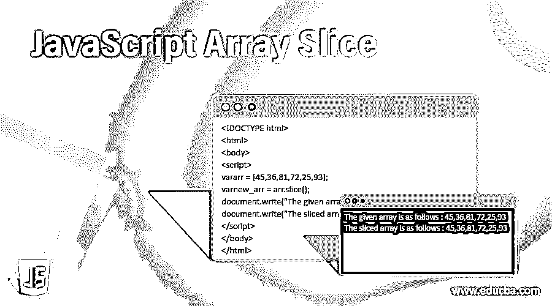

# JavaScript 数组切片

> 原文：<https://www.educba.com/javascript-array-slice/>




## JavaScript 数组切片介绍

在本文中，我们将讨论 javascript 中的数组切片方法。数组用于存储具有相似数据类型的项目或数据的集合，或者可以简单地将数组定义为一组具有相同数据类型的元素。数组切片是一种对给定数组进行切片以获得数组的一部分作为新数组的方法。在 javascript 中，有一种称为 slice()方法的方法，用于选择给定元素的一部分，并将其作为新的数组对象返回，而不改变原始数组。因此，数组中新选择的元素被复制到新的数组中。

### JavaScript 中数组 slice()方法的使用举例

在这一节中，我们将看到 slice()方法如何在 javascript 中处理 array。slice()函数用于返回数组中选定元素的一部分，而不改变原来的数组。此方法选择从给定的开始参数开始并在给定的结束参数结束的元素，但结束参数不作为可选参数包含在此方法中。现在让我们看看下面的语法和例子。

<small>网页开发、编程语言、软件测试&其他</small>

**语法:**

```
arr.slice(start, end)
```

**参数:**

*   **start:** 该参数用于定义一个数组的索引，函数将从该索引开始选择数组的元素。该参数是可选的。
*   **end:** 该参数用于定义一个数组的索引，在该处函数应该停止从数组中提取元素。该参数也是可选的。

此方法返回一个新数组，其中包含该数组的选定元素。我们还应该注意，在 slice()方法中，如果没有定义 start 参数，那么切片从数组的索引 0 开始，因此这个 start 参数标识数组的从零开始的索引。类似地，如果没有定义 end 参数，那么 slice()方法将提取 end-1，这意味着它将使用 end 参数数组的长度或大小。

#### 示例#1

**代码:**

```
<!DOCTYPE html>
<html>
<body>
<p>Click the button below to select the second and the third elements from the array and print.</p>
<button onclick="func()">click me</button>
<p id="arr_slice"></p>
<script>
function func() {
var article = ["The", "Educba", "Training", "for", "Javascript"];
var heading = article.slice(1, 3);
document.getElementById("arr_slice").innerHTML = heading;
}
</script>
</body>
</html>
```

**输出:**


**解释:**在上面的程序中，我们可以看到我们使用 slice()方法选择了给定数组的第二个和第三个元素。在语句 article.slice(1，3)中可以看到，这意味着名为“article”的给定数组有 5 个元素，索引从 0 开始。在上面的语句中，我们可以看到 start 参数的索引为 1，end 参数的索引为 3，这表示它将从给定数组中选择第二个和第三个元素。

我们知道 slice()方法用于切片给定数组的一部分，而不改变原始数组。这种方法有许多不同的用途。我们将在下面的文章中看到在 javascript 中使用数组的 slice()方法。slice()方法用于克隆一个数组。javascript 中的克隆意味着将对象属性复制到另一个对象，以避免创建已经存在的对象。让我们看看下面的例子

#### 实施例 2

**代码:**

```
<!DOCTYPE html>
<html>
<body>
<script>
var arr = [45,36,81,72,25,93];
var new_arr = arr.slice();
document.write("The given array is as follows :" + arr )
document.write("The sliced array is as follows : " + arr.slice() );
</script>
</body>
</html>
```

**输出:**


**解释:**在上面的程序中，我们看到我们使用了一个 slice()方法，其中没有参数，所以它将给定数组中的所有元素打印为一个新数组，该数组与原始数组具有相同的元素。因此，slice()方法用于打印数组元素。正如我们在上面的示例中看到的，我们从给定的数组中提取了一些元素。所以现在我们将看到如何使用 slice()方法来复制数组的一部分，而不改变给定的原始数组。让我们看看下面的例子。

#### 实施例 3

**代码:**

```
<!DOCTYPE html>
<html>
<body>
<script>
var colors = ['red','green','blue','yellow','purple'];
var rgb = colors.slice(0,3);
console.log(rgb);
document.write("The given array is as follows :" + colors )
document.write("The sliced array is as follows : " + rgb );
</script>
</body>
</html>
```

**输出:**


**解释:**在上面的程序中，我们可以看到我们只是从给定的数组中复制了数组的一部分作为新的数组。在这种情况下，我们从起始索引 0 和结束索引 3 开始分割元素，这将打印给定数组的 3 个元素。因此，slice()方法用于通过使用 slice()方法来复制给定数组的一部分。现在让我们看看如何使用 slice()方法将类似数组的对象转换为数组。让我们看一个例子来证明这一点。

#### 实施例 4

**代码:**

```
<!DOCTYPE html>
<html>
<body>
<script>
function toArray() {
return Array.prototype.slice.call(arguments);
}
var convertion = toArray('A','B','C');
console.log(convertion);
document.write("The given array like object is converted to the array as follows:" + convertion)
</script>
</body>
</html>
```

**输出:**


**说明:**在上面的程序中，我们可以看到一个名为“toArray”的函数，它的“arguments”是一个类似数组的对象。然后在函数“toArray”体中，我们调用 slice()方法，以便它将给定的参数转换成数组。因此，传递给函数“toArray”的每个参数都将是新数组的元素。

### 结论

在本文中，我们得出结论，array slice()方法主要用于切片或选择给定数组的部分元素。在本文中，我们看到了什么是语法及其参数。我们还看到了 javascript 中 slice()方法在 array 上的主要用途。slice()方法有两个参数，这两个参数都是可选的。对于数组的特定复制部分，我们必须指定“开始”和“结束”参数。我们在上面的例子中看到了这一点。

### 推荐文章

这是一个 JavaScript 数组切片的指南。这里我们讨论 javascript 中 array slice()方法的介绍和工作原理，以及不同的例子和代码实现。您也可以看看以下文章，了解更多信息–

1.  [JavaScript 数组映射()](https://www.educba.com/javascript-array-map/)
2.  [JavaScript 数组包含()](https://www.educba.com/javascript-array-includes/)
3.  [JavaScript 数组串联](https://www.educba.com/javascript-array-concat/)
4.  [JavaScript 数组排序](https://www.educba.com/javascript-array-sort/)


