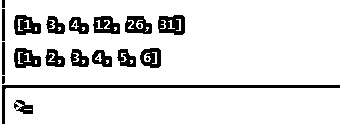
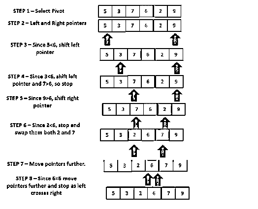
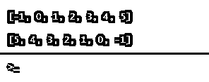
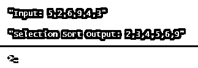

# JavaScript 中的排序

> 原文：<https://www.educba.com/sorting-in-javascript/>


## JavaScript 排序简介

排序是编程中最常用的技术。排序只不过是按顺序排列元素。例如，如果我们想对一个州或国家的名称进行升序或降序排序，那么我们需要使用排序算法。Jscript 中有许多类型的排序算法可以有效地对数组或元素进行排序。排序最重要的需求是大型数据库中的数据搜索可以优化到非常高的水平。如果数据按排序顺序存储。例如，就拿电话簿来说，其中的电话号码是按照人名分类的，这样就可以很容易地进行搜索。

### JavaScript 中排序是如何执行的？

让我们用一些随机排列的元素，所有的东西都混在一起。例如，以[ 8，5，3，6，2 ]为例，您希望使用排序算法将其排序为[ 2，3，5，6，8 ]。例如，将从数组左侧取出元素进行排序，并将其与数组中的相邻元素进行比较。如果第一个元素大于相邻的元素，那么我们切换元素。然后，我们将数组中的第二个元素与下一个元素进行比较。如果元素顺序错误，将会被切换。这个过程一直重复，直到我们到达数组的末尾。

<small>网页开发、编程语言、软件测试&其他</small>

**排序示例:**

| //以未排序的数组开始 |  |
|  | [ 9, 8, 3, 7, 2 ] |
|  | //成对检查元素，并根据需要翻转它们: |
|  | // 9 > 8 9 > 3 9 > 7 9 > 2 |
|  | [ 8, 9, 3, 7,2 ], [ 8, 3, 9, 7, 2 ], [ 8, 3, 7, 9, 2 ], [ 8, 3, 7, 2, 9 ] |
|  | //重复: |
|  | [ 3, 8, 7, 2, 9 ], [ 3, 7, 8, 2, 9 ], [ 3, 7, 2, 8, 9 ], [ 3, 7, 2, 8, 9 ] |
|  | [ 3, 7, 2, 8, 9 ], [ 3, 2, 7, 8, 9 ], [ 3, 2, 7, 8, 9 ], [ 3, 2, 7, 8, 9 ] |
|  | [ 2, 3, 7, 8, 9 ], … |

### JavaScript 中排序算法的类型

下面是 JavaScript 中不同类型的排序算法

1.  冒泡排序
2.  插入排序
3.  合并排序
4.  快速排序
5.  选择排序

#### 1.冒泡排序

冒泡排序是通过比较相邻元素来重复排序数组元素而执行的。它比较相邻的元素，如果它们的顺序不对，它就交换元素。该算法重复运行，直到列表中的所有元素都被排序。如果列表中的所有元素都已排序，那么算法会自动结束。虽然冒泡排序算法很简单，但与其他排序技术相比，它会消耗更多的时间。

**JavaScript 中的冒泡排序是如何工作的？**

*   在冒泡排序中，该算法将取数组的第 1 个<sup>元素，并将该值与数组中它旁边的元素进行比较。</sup>
*   如果第一个<sup>第一个</sup>元素大于第二个<sup>第二个</sup>，那么该元素将交换位置。
*   如果不满足条件，那么算法将比较第 2 个<sup>和第 1 个</sup>元素与第 3 个<sup>和第 3 个</sup>
*   这个过程一直持续到数组中的所有元素都按照各自的顺序进行了冒泡排序。

##### 示例#1

**代码:**

```
<html>
<head>
<title> Bubble Sort </title>
</head>
<body>
<script>
function bubblesort (a,N)
{
var i=j=v=0;
for (i=1; i<N; i++)
{
v = a[i];
j = i;
while (j>0 && a[j-1]>v)
{
a[j] = a[j-1];
j--;
};
a[j] = v;
}
for (i=0; i<a.length; i++)
{
};
};
var x = [9,4,5,2,1,6,7,0,3];
console.log("Input before bubble sort: " +x);
bubblesort(x,9);
console.log("Input after bubble sort: " +x);
</script>
</body>
</html>
```

**输出:**


##### **例 2**

**代码:**

```
<html>
<head>
<title> Bubble Sort </title>
</head>
<body>
<script>
function bubbleSort(array)
{
var flag = true; //checks to see if any swaps are made
while (flag)
{
flag = false; //if flag remains false, then the list is already sorted as no swaps are necessary
for (var i = 0; i < array.length - 1; i++) { //program terminates when this "if" is not accessed
if (array[i] > array[i + 1])
{
var temp = array[i];
array[i] = array[i + 1];
array[i + 1] = temp;
flag = true; //if swap occurs, flag is changed to true and process repeats
}
}
}
}
var myArray = [32, 33, 8, 2, 9];
bubbleSort(myArray);
console.log(myArray);
</script>
</body>
</html>
```

**输出:**


#### 2.插入排序

插入排序算法的工作原理是将未排序的数组分为两类:排序的类别和未排序的类别。首先，排序的类别将有一个排序元素。然后，我们逐个选择未排序的类别元素。将排序类别中的元素插入到正确的位置。

##### 示例#1

**代码:**

```
<html>
<body>
<script>
function InsertionSort(arr)
{
let len = arr.length, value, i, j;
for(i = 1; i < len; i++)
{
value = arr[i];
j = i - 1;
while (j >= 0 && arr[j] > value)
{
arr[j+1] = arr[j];
j--;
}
arr[j+1] = value;
}
return arr;
}
var myArray = [5,8,-3,2,7,0,6];
InsertionSort(myArray);
console.log(myArray);
</script>
</body>
</html>
```

**输出:**


##### 实施例 2

**代码:**

```
<html>
<body>
<script>
function insertionSort(inputArray)
{
var totalElements = inputArray.length - 1;
var temp = 0;
var lastIndex = 0;
var prevIndex = 0;
for(var i = 0;i <= totalElements;i++)
{
for(var currentIndex = i; currentIndex > lastIndex; currentIndex--)
{
prevIndex = currentIndex - 1;
if(inputArray[currentIndex] < inputArray[prevIndex]){
temp = inputArray[currentIndex];
inputArray[currentIndex] = inputArray[prevIndex];
inputArray[prevIndex] = temp;
}
else
break;
}
}
return inputArray;
}
console.log(insertionSort([1,31,26,4,3,12]));
console.log(insertionSort([5,6,1,2,3,4]));
</script>
</body>
</html>
```

**输出:**




#### 3.合并排序

合并排序算法是程序员最常用的排序算法。该算法中使用的概念是分而治之，对元素数组进行排序。它会将较大的元素组分成较小的组。然后，它对较小的元素组进行排序，以对较大的元素组进行排序。与其他排序算法相比，合并排序易于理解和实现。

##### 示例#1

**代码:**

```
<!DOCTYPE html>
<html>
<head>
<meta charset="utf-8">
<title>JavaScript program of Merge sort</title>
</head>
<body>
<script>
function merge_sort(left_part,right_part)
{
var i = 0;
var j = 0;
var results = [];
while (i < left_part.length || j < right_part.length) {
if (i === left_part.length) {
// j is the only index left_part
results.push(right_part[j]);
j++;
}
else if (j === right_part.length || left_part[i] <= right_part[j]) {
results.push(left_part[i]);
i++;
} else {
results.push(right_part[j]);
j++;
}
}
return results;
}
console.log(merge_sort([1,3,4], [3,7,9]));
</script>
</body>
</html>
```

**输出:**


##### 实施例 2

**代码:**

```
<!DOCTYPE html>
<html>
<head>
<meta charset="utf-8">
<title> JavaScript program of Merge sort </title>
</head>
<body>
<script>
function mergeSort(data)
{
if(data.length == 1 ) return data;
var mid = data.length / 2;
var left = data.slice(0, mid);
var right = data.slice(mid);
left = mergeSort(left);
right = mergeSort(right);
return merge(left, right);
}
function merge(left, right)
{
var result=[];
var leftIndex=0;
var rightIndex=0;
while(leftIndex<left.length && rightIndex<right.length)
{
if(left[leftIndex]>right[rightIndex])
{
result.push(right[rightIndex]);
rightIndex++;
}
else
{
result.push(left[leftIndex]);
leftIndex++;
}
}
while(leftIndex<left.length)
{
result.push(left[leftIndex]);
leftIndex++;
}
while(rightIndex<right.length)
{
result.push(right[rightIndex]);
rightIndex++;
}
return result;
}
console.log(insertionSort([1,31,26,4,3,12]));
console.log(insertionSort([5,6,1,2,3,4]));
</body>
</script>
</html>
```

**输出:**


#### 4.快速排序

快速排序也遵循与合并排序相同的技术，即分治法。它通过将较大的元素分成较小的组来执行，并根据条件对较小的组中的元素进行排序。在快速排序中，我们将一个元素作为枢纽元素。pivot 元素是位于数组中间的元素。从 pivot 元素开始，我们处理数组左边和右边的另一个元素。




##### 示例#1

**代码:**

```
<!DOCTYPE html>
<html>
<head>
<meta charset="utf-8">
<title> JavaScript program of Merge sort </title>
</head>
<body>
<script>
function QuickSort(arr, left = 0, right = arr.length - 1) {
let len = arr.length,
index
if(len > 1) {
index = partition(arr, left, right)
if(left < index - 1) {
QuickSort(arr, left, index - 1)
}
if(index < right) {
QuickSort(arr, index, right)
}
}
return arr
}
function partition(arr, left, right) {
let middle = Math.floor((right + left) / 2),
pivot = arr[middle],
i = left, // Start pointer at the first item in the array
j = right // Start pointer at the last item in the array
while(i <= j) {
// Move left pointer to the right until the value at the
// left is greater than the pivot value
while(arr[i] < pivot) {
i++
}
// Move right pointer to the left until the value at the
// right is less than the pivot value
while(arr[j] > pivot) {
j--
}
// If the left pointer is less than or equal to the
// right pointer, then swap values
if(i <= j) {
[arr[i], arr[j]] = [arr[j], arr[i]] // ES6 destructuring swap
i++
j--
}
}
return i
}
console.log(QuickSort([24,2,45,20,56,75,2,56,99,53,12]));
</script>
</body>
</html>
```

**输出:**


##### 实施例 2

**代码:**

```
<html>
<head>
<meta charset="utf-8">
<title>JavaScript program of Quick sort</title>
</head>
<body>
<script>
function quick_Sort(origArray)
{
if (origArray.length <= 1)
{
return origArray;
}
else
{
var left = [];
var right = [];
var newArray = [];
var pivot = origArray.pop();
var length = origArray.length;
for (var i = 0; i < length; i++)
{
if (origArray[i] <= pivot)
{
left.push(origArray[i]);
} else {
right.push(origArray[i]);
}
}
return newArray.concat(quick_Sort(left), pivot, quick_Sort(right));
}
}
var myArray = [3, 0, 2, 5, -1, 4, 1 ];
console.log("Original array: " + myArray);
var sortedArray = quick_Sort(myArray);
console.log("Sorted array: " + sortedArray);
</script>
</body>
</html>
```

**输出:**


#### 5.选择排序

这是最简单的排序技术。在这个算法中，您需要通过选择 1 个 <sup>st</sup> 最小元素，然后将最小元素交换到 1 个 <sup>st</sup> 位置，以线性方法遍历数组。然后，我们必须线性检查数组，并选择第 2 个<sup>和第</sup>个最小的元素。然后，将第 2 个<sup>和第 2 个</sup>最小的元素移动到第 2 个<sup>和第 2 个</sup>位置，继续排序过程，直到数组排序完毕。示例:

*   [ 5, 4, 2, 1]
*   选择排序会将 5 视为最小元素，并将它与数组的其余元素进行比较。如果数组中的任何元素小于 5，那么它将被交换。
*   [1, 4, 2, 5]
*   交换完成后，现在选择 4 作为最小元素，并与数组的其余部分进行比较。2 小于 4。所以，它会被交换。
*   这个过程一直持续到数组被完全排序。

排序后的输出将是[ 1，2，4，5 ]。

##### 示例#1

**代码:**

```
<!DOCTYPE html>
<html>
<head>
<meta charset="utf-8">
<title>JavaScript program of Selection sort</title>
</head>
<body>
<script>
function Selection_Sort(arr, compare_Function)
{
function compare(a, b)
{
return a - b;
}
var min = 0;
var index = 0;
var temp = 0;
//{Function} compare_Function Compare function
compare_Function = compare_Function || compare;
for (var i = 0; i < arr.length; i += 1) {
index = i;
min = arr[i];
for (var j = i + 1; j < arr.length; j += 1) {
if (compare_Function(min, arr[j]) > 0) {
min = arr[j];
index = j;
}
}
temp = arr[i];
arr[i] = min;
arr[index] = temp;
}
//return sorted arr
return arr;
}
console.log(Selection_Sort([3, 0, 2, 5, -1, 4, 1], function(a, b) { return a - b; }));
console.log(Selection_Sort([3, 0, 2, 5, -1, 4, 1], function(a, b) { return b - a; }));
</script>
</body>
</html>
```

**输出:**




##### 实施例 2

**代码:**

```
<!DOCTYPE html>
<html>
<head>
<meta charset="utf-8">
<title>JavaScript program of Selection sort</title>
</head>
<body>
<script>
function selection_sort(A) {
var len = array_length(A);
for (var i = 0; i < len - 1; i = i + 1) {
var j_min = i;
for (var j = i + 1; j < len; j = j + 1) {
if (A[j] < A[j_min]) {
j_min = j;
} else {}
}
if (j_min !== i) {
swap(A, i, j_min);
} else {}
}
}
function swap(A, x, y) {
var temp = A[x];
A[x] = A[y];
A[y] = temp;
}
var myArray = [ 5, 2, 6, 9, 4, 3 ];
console.log("Input: " + myArray);
var sortedArray = selection_sort(myArray);
console.log("Selection Sort Output: " + sortedArray);
</script>
</body>
</html>
```

**输出:**




### 结论

我们必须先学习简单的编程概念，以便将来编写复杂的编程。排序算法的概念被用在许多复杂的程序中，以降低对数据库或事物列表进行排序的难度。从上面的文章中，可以学到很多排序算法技巧。如果你想提高程序的一致性和性能，那么使用排序算法并不是一个坏主意。

### 推荐文章

这是一个 JavaScript 排序指南。这里我们讨论一下引言，JavaScript 中排序是如何执行的？JavaScript 中排序算法的类型及示例。您也可以看看以下文章，了解更多信息–

1.  [JavaScript 实例 of](https://www.educba.com/javascript-instanceof/)
2.  [JavaScript JSON 转字符串](https://www.educba.com/javascript-json-to-string/)
3.  [JavaScript hasOwnProperty()](https://www.educba.com/javascript-hasownproperty/)
4.  [JavaScript 循环数组](https://www.educba.com/javascript-loop-array/)


