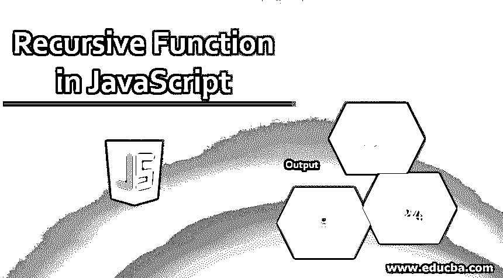

# JavaScript 中的递归函数

> 原文：<https://www.educba.com/recursive-function-in-javascript/>




## JavaScript 中递归函数的介绍

Javascript 是一种解释器和高级脚本语言，构成了 HTML 和基于 web 的[编程语言](https://www.educba.com/what-is-a-programming-language/)的基础。递归函数是调用自身来生成预期输出的函数。为了更容易理解，您可以考虑一个数字函数因子，它可以作为 Javascript 中递归函数的完美例子。在这个主题中，我们将学习 JavaScript 中的递归函数。

递归也被定义为编程模式，它通常在特定的情况或任务可以很容易地分成几个更小的子任务的情况下很有用，这些子任务是同一类型的，但是本质上要简单得多。每当一个函数执行一个特定的任务时，它可以调用许多函数作为中间体来处理，当它对自己这样做时，它被称为递归函数。

<small>网页开发、编程语言、软件测试&其他</small>

**递归函数的语法**

```
function func_name(var1,var2) {
//variable declaration
// code block and actual logic
for (initialisation; condition)
}
//loop code block and returning the result
}
//recursively calling a function
func_name(num1, num2)
```

**解释**

*   在上面解释的语法中，我们试图通过使用 for 循环结构来理解 Javascript 中递归函数的概念。一开始，我们已经声明了一个名为 func_name 的函数，它构成了我们的基本实体，下面所有的代码都将写在那个函数块内部。
*   接下来，在函数名中，我们通过名称 var1 和 var2 传递两个参数，这解释了变量及其值。接下来是变量声明部分，在这里我们将编写代码逻辑所需的变量和其他值，并发布实际的代码逻辑将被实现。
*   在这种情况下，我们利用 for 循环来编写代码逻辑块。一旦编写了代码，就需要重复该函数语句，即递归调用该函数块，在这种情况下是 func_name，因此，我们将在 for 循环外部的 func_name 中传递两个数字参数值作为参数，以便再次调用该函数，直到消耗完传递的值。
*   这就是 JavaScript 中递归函数的实现方式。这里需要注意的一点是，我们没有在 for 循环中使用迭代条件，因为该条件将由递归函数在其调用中提供。

### JavaScript 中递归函数是如何工作的？

由于 JavaScript 是一种面向 web 的语言，因此可以利用 for 循环或 while 循环来实现递归功能。在递归函数的情况下，程序的主要目标是将主任务缩减为许多更小的子任务，直到子任务不符合条件并且不能进入循环或函数内部编写的任何代码块。实现递归不必使用任何循环语句，但也可以通过使用条件语句块(如 if-else 构造)来实现。

### JavaScript 中递归函数的例子

让我们借助各种例子来理解这一点。

#### 示例#1

让我们用 pow 函数来理解这一点，它是 power 的简写形式。在这个例子中，我们将读到 pow(a，b)，它将 a 的幂提升到 b 的自然数。如果你用其他术语来说，它意味着 a 要乘以自身 b 的次数。

```
//declaration of function power
function pow(a,b) {
//writing if condition and checking if it has broken into simplest task already
if (b == 1) {
//returning the value which needs to be reiterated
return a;
} else {
return a * pow(a, b - 1);
}
}
//recursively calling the function pow by passing two values to process
alert( pow(2, 3) );
```

**输出:**


在本例中，我们递归调用函数 pow，并计算 2，3 倍的幂，结果应该是 8。调用 pow 时，执行块根据条件语句分为两类。第一个会讲[if 语句](https://www.educba.com/if-statement-in-r/)其中 if a==1 = b，第二个是指块的 else 部分，其中 a 乘以 a 和 b-1 的幂的合力。

#### 实施例 2

在第二个例子中，我们将研究递归函数的另一个非常流行的例子。这就是所谓的求一个数的阶乘。当你谈到求一个数的阶乘时，你的意思是把这个数和它所有随后递减的值相乘，直到 1。

计算一个数的阶乘的公式如下:

```
b! = 1 iff b=0
else if (b-1)! *b iff b>0
```

让我们借助一个例子来理解这个公式。4 的阶乘是 4*3*2*1= 24。

**代码:**

```
//declaring a function func
function fact(b) {
//declaring a variable
var res = 1;
//for loop to find the factorial of the number
for (let i = b; i > 1; i--) {
//fetching and consolidating the result statement
res *= i;
}
//returning the result which contains the factorial of the number b
return res;
}
```

**输出:**


在上面解释的代码中，阶乘将从名为 fact 的函数内部传递的任何值中取出，而值 res 将负责计算该值。

#### 实施例 3

在本例中，我们将通过 if-else 循环来了解递归函数在计数器实现中的用法。

**代码:**

```
//declaring a function value
var Cdown = function(val) {
//checking if the value is greater than 0
if (val > 0) {
//documenting and logging the console output
console.log(val);
return Cdown(val - 1);
} else {
return val;
}
};
Cdown(5);
```

**输出:**


在本例中，值 5 将被记录为 Cdown 函数的输出，并将计算阶乘。

### 推荐文章

这是 JavaScript 中递归函数的指南。这里我们讨论它的语法和递归函数如何在 JavaScript 中工作，以及不同的例子。您也可以阅读以下文章，了解更多信息——

1.  [JavaScript 中的模式](https://www.educba.com/patterns-in-javascript/)
2.  [JavaScript 中的 For 循环](https://www.educba.com/for-loop-in-javascript/)
3.  [JavaScript 对象](https://www.educba.com/javascript-objects/)
4.  [JavaScript 中的 Case 语句](https://www.educba.com/case-statement-in-javascript/)


