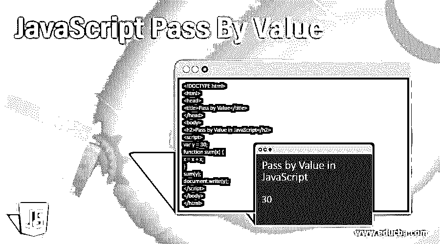

# JavaScript 按值传递

> 原文：<https://www.educba.com/javascript-pass-by-value/>




## JavaScript 按值传递简介

编程中最令人困惑也最有趣的特性之一是区分变量是通过值传递还是通过引用传递。但是在 JavaScript 中，我们不需要挣扎，因为使用了唯一的传值概念。JavaScript 按值传递是通过直接传递变量值作为参数来调用的函数。换句话说，函数内部参数的改变不会影响从函数外部传递过来的变量。JavaScript 是面向对象的，这意味着 JavaScript 的大部分都是对象。因此，数据类型的概念也来了，原始和复杂的数据类型也将在 JavaScript 的值传递中发挥作用。

**语法:**

<small>网页开发、编程语言、软件测试&其他</small>

```
function functionName(arg1) {
// code of the function
}
// call to the function
functionName(arg2);
```

所以在这里，functionName 是有参数的函数，在函数定义之后，我们用另一个参数调用 functionName，这将自动替换已定义的参数。

JavaScript 将复制我们作为局部变量传递给函数的变量值。我们对函数内部的局部变量所做的任何改变都不会影响传递的参数。

我们有两种数据类型，原始数据类型(不可变数据类型)和复杂数据类型。

*   **原始数据类型:**数字、字符串、布尔、未定义和空
*   **复杂数据类型:**对象、函数或数组等

有趣的是，只有原始类型可以通过值传递，而复杂类型不能，复杂类型只能通过引用传递。从技术上来说，引用传递存在于 JavaScript 中。当变量保存一个对象时，一个复杂类型的函数数组通过引用进入画面，其中变量保存对象的引用或地址。

目前，我们不需要考虑按引用传递概念，而需要更深入地了解按值传递概念。

### 实现 JavaScript 按值传递的示例

下面是提到的例子:

#### 示例#1

**代码:**

```
<!DOCTYPE html>
<html>
<body>
<script>
var employeeName1 = "Jack";
var employeeName2 = employeeName1;
employeeName1 = "Jane";
document.write(employeeName1 + "</br>");
document.write(employeeName2);
</script>
</body>
</html>
```

**输出:**


在这里，这是一个简单的结果，我们在这里只使用=操作符来显示按值传递的概念。

*   employeeName1 是用值“Jack”创建的。JS 在这里分配一部分内存。
*   创建另一个变量 employeeName2，并将 employeeName1 的副本传递给它。
*   employeeName1 和 employeeName2 都是独立的，都有自己分配的内存空间。
*   现在，employeeName2 也有值“Jack”。employeeName1 更改为“Jane ”,但 employeeName2 仍将保持原始值，即“Jack ”,因为两者的内存分配不同，因此输出也不同。

#### 实施例 2

**代码:**

```
<!DOCTYPE html>
<html>
<body>
<script>
let x = 10;
let samplechange = (value) => {
value = 20
}
samplechange(x);
document.write(x);
</script>
</body>
</html>
```

**输出:**


#### 实施例 3

**代码:**

```
<!DOCTYPE html>
<html>
<head>
<title>Pass by Value</title>
</head>
<body>
<h2>Pass by Value in JavaScript</h2>
<script>
var y = 30;
function sum(x) {
x = x + x;
}
sum(y);
document.write(y);
</script>
</body>
</html>
```

**输出:**


让我解释一下上面的例子是如何传递值的，

*   我们定义了一个 sum()函数，它接受参数 x，函数将 x 的值改为 x 的 2 倍
*   在函数的顶部，我们声明并初始化了一个值为 30 的变量 y
*   在函数体之后，我们将 y 变量传递给函数 sum()。在这里，当 y 被传递给函数 sum()时，JavaScript 会将 y 的值复制到 x 变量。
*   在 sum(y)上，x 的值将根据所写的函数而改变，即 x + x，所以现在 y 的 x 值将是 60
*   但是 y 值不会变，因为 x 和 y 都是不同的变量。
*   因此，在记录时，x 值的输出将是 60，y 值也将是 30。
*   如果该值通过引用传递，y 值将更改为 60。

#### 实施例 4

在 callByValue 之前，函数内部和 callByValue 之后变量的值发生变化

**代码:**

```
<!DOCTYPE html>
<html>
<head>
<title>Pass by Value</title>
</head>
<body>
<h2>Pass by Value in JavaScript</h2>
<script>
function callValue(var1, var2) {
document.write("Inside Call by Value Method");
var1 = "Chaitanya";
var2 = "CPG";
document.write(" var1 = " + var1 +" var2 = " +var2 + "</br>");
}
let var1 = "Karthick";
let var2 = "IBM";
document.write("Before Call by Value Method");
document.write(" var1 = " + var1 +" var2 = " +var2 + "</br>");
callValue(var1, var2)
document.write("After Call by Value Method");
document.write(" var1 = " + var1 +" var2 = " +var2 + "</br>");
</script>
</body>
</html>
```

**输出:**


#### 实施例 5

**代码:**

```
<!DOCTYPE html>
<html>
<head>
<title>Pass by Value</title>
</head>
<body>
<h2>Pass by Value in JavaScript</h2>
<script>
let var1 = 100;
function updateValue(var1){
var1 = var1 * 4;
document.write("Updated Value is: ", var1 + "</br>");
}
updateValue(var1);
document.write("Original Value is: ", var1);
</script>
</body>
</html>
```

**输出:**


### 按值传递的优势

以下是优点:

*   一个函数可以返回多个值
*   相比之下，执行速度更快，因为没有参数的副本。
*   为了避免不知不觉的更改，使用 const 引用并传递它将有助于我们撤销更改
*   按值传递是内存安全和高效的
*   传递给函数的参数值不会改变

### 结论

考虑到原始和复杂的数据类型，我们已经看到了这个特性在 JavaScript 中是如何工作的。用几个例子来说明，这将有助于您进一步探索，并了解了按值传递的优势。对这些例子的简单解释会让你很好地了解如何使用传值。你们甚至可以在 JavaScript 中探索复杂数据类型的引用传递。

### 推荐文章

这是一个 JavaScript 按值传递的指南。在这里，我们将通过编程示例来介绍 JavaScript 的值传递。您也可以浏览我们的其他相关文章，了解更多信息——

1.  [JavaScript 比较字符串](https://www.educba.com/javascript-compare-strings/)
2.  [JavaScript 编译器](https://www.educba.com/javascript-compilers/) >
3.  [Java 和 JavaScript](https://www.educba.com/java-and-javascript/)
4.  [JavaScript 文字量](https://www.educba.com/javascript-literals/)


