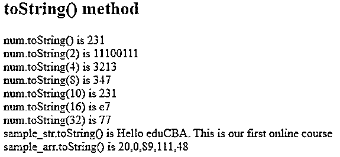

# JavaScript toString

> 原文：<https://www.educba.com/javascript-tostring/>


## JavaScript toString 简介

在我们见过的所有 JavaScript 函数中，JavaScript 中的这个 toString()函数具有独特的功能。JavaScript 中的 toString()函数使用数字作为输入，并将数字转换为字符串。JavaScript toString()函数返回代表特定数字对象的字符串。toString()是 JavaScript 中的一个内置方法，它提供了从数字到字符串类型的转换，不同之处在于可读性和性能。我们还可以使用 toString 来转换数组和字符串，这将返回一个表示特定数组及其元素的字符串。

**语法**

<small>网页开发、编程语言、软件测试&其他</small>

下面给出了语法:

```
Object.toString()
```

*   **编号:** sample_number.toString(基数)。
*   **String:**sample _ String . tostring()。
*   **数组:** sample_array.toString()。

参数 radix 是可选参数；它必须是介于 2 和 36 之间的整数。这里用一个基值来表示数值。

**例如:**

*   **2:** 代表二进制值。
*   **8:** 代表八进制值。
*   **16:** 代表十六进制值。

**Note:** If the radix parameter is given a value less than 2 or a value greater than 36, an exception called RangeError is thrown.

### JavaScript toString 的例子

以下是 JavaScript toString 的示例:

#### 示例#1

一个简单的例子，演示了用 toString()转换数字。

**代码:**

```
<!DOCTYPE html>
<html>
<body>
<p>toString() function to convert number to string</p>
<script>
var num = 20;
var n = num.toString();
document.write(n)
</script>
</body>
</html>
```

**输出:**


#### 实施例 2

使用 to string()方法将字符串转换为字符串对象的示例。

**代码:**

```
<!DOCTYPE html>
<html>
<body>
<p>Converting string to string object using toString()</p>
<script>
var sample_str = "This is eduCBA website providing online courses for Software Development";
var result = sample_str.toString();
document.write(result)
</script>
</body>
</html>
```

**输出:**


#### 实施例 3

**代码:**

```
<html>
<head>
<title>Converting Array using JavaScript Array toString Method</title>
</head>
<body>
<script>
var sample_arr = new Array("Infy", "TCS", "CG", "CPG");
var result_str = sample_arr.toString();
document.write("Returned string is : " + result_str );
</script>
</body>
</html>
```

**输出:**


这些是 toString()方法应用于数字、字符串和数组的简单例子。

让我们添加参数 radix，它将指定在 string 中表示整数的基数。

#### 实施例 4

**代码:**

```
<html>
<head>
</head>
<h2>Converting number using JavaScript number toString Method with parameter</h2>
<body>
<script>
var sample_num=369;
document.write("Output : " + sample_num.toString(2));
</script>
</body>
</html>
```

**输出:**


#### 实施例 5

说明将数字转换为八进制和十六进制值的示例。

**代码:**

```
<html>
<head>
</head>
<h2>Converting number using JavaScript number toString Method with parameter</h2>
<body>
<script>
var sample_num_toEight=1369;
document.write("Output : " + sample_num_toEight.toString(8));
var sample_num_toHexa=1369;
document.write(" Output : " + sample_num_toHexa.toString(16));
</script>
</body>
</html>
```

**输出:**


Number(base)作为参数传递给 toString()方法，Number 相应地被解析并转换为指定的基数，如上所示。如果在将数字转换为字符串对象时没有参数传递给 toString()，它将显示作为输入传递的相同数字。

**Note:** toString() called on null will return a null value, and undefined will return an undefined value.

toString()方法也可以用来检测对象的类。默认情况下，toString 用于获取对象的类。Object.prototype.toString()要和每个对象一起使用，需要调用 function.prototype.call()/。对 object 应用()方法，传递要查找其数据类型的对象。

#### 实施例 6

**代码:**

```
<html>
<head>
</head>
<h2>Using toString to detect object class using toString()</h2>
<body>
<script>
const toString = Object.prototype.toString;
document.write(toString.call(new Date));
document.write(toString.call(new String));
document.write(toString.apply(Math));
document.write(toString.apply(undefined));
document.write(toString.apply(null));
</script>
</body>
</html>
```

**输出:**


**Note:** For radices above 10, on conversion, letters indicate that the numeral is greater than 9\. As for hexadecimal numbers(base 16), letters a-f are used.

#### 实施例 7

要结合成一个整体，使用 JavaScript 的 toString()方法。

**代码:**

```
<html>
<head>
<title>JavaScript toString() Method</title>
</head>
<body>
<h2>toString() method</h2>
<script>
sample_num = new Number(231);
document.write("num.toString() is " + sample_num.toString());
document.write("<br />");
document.write("num.toString(2) is " + sample_num.toString(2));
document.write("<br />");
document.write("num.toString(4) is " + sample_num.toString(4));
document.write("<br />");
document.write("num.toString(8) is " + sample_num.toString(8));
document.write("<br />");
document.write("num.toString(10) is " + sample_num.toString(10));
document.write("<br />");
document.write("num.toString(16) is " + sample_num.toString(16));
document.write("<br />");
document.write("num.toString(32) is " + sample_num.toString(32));
document.write("<br />");
sample_str = new String("Hello eduCBA. This is our first online course");
document.write("sample_str.toString() is " + sample_str.toString());
document.write("<br />");
arr = [20, 0, 89, 111, 48]
sample_array = arr.toString();
document.write("sample_arr.toString() is " + sample_array.toString());
</script>
</body>
</html>
```

**输出:**




### 结论

至此，我们可以结束文章“JavaScript toString()”。我们已经看到了 toString()方法，以及它如何与上面举例说明的各种示例一起工作。这些是我们提供的最简单的例子，通过它们你将能够设计和理解这个主题背后的概念。正如我们所看到的，有许多方法可以操纵数据；其中，toString()是一种用自己的属性操作数据的方法。因此，开发人员可以根据性能和可读性来决定使用哪种方法。

### 推荐文章

这是一个 JavaScript toString 的指南。这里我们分别讨论 JavaScript toString 的介绍和例子。您也可以看看以下文章，了解更多信息–

1.  [JavaScript 父节点](https://www.educba.com/javascript-parent-node/)
2.  [JavaScript 延迟](https://www.educba.com/javascript-delay/)
3.  [JavaScript 浮动](https://www.educba.com/javascript-floating/)
4.  [JavaScript 动画](https://www.educba.com/javascript-animation/)


