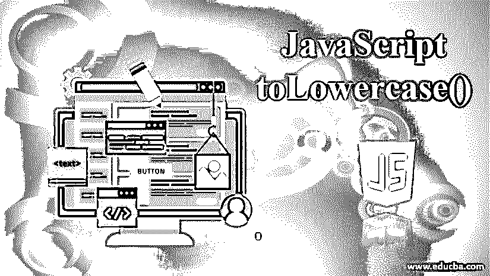

# JavaScript toLowercase()

> 原文：<https://www.educba.com/javascript-tolowercase/>




## JavaScript toLowercase()简介

Javascript 为我们提供了许多字符串对象操作的属性和方法。根据我们的需要和要求，我们可以使用它们来获得合成值。javascript 中可用于字符串操作的方法之一是 toLowerCase()方法，该方法将调用它的 string 对象转换为等价的值，但使用小写字母。

**例如，**

<small>网页开发、编程语言、软件测试&其他</small>

当我声明一个名为 sample 的变量并用值“hello students”初始化它，然后使用 sample 对象调用 toLowerCase()方法时，它返回给我一个值为“Hello Students”的字符串对象，其中的所有字母都是小写的。下面是相同的代码和输出。

**代码:**

```
<!DOCTYPE html>
<html>
<body>
<p>Please Click the button to get lowercase letters in the string. </p>
<button onclick="covertToLower()">Try it</button>
<p id="showSample"></p>
<script>
function covertToLower() {
var sample = "Hello Students";
var result = sample.toLowerCase(); document.getElementById("showSample").innerHTML = result;
}
</script>
</body>
</html>
```

**输出:**

点击“尝试”按钮后，它将以小写显示字符串作为输出。


### JavaScript 中 toLowerCase()方法的变体

下面我们必须解释 JavaScript toLowercase()方法的变体:

*   **公共字符串 toLowerCase():** 这个方法的工作原理和 toLocaleLowerCase()方法一样。它将默认区域设置视为英语。
*   **公共字符串 toLocaleLowerCase():** 区域设置基于浏览器的语言设置，有时可能会有所不同，如土耳其语、希腊语等。这种方法在小写情况下会产生相同的结果，但对于不同地区的某些字符会有所不同，比如土耳其语中不带点的 I。它将默认区域设置视为计算机的当前区域设置。

### 实现 JavaScript toLowercase()的示例

以下是对要实施的计划的解释:

#### toLocaleLowerCase()

**代码:**

```
<!DOCTYPE html>
<html>
<body>
<p>To convert the string into lowercase according to your browser's current locale click on the button</p>
<button onclick="covertToLower()">Convert</button>
<p id="sampleDemo"></p>
<script>
function covertToLower() {
var tempString = "JavascriPt Coders";
var result = tempString.toLocaleLowerCase(); document.getElementById("sampleDemo").innerHTML = result;
}
</script>
</body>
</html>
```

**输出:**


由于我当前浏览器的默认语言是英语，toLowerCaseLocale()的输出类似于 toLowerCase()。如果浏览器的当前区域设置不同，比如土耳其语、希腊语或其他语言，情况就会有所不同。

### toLowerCase()方法工作的内部细节

*   在内部，字符串被转换为字符数组，然后每个字符被比较并转换为所需的。
*   最后，在包含所有小写字符的最终数组形成后，它被转换成一个字符串，新字符串被
*   因此，有必要记住，提供给该方法的原始字符串对象不会被更改或修改；相反，创建并返回一个新的 string 对象。

**代码:**

```
public String toLowerCase(Locale locale) { if (locale == null) {
throw new NullPointerException();
}
int initialUpperChar;
final int stringLength = value.length;
/* Check if there are any characters whose case needs to be changed. */ scan: {
for (initialUpperChar = 0 ; initialUpperChar < stringLength; ) { char c = value[initialUpperChar];
if ((c >= Character.MIN_HIGH_SURROGATE)
&& (c <= Character.MAX_HIGH_SURROGATE)) { int currentChar = codePointAt(initialUpperChar);
if (currentChar != Character.toLowerCase(currentChar)) { break scan;
}
initialUpperChar += Character.charCount(currentChar);
if (c != Character.toLowerCase(c)) { break scan;
}
initialUpperChar++;
}
}
return this;
}
char[] result = new char[stringLength]; int offsetOfResult = 0;
/* result may grow, so i+offsetOfResult is the write location in result */
/* Now copy the first few characters in lowerCase. */ System.arraycopy(value, 0, result, 0, initialUpperChar);
"lt");
String targetLanguage = locale.getLanguage(); boolean isLocaleDependent =
(targetLanguage == "tr" || targetLanguage == "az" || targetLanguage ==
char[] lowerCharacterArray; int lowerChar;
int sourceChar; int sourceCount;
for (int i = initialUpperChar; i < stringLength; i += sourceCount) { sourceChar = (int)value[i];
if ((char)sourceChar >= Character.MIN_HIGH_SURROGATE
&& (char)sourceChar <= Character.MAX_HIGH_SURROGATE) { sourceChar = codePointAt(i);
sourceCount = Character.charCount(sourceChar);
sourceCount = 1;
}
SIGMA
if (isLocaleDependent || sourceChar == '\u03A3') { // GREEK CAPITAL LETTER
lowerChar = ConditionalSpecialCasing.toLowerCaseEx(this, i, locale);
} else if (sourceChar == '\u0130') { // LATIN CAPITAL LETTER I DOT lowerChar = Character.ERROR;
} else {
lowerChar = Character.toLowerCase(sourceChar);
}
if ((lowerChar == Character.ERROR)
|| (lowerChar >= Character.MIN_SUPPLEMENTARY_CODE_POINT)) { if (lowerChar == Character.ERROR) {
if (!isLocaleDependent && sourceChar == '\u0130') { lowerCharacterArray =
ConditionalSpecialCasing.toLowerCaseCharArray(this, i,
Locale.ENGLISH);
} else {
lowerCharacterArray = ConditionalSpecialCasing.toLowerCaseCharArray(this, i, locale);
}
} else if (sourceCount == 2) {
offsetOfResult += Character.toChars(lowerChar, result, i + offsetOfResult) - sourceCount;
continue;
} else {
lowerCharacterArray = Character.toChars(lowerChar);
}
/* Grow the size of the result if required */
int mapstringLength = lowerCharacterArray.length; if (mapstringLength > sourceCount) {
char[] result2 = new char[result.length + mapstringLength - sourceCount]; System.arraycopy(result, 0, result2, 0, i + offsetOfResult);
result = result2;
}
for (int x = 0; x < lengthOfMap; ++x) {
result[i + offsetOfResult + x] = lowerCharacterArray[x];
}
offsetOfResult += (mapstringLength - sourceCount);
} else {
result[i + offsetOfResult] = (char)lowerChar;
}
}
return new String(result, 0, stringLength + offsetOfResult);
}
```

**对上面代码的解释:**上面的 java 代码代表了 javascript 代码必须如何在内部工作。最小 _ 最大 _ 代理。在 UTF-16 编码中，Unicode 高代理项代码单元常量的最小值是“\uD800”。MAX_HIGH_SURROGATE。在 UTF-16 编码中，Unicode 高代理项代码单元常量的最大值是“\uDBFF”。最小 _ 补充 _ 代码 _ 点。在 UTF-16 编码中，Unicode 补充码位常量的最小值是 U+10000。

### 结论

我们可以得出结论，对于 toLowerCase()和 toUpperCase()方法以及它们针对某个地区的变体，内部工作方式非常相似。在这两种方法中，符号和数字都被保留；只有字符被转换成小写或大写。我们应该记住，这两种方法都不会修改原始字符串的字符。相反，它们都创建了一个新的 String 对象，该对象包含与所需格式的字符相同的值。这两种方法都很有效，并在 ECMAScript 1 javascript 版本中引入。

### 推荐文章

这是 JavaScript toLowercase()的指南。在这里，我们讨论一个介绍，不同的方法，例子和 JavaScript toLowercase()的内部细节，以及相应的例子。您也可以浏览我们的其他相关文章，了解更多信息——

1.  [JavaScript 中的算术](https://www.educba.com/arithmetic-operators-in-javascript/)
2.  [JavaScript 箭头函数](https://www.educba.com/javascript-arrow-function/)
3.  [JavaScript 中的按位运算符](https://www.educba.com/bitwise-operators-in-javascript/)
4.  [JavaScript 中的平方根](https://www.educba.com/square-root-in-javascript/)


