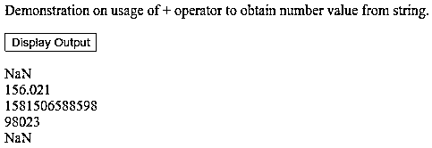
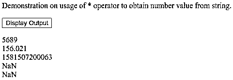

# JavaScript 字符串到数字

> 原文：<https://www.educba.com/javascript-string-to-number/>


## JavaScript 字符串到数字简介

Javascript 字符串到数字的转换是一个简单而常见的操作。在编码时，我们经常会遇到这样的情况，我们希望将从某处检索到的字符串值转换成数字格式，以便在 javascript 中对这些数字执行一些进一步的操作。有几种方法可以用来获得字符串中数字的数值。在这一节中，我们将讨论所有可能的方法，这些方法可以合并到我们的代码中，并讨论哪些方法适合于哪些情况。每种方法都有自己的优缺点。在这里，我们可以使用一些内置的方法或一些数学运算符，或其他一些技巧来从字符串中获取数值。

### 将 JavaScript 字符串转换为数字的方法

以下是在 JavaScript 中将字符串转换为数字的不同方法:

<small>网页开发、编程语言、软件测试&其他</small>

#### 1.数字对象

我们可以使用 Number 对象来检索字符串的数字格式值。这里，我们需要记住 Number 是一个包装类数据类型，可以用于许多目的。如果我们使用一个新的 number()而不仅仅是 Number()，那么我们得到一个新的 object 类型的 object，而不仅仅是那个字符串中的 Number 的值。当我们希望保留十进制值(即数字中小数点后指定的位数)时，可以使用此方法。让我们借助一个例子来看看它是如何在 javascript 中使用的。

**代码:**

```
<!DOCTYPE html>
<html>
<body>
<p>Demonstration on usage of Number Wrapper object to obtaing number value from string.</p>
<button onclick="getNumbers()">Display Output</button>
<p id="sampleDemo"></p>
<script>
function getNumbers() {
var sampleNumber1 = true; var sampleNumber2 = false;
var sampleNumber3 = new Date(); var sampleNumber4 = "999";
var sampleNumber5 = "999 888";
var displayMessage = Number(sampleNumber1) + "<br>" + Number(sampleNumber2) + "<br>" + Number(sampleNumber3) + "<br>" + Number(sampleNumber4) + "<br>" + Number(sampleNumber5);
document.getElementById("sampleDemo").innerHTML = displayMessage; console.log("type of number "+typeof Number(sampleNumber1)); console.log("type of new number "+typeof new Number(sampleNumber1));
}
</script>
</body>
</html>
```

**输出:**


控制台上的**:**

从上面的输出可以看出，当只使用 number()时，返回的对象是 Number 类型，当我们使用新的 Number()时，它返回一个对象。


#### 2.使用 parseInt()和 parseFloat()方法

Javascript 为我们提供了内置的方法，通过使用 parseInt()方法将字符串格式的对象转换成其对应的数字格式。注意，十进制值被包装成整数，当我们使用 parseInt()方法时，可能会损失精度。如果你想保持精度并获得十进制值，我们可以使用 parseFloat()方法。让我们借助一个例子来检查它的工作情况——

**代码:**

```
<!DOCTYPE html>
<html>
<body>
<p>Demonstration on usage of parseInt and parseFloat methods to obtain number value from string.</p>
<button onclick="getNumbers()">Display Output</button>
<p id="sampleDemo"></p>
<script>
function getNumbers() {
var sampleNumber1 = "56,54"; var sampleNumber2 = "156.021"; var sampleNumber3 = new Date();
var sampleNumber4 = "I got 96 marks"; var sampleNumber5 = "96 is my score";
var displayMessage=parseInt(sampleNumber1) + "<br>" + parseInt(sampleNumber2) + "<br>" + parseInt(sampleNumber3) + "<br>" + parseInt(sampleNumber4) + "<br>" + parseInt(sampleNumber5);
document.getElementById("sampleDemo").innerHTML = displayMessage;
}
</script>
</body>
</html>
```

**输出:**


#### 3.使用+(加号运算符)

可以实现的技巧之一是在检索数字时使用+运算符。Javascript 自动将字符串转换成适当的数值，并帮助我们从字符串中获取数字。使用这个技巧时，十进制数的精度也保持不变。让我们看看如何在我们的代码中实现这一点。

**代码:**

```
<!DOCTYPE html>
<html>
<body>
<p>Demonstration on usage of + operator to obtain number value from string.</p>
<button onclick="getNumbers()">Display Output</button>
<p id="sampleDemo"></p>
<script>
function getNumbers() {
var sampleNumber1 = "56,54"; var sampleNumber2 = "156.021"; var sampleNumber3 = new Date(); var sampleNumber4 = "98023";
var sampleNumber5 = "96 is my score";
var displayMessage=
+sampleNumber1 + "<br>" +
+sampleNumber2 + "<br>" +
+sampleNumber3 + "<br>" +
+sampleNumber4 + "<br>" +
+sampleNumber5;  document.getElementById("sampleDemo").innerHTML = displayMessage;
}
</script>
</body>
</html>
```

**输出:**




#### 4.使用 Math.floor()函数

从字符串中检索数字的方法之一是使用 javascript 中提供的数学库的 floor()方法。我们要注意的是，在使用 Math.floor()函数时，十进制数字是四舍五入的，只返回字符串的整数值。让我们借助一个例子来检查它是如何工作的。

**代码:**

```
<!DOCTYPE html>
<html>
<body>
<p>Demonstration on usage of Math.floor methods to obtain number value from string.</p>
<button onclick="getNumbers()">Display Output</button>
<p id="sampleDemo"></p>
<script>
function getNumbers() {
var sampleNumber1 = "5689"; var sampleNumber2 = "156.021";
var sampleNumber3 = new Date();
var sampleNumber4 = "I got 96 marks"; var sampleNumber5 = "96 is my score";
var displayMessage=Math.floor(sampleNumber1) + "<br>" + Math.floor(sampleNumber2) + "<br>" + Math.floor(sampleNumber3) + "<br>" + Math.floor(sampleNumber4) + "<br>" + Math.floor(sampleNumber5);
document.getElementById("sampleDemo").innerHTML = displayMessage;
}
</script>
</body>
</html>
```

**输出:**

上面的代码点击"显示输出"按钮后。


#### 5.使用*(乘法运算符)

将字符串转换为相应数字的最有效方法之一是使用*运算符，并将要转换的字符串乘以 1。这将导致数值检索，因为 javascript 在内部将字符串转换为数字，然后乘以 1 以获得乘积。下面给出了一个示例，演示了如何在编码时使用它。

**代码:**

```
<!DOCTYPE html>
<html>
<body>
<p>Demonstration on usage of * operator to obtain number value from string.</p>
<button onclick="getNumbers()">Display Output</button>
<p id="sampleDemo"></p>
<script>
function getNumbers() {
var sampleNumber1 = "5689"; var sampleNumber2 = "156.021";
var sampleNumber3 = new Date();
var sampleNumber4 = "I got 96 marks"; var sampleNumber5 = "96 is my score";
var displayMessage=sampleNumber1*1 + "<br>" + sampleNumber2*1 + "<br>" + sampleNumber3*1 + "<br>" + sampleNumber4*1 + "<br>" + sampleNumber5*1;
document.getElementById("sampleDemo").innerHTML = displayMessage;
}
</script>
</body>
</html>
```

**输出:**




### 结论

这样，我们就可以在 Javascript 中以多种方式将一个给定的字符串转换成其对应的数值。使用哪一个取决于您是否需要保留十进制值的精度，以及浏览器版本对您内置功能的支持(如果您选择支持的话)。但是，据观察，当我们使用*运算符并通过乘以 1 来转换字符串以获得其数值时，可以提供最佳性能。

### 推荐文章

这是一个 JavaScript 字符串到数字的指南。在这里，我们讨论将 JavaScript 字符串转换为数字的方法及其示例和代码实现。您也可以浏览我们推荐的其他文章，了解更多信息——

1.  [JavaScript 字符串格式](https://www.educba.com/javascript-string-format/)
2.  [Javascript 嵌套函数](https://www.educba.com/javascript-nested-functions/)
3.  [JavaScript 日期函数](https://www.educba.com/javascript-date-function/)
4.  [JavaScript 字符串替换](https://www.educba.com/javascript-string-replace/)


