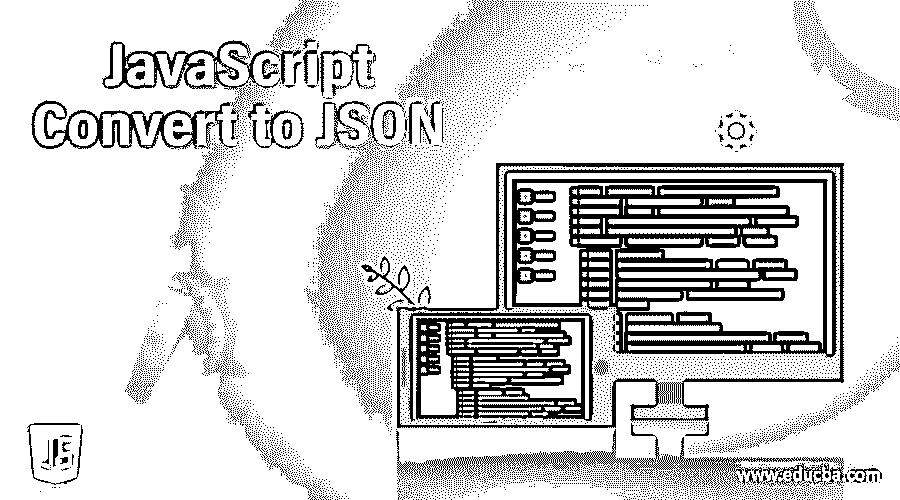

# JavaScript 转换为 JSON

> 原文：<https://www.educba.com/javascript-convert-to-json/>




## JavaScript 转换为 JSON 简介

javascript 是一种客户端编程语言，用于开发网页并将客户端请求发送到服务器进行验证。JSON 是 javascript 对象符号，也是服务器端响应的响应格式之一。使用 JSON.parse()是预定义的方法，用于传递带有左“({ '和')}”括号的值，我们可以将任意数量的值传递给这些格式，以便将 javascript 变量值转换为 JSON 格式代码。我们可以使用 n 种方法将数据传递和传输到脚本中，但是我们主要使用 JSON.parse()方法。

### JavaScript 转换为 JSON 的语法

javascript 代码总是有一些预定义的方法来完成用户验证或任何其他客户端请求过程。每个功能都有自己的语法和格式，将在网页中使用。我们将看到在 javascript 代码中使用默认方法的地方。

<small>网页开发、编程语言、软件测试&其他</small>

```
<html>
<head>
<script>
var variablename='values';
var variablename1 = JSON.parse(variablename);
var variablename2 = JSON.stringify(variablename);
----some logic scripts—
We can sent the request to the servers using below codes
fetch(URL,{
method:"POST/GET"
body:JSON.stringify(datas);
headers:{
"Content-type":"application/json;charset=UTF-8"
}
</script>
</head>
<body>
</body>
</html>
```

以上代码是名为 json 的 javascript 方法的基本语法。parse()用在脚本中的任何地方，用于在 UI 中发送请求，之后，服务器代码将接收 JSON 格式的响应。

### JavaScript 如何转换成 JSON？

javascript 语言用于发送请求并从服务器接收响应。接收的数据将是 xml 或 json 格式。我们还将接收的数据转换为其他格式，如字符串转换。该方法是 stringify()方法，其函数用于更改字符串处理方法的行为，值是字符串数组，并计算作为对象值属性的对象数量，该值将包含在 JSON 字符串中。如果假设服务器响应为空值或不以字符串或某些其他格式提供，则对象的属性也包括在 JSON 格式中，并接收服务器数据。它可以拆分为空格，也用于字符串和数字。空白中的实例作为字符串格式插入并接收 JSON 输出，易于阅读。

我们可以使用一些其他的在线转换，将整个 javascript 代码转换成 JSON 格式。将脚本转换为 JSON 格式后，JSON 文本必须是可读格式，我们还需要将其转换为对象，并使用 toString()方法实现它，然后它会自动转换为基于 java 的实例，这有助于用另一个可读格式的文件写入结果。同时，我们在这个场景中使用了 JSON API，比如 Jackson JSON API 等。基本上，JSON 对象用于交换数据格式的键值对技术，通常包括像{和}这样的大括号。我们还提到了脚本中的数据，没有像 JSON.parsesimpily 这样的方法，我们声明了像 var variable name ={ key:value，key1:value1}这样的 javascript 变量类型；这一行是我们用键-值对声明特定变量的一个例子，键必须是唯一的，所以不接受重复的键，但值可以是重复的或原始的，有时接受值，在这种情况下也接受空值。

JSON 对象将像文本格式一样工作，但是它必须被转换成字符串格式，arrayformat。我们可以像点符号或方括号符号一样使用 JSON，两者都是可以接受的。我们主要使用 JSON.stringify()方法将脚本中声明的 javascript 值转换为 JSON 值。我们使用 fetch API 将请求发送到服务器，它提供了一个通过网络获取资源的接口，主要用于将请求发送到服务器，并使用 JSON 或其他格式接收响应。如果假设我们需要使用 JSON 格式接收响应，我们将声明 fetch(“URI”)。然后(resp=>resp.json())。json()是在客户机向服务器发送请求后接收 JSON 格式的响应的方法。

### JavaScript 转换成 JSON 的例子

以下是 javascript 转换为 JSON 的示例:

#### 示例#1

**代码:**

```
<!DOCTYPE html>
<html>
<head>
<title>
Welcome To My Domain
</title>
</head>
<body style="text-align:center;">
<h1 style="color:pink;">
Have a <u>Gud</u> day user
</h1>
<p id="first"
style=" font-weight: bold">
</p>
<button onclick="demo()">
Please click
</button>
<p id="second"
style="color:red;
font-weight: bold" <u>;</u>>
</p>
<script>
var g = {
a_1: "siva",
a_2: "raman",
a_3: "sivaraman",
a_4: "arun",
a_5: "kumar",
a_6: "arunkumar"
};
var u =
document.getElementById("first");
var d =
document.getElementById("second");
//u.innerHTML =
//JSON.stringify(g);
function demo() {
//g.a_7 = "jegan";
d.innerHTML = JSON.stringify(g);
}
</script>
</body>
</html>
```

**输出:**


**点击按钮后:**


#### 实施例 2

**代码:**

```
<!DOCTYPE html>
<html>
<head>
<title>
Welcome To My DOmain
</title>
</head>
<body style="text-align:center;">
<h1 style="color:pink;">
Have a Gud day user
</h1>
<p id="first"
style=" font-weight: bold">
</p>
<button onclick="demo()">
Please click
</button>
<p id="second"
style="color:red;
font-weight: bold" <u>;</u>>
</p>
<script>
var g = {
a_1: "siva",
a_2: "raman",
a_3: "sivaraman",
a_4: "arun",
a_5: "kumar",
a_6: "arunkumar"
};
var u =
document.getElementById("first");
var d =
document.getElementById("second");
u.innerHTML =
JSON.stringify(g);
function demo() {
g.a_7 = "jegan";
d.innerHTML = JSON.stringify(g);
}
</script>
</body>
</html>
```

**输出:**


#### 实施例 3

**代码:**

```
<!DOCTYPE html>
<html>
<body>
<h2>Welcome To My Domain</h2>
<p id="demo"></p>
<script>
var t = '{"students":[' +
'{"firstName":"Siva","lastName":"Raman" },' +
'{"firstName":"Arun","lastName":"Kumar" },' +
'{"firstName":"ST","lastName":"Jubb" }]}';
result = JSON.parse(t);
document.getElementById("demo").innerHTML =
result.students[0].firstName + " " + result.students[0].lastName;
result.students[1].firstName + " " + result.students[1].lastName;
result.students[2].firstName + " " + result.students[2].lastName;
</script>
</body>
</html>
```

**输出:**


上面的例子展示了 javascript 到 json 的转换，前两个例子我们使用了 JSON.stringify()方法，最后一个例子在脚本中使用了 JSON.parse()。

### 结论

最后，我们通过在线/离线过程将 javascript 代码转换为 JSON 格式，基本上它也将显示文本格式，但我们使用一些默认方法，如 JSON.stringify()方法将 JSON 对象转换为字符串，并再次使用 JSON.parse()方法将数据重新转换为 javascript 对象。

### 推荐文章

这是一个 JavaScript 转换成 JSON 的指南。这里我们讨论一下入门以及 javascript 如何转换成 json？以及不同的示例及其代码实现。您也可以看看以下文章，了解更多信息–

1.  [JavaScript 号](https://www.educba.com/javascript-number/)
2.  [JavaScript exec()](https://www.educba.com/javascript-exec/)
3.  [JavaScript clearTimeout()](https://www.educba.com/javascript-cleartimeout/)
4.  [卸载 JavaScript](https://www.educba.com/unshift-javascript/)


