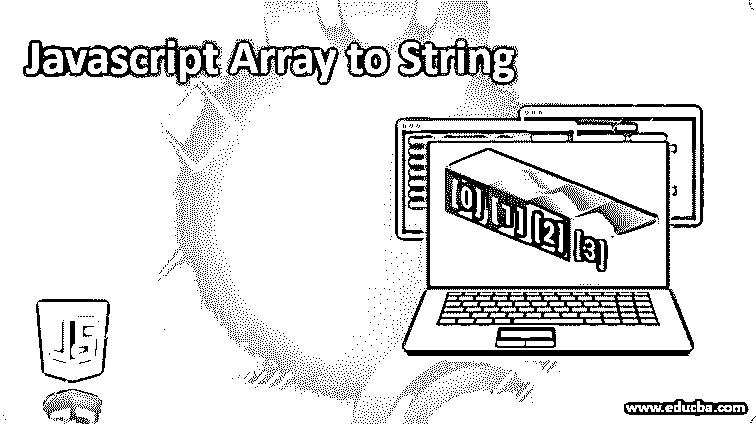

# Javascript 数组到字符串

> 原文：<https://www.educba.com/javascript-array-to-string/>




## Javascript 数组到字符串简介

Javascript 数组是相似数据类型的元素的集合。我们通常有一个数组形式的数据元素集合，由于其他一些原因，它需要进一步转换成字符串。在 javascript 中，这可以通过多种方式实现。这里，我们将详细讨论 javascript 中帮助将数组转换为字符串的五种方法。根据情况和要求，我们可以使用其中任何一种。每种方法都有其优点和缺点。

1.  toString()方法
2.  类型强制(+)运算符
3.  join()方法
4.  stringify()方法
5.  手动编码以将数组转换为

### Javascript 数组到字符串的方法

以下是 javascript 的方法:

<small>网页开发、编程语言、软件测试&其他</small>

#### 1.toString()方法

在 javascript 中，我们为所有对象提供了一个通用的内置方法 toString()来将对象转换为字符串数据类型。对象的 toString()方法由 array 重写，以将 Array 对象转换为 String 数据类型。使用 toString(，)方法时，array 对象保持不变，并创建一个具有数组字符串值的新对象。让我们借助一个例子来理解它的工作原理。

**代码:**

```
<!DOCTYPE html>
<html>
<body>
<p>Demonstration to use toString() method to convert array to string </p>
<button onclick="convertToString()">Display Language String</button>
<p id="sampleDemo"></p>
<script>
function convertToString() {
var languages = ["Java", "Hibernate", "Angular", "Typescript","Javascript","Maven","C","C++","PHP","Ajax","HTML"]; var languageString = languages.toString();
document.getElementById("sampleDemo").innerHTML = languageString;
}
</script>
</body>
</html>
```

点击“显示语言字符串”按钮后，上述代码的输出如下。

**输出:**


#### 2.JavaScript 的类型强制

我们可以使用 javascript 的 **+** 运算符将数组转换为字符串。每当我们使用加号操作符向字符串添加数组时，javascript 都会在内部将被连接的对象转换为字符串格式。类似地，如果我们添加一个数组，它会被转换成一个字符串。让我们借助一个例子来理解如何做到这一点。

**代码:**

```
<!DOCTYPE html>
<html>
<body>
<p>Demonstration to javascript type coercion to convert array to string </p>
<button onclick="convertToString()">Display Language String</button>
<p id="sampleDemo"></p>
<script>
function convertToString() {
var languages = ["Java", "Hibernate", "Angular", "Typescript","Javascript","Maven","C","C++","PHP","Ajax","HTML"];
var languageString = languages+[]; document.getElementById("sampleDemo").innerHTML = languageString;
}
</script>
</body>
</html>
```

上述代码的输出如下。

**输出:**


#### 3.join()方法

以上所有方法都可以用来将数组转换为字符串，并以逗号作为分隔符。该分离器不能根据我们的方便进行更改或修改。当我们想用我们选择的分隔符从数组中创建一个字符串时，我们必须使用数组的 join()方法。默认分隔符是逗号，不需要提及。如果我们想要任何其他分隔符，那么我们必须指定相同的分隔符。这个方法将数组转换成我们选择的格式的字符串。让我们在一个例子的帮助下看一个如何实现这一点的例子。

**代码:**

```
<!DOCTYPE html>
<html>
<body>
<p>Demonstration to use join() method to convert array to string </p>
<button onclick="convertToString()">Display Language String</button>
<p id="sampleDemo1"></p>
<p id="sampleDemo2"></p>
<p id="sampleDemo3"></p>
<script>
function convertToString() {
var languages = ["Java", "Hibernate", "Angular", "Typescript","Javascript","Maven","C","C++","PHP","Ajax","HTML"]; var languageString1 = languages.join();
var languageString2 = languages.join(" <-> "); var languageString3 = languages.join(" - ");
document.getElementById("sampleDemo1").innerHTML = languageString1; document.getElementById("sampleDemo2").innerHTML = languageString2; document.getElementById("sampleDemo3").innerHTML = languageString3;
}
</script>
</body>
</html>
```

单击“显示语言字符串”按钮后，上述代码的输出如下

**输出:**


#### 4.JSON.stringify()方法

如果我们想转换一个内部包含数组的数组，那么我们可以使用 JSON.stringify()方法。当我们想要将嵌套数组转换成字符串时，可以使用这种方法。让我们借助一个例子来看看如何做到这一点。

**代码:**

```
<!DOCTYPE html>
<html>
<body>
<p>Demonstration to use JSON.stringify() method to convert array to string </p>
<button onclick="convertToString()">Display Language String</button>
<p id="sampleDemo1"></p>
<script>
function convertToString() {
var languages = ["Java", "Hibernate", "Angular", "Typescript","Javascript","Maven","C","C++","PHP","Ajax","HTML", ["Webstorm","Eclipse","Sublime Text","gedit"]];
var languageString1 = JSON.stringify(languages); document.getElementById("sampleDemo1").innerHTML = languageString1;
}
</script>
</body>
</html>
```

上述代码的输出如下。

**输出:**


#### 5.手动迭代数组元素以准备字符串

除此之外，如果我们想要将数组转换为字符串，那么如果由于某些原因无法使用上述任何方法，我们可以使用我们的硬编码方法来转换数组。在这种情况下，重要的是理解和了解你要写的逻辑和代码的主要逻辑和时空复杂性。让我们借助一个例子来了解如何做到这一点。

**代码:**

```
<!DOCTYPE html>
<html>
<body>
<p>Demonstration to write manual code convert array to string </p>
<button onclick="convertToString()">Display Language String</button>
<p id="sampleDemo"></p>
<script>
function convertToString() {
var languages = ["Java", "Hibernate", "Angular", "Typescript","Javascript","Maven","C","C++","PHP","Ajax","HTML"]; var languageString = callMyMethod(languages);
document.getElementById("sampleDemo").innerHTML = languageString;
}
function callMyMethod(array) { let string = '';
array.forEach(function(counter, currentIndex) { string += counter;
if (currentIndex != (array.length - 1)) { string += ',';
};
});
return string;
}
</script>
</body>
</html>
```

点击“显示语言字符串”按钮后，上述代码的输出如下。

**输出:**


### 推荐文章

这是一个 Javascript 数组到字符串的指南。在这里，我们讨论 string 的介绍和 Javascript 数组方法，以及不同的示例和代码实现。您也可以看看以下文章，了解更多信息–

1.  [JavaScript 日期解析](https://www.educba.com/javascript-date-parse/)
2.  [JavaScript indexOf()](https://www.educba.com/javascript-indexof/)
3.  [JavaScript 数组串联](https://www.educba.com/javascript-array-concat/)
4.  [JavaScript 数组过滤器](https://www.educba.com/javascript-array-filter/)


