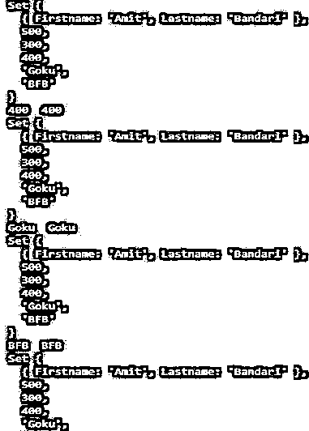

# 在 JavaScript 中设置

> 原文：<https://www.educba.com/set-in-javascript/>


## JavaScript 中的 Set 简介

集合是(ES2015) ES6 的一种新型对象类型，允许我们创建唯一值/项目的集合。集合中的值可以是简单的原语，如整数、字符串，也可以是复杂的对象类型，如数组或对象文字。在这里，我们将看到 javascript 中 set 的一些可用方法，如 add、size、forEach、has、delete 和 clear。

**语法:**

<small>网页开发、编程语言、软件测试&其他</small>

```
new Set( [IT] );
```

**IT 参数:**单词“IT”包含要添加到您正在创建的新集合中的所有元素/值。如果未传递/指定参数“IT ”(即传递 null ),则将创建空集。

**Returns:** 上面的语法返回一个带有对象' IT '的新集合。

考虑一个小例子来理解 JavaScript 集合中这个方法的概念。

**集合示例**

**代码:**

```
var set1 = new Set(["Anil","Sunil","Anitha","Pavan","Kumar"]);
// This set contains ["Anil","Sunil","Anitha","Pavan","Kumar"]
var set 2 = new Set(["dooooor"]);
//This set contains 'd', 'o', 'r'
var set3 = new Set([100, 200, 300, 400, 500, 500]);
//This set contains [100, 200, 300, 400, 500, 500]
var set4 = new Set();
//This set is an empty set which has no items
```

Set.prototpe.size: 这将返回集合中存在的元素/项目的数量。

**代码:**

```
var set1 = new Set(["Anil","Sunil","Anitha","Pavan","Kumar"]);
// This set contains ["Anil","Sunil","Anitha","Pavan","Kumar"]
var set 2 = new Set(["dooooor"]);
//This set contains 'd', 'o', 'r'
var set3 = new Set([100, 200, 300, 400, 500, 500]);
//This set contains [100, 200, 300, 400, 500, 500]
var set4 = new Set();
//This set is an empty set which has no items
```

### JavaScript 中的 Set 方法

正如我们已经看到的，JavaScript 中的 set 的一些方法是 add、delete、size、forEach、clear。对这些方法知之甚少。

#### 1.添加方法

**Set.prototype.add():** 这将在 Set 对象的末尾添加一个具有特定值的新元素/项目。

**语法:**

```
Set1.add(value1);
```

**参数:** Value1 =添加到集合中的值。

**Returns:** 上面的这个语法将返回 set 对象。

##### 例子

现在是在方法的帮助下添加新集合的时候了。

**代码:**

```
var set1 = new Set();
//An empty set is created
set1.add(100);
//100 added to the set
set1.add(200);
//200 added to the set
set1.add(300).add(400).add(500);
//Now 300, 400, 500 added to the set with chaining method
console.log(set1);
//This will print 100, 200, 300, 400, 500
```

**输出:**


#### 2.删除方法

**Set.prototype.delete():** 这将从 Set 对象中删除现有的元素/项目。

**语法:**

```
Set1.delete(value1);
```

**参数:** Value1 =将从集合中删除的值。

**返回:**如果 value1 成功删除，上述语法将返回 true，否则返回 false。

##### 例子

现在是时候在方法的帮助下删除新的集合了。

**代码:**

```
var set1 = new Set("booooooriing");
//created a set containing 'b', 'o', 'r', 'i', 'n', 'g'
console.log(set1.delete('o'));
//deleting o from the set
console.log(set1);
//Now the set contains 'b', 'r', 'i', 'n', 'g'
console.log(set1.delete('h'));
//deleting element which is not in the set prints false
```

**输出:**


#### 3.清除方法

**Set.prototype.clear():** 这将从 Set 对象中清除/移除所有现有的元素/项目。清除集合中的所有项目不需要值。

**语法:**

```
Set1.clear();
```

**参数:**本方法不涉及参数。

**退货:**未定义

##### 例子

现在是在方法的帮助下清除新集合的时候了。

**代码:**

```
var set3 = new Set([100, 200, 300, 400, 500]);
//creating a set with integers using Set.prototype.clear()
console.log(set3);
//prints [100, 200, 300, 400, 500]
set3.clear();
//clears the whole set by removing all the elements at once
console.log(set3);
//prints [] because nothing present in the set now
```

**输出:**


#### 4.forEach 方法

**Set.prototype.forEach():** 这将给定的函数按插入顺序对集合中的每个元素/项目执行一次。

**语法:**

```
Set1.forEach(callback[, thisarg]);
```

**参数:**

*   **回调:**该参数是为集合中的每个元素执行的函数。
*   **Thisarg:** 这是在执行回调时使用的值。

**退货:**未定义

回调函数通常提供 3 个参数:

*   元素键
*   元素值
*   设置要遍历的对象

##### 例子

现在是借助方法使用 forEach 的时候了。

**代码:**

```
var set1 = new Set();
// creating set using the Set.prototype.forEach(callback[, thisargu])
set1.add({Firstname: "Amit", Lastname: "Bandari"});
set1.add(500);
set1.add(300);
set1.add(400);
set1.add("Goku");
set1.add("BFB");
// adding different types of elements to the set
function printOne(values)
{
console.log(values);
}
// Here we are only using one parameter value to declare a call back function so that it will ignore other two types
set1.forEach(printOne);
// It prints all elements/values of the set which are in the printOne(values)
function printTwo(key, values)
{
console.log(key+" "+values);
}
// Here we are using two parameter values to call back a function so that it will ignore remaining last type
set1.forEach(printTwo);
// keys and values are in the same set so values will be printed twice
function printThree(key, values, set)
{
// it will be going to print keys and values and the set object
console.log(key+" "+values);
console.log(set);
}
// Now we are using all the three parameter value types using call back function
set1.forEach(printThree);
// It will print keys and values of each element and the entire set object will be printed
```

**输出:**




#### 5.有方法

**Set.prototype.has():** 如果特定元素/值出现在 Set 对象的现有元素/项目中，将返回 true。

**语法:**

```
Set1.has(value1);
```

**参数:** Value1 =将要在集合元素中搜索的值。

**返回:**如果 value1 成功，上面的语法将返回 true，否则将返回 false。

##### 例子

现在是在方法的帮助下使用 has 的时候了。

**代码:**

```
var set1 = new Set();
// Creating a new set with no elements for now
set1.add(500);
// adding element 500 to the set
set1.add(300);
// adding element 300 to the set
console.log(set1.has(500));
// prints true because 500 present in the set
console.log(set1.has(10));
// prints false because element 10 not present in the set object
```

**输出:**


#### 6.Keys 方法

**Set.prototype.keys():** 这也将像 values 方法一样，以相同的插入顺序从 Set 对象中返回所有现有的元素/项目。

**语法:**

```
Set1.keys();
```

**参数:**不需要参数。

**返回:**它还返回迭代器对象，该对象包含集合中基于插入顺序的所有值/元素。

##### 例子

现在是在方法的帮助下使用密钥的时候了。

**代码:**

```
var set1 = new Set();
//creating a new set
set1.add(500);
set1.add(300);
set1.add(400);
set1.add("GOKU");
set1.add("BFB");
// adding elements to the set object
var getValues = set1.values();
// getting all the values from the set
console.log(getValues);
// prints a Set Iterator which contains {500, 300, 400, "GOKU", "BFB"}
var getKeys = set1.keys();
// getting all the values in the set
console.log(getKeys);
// prints a Set Iterator which contains {500, 300, 400, "GOKU", "BFB"}
```

**输出:**


#### 7.价值方法

**Set.prototype.values():** 这将从 Set 对象中以相同的插入顺序返回所有现有的元素/项目。

**语法:**

```
Set1.values();
```

**参数:**不需要参数。

**Returns:** 它返回迭代器对象，该对象包含集合中所有值/元素，基于它们被插入的顺序

### 结论

在文章的最后，我们认为你已经学习了什么是 Set 和它的一些方法。还有一些其他的方法，比如条目，迭代器等等。，那些和其他方法差不多。

### 推荐文章

这是一个在 JavaScript 中设置的指南。这里我们讨论 JavaScript 中的 set 方法以及它们的语法、属性、参数和代码实现。您也可以浏览我们推荐的其他文章，了解更多信息——

1.  [JavaScript 中的导航器](https://www.educba.com/navigator-in-javascript/)
2.  [JavaScript 日期格式](https://www.educba.com/javascript-date-formats/)
3.  [在 JavaScript 中反转](https://www.educba.com/reverse-in-javascript/)
4.  [JavaScript 文字量](https://www.educba.com/javascript-literals/)


