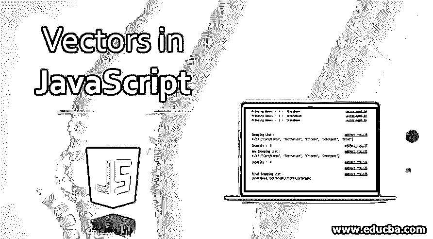

# JavaScript 中的向量

> 原文：<https://www.educba.com/vectors-in-javascript/>




## JavaScript 中的向量简介

向量是一种特殊的数组，其大小可以根据存储在其中的数据而增加或减少。向量可以保存任何类型的元素、对象和数据类型。可以说向量是一维动态数组。由于它的动态结构，它提供了预先分配结构大小的能力，并允许快速分配内存空间。现在我们已经定义了什么是向量，让我们来理解为什么使用它们。

### JavaScript 中为什么要用向量？

向量的值/项/元素存储在连续的空间中，这意味着可以使用迭代器和偏移量来访问这些项。

<small>网页开发、编程语言、软件测试&其他</small>

以下几点向我们解释了为什么即使我们有数组也要使用向量，以及它提供了什么好处/特性使它在编程中有用:

*   向量可用于以有组织的方式存储对象或对象集合。
*   可以预先提供向量的大小。
*   充当数据结构容器。
*   它提供快速的内存空间分配。
*   本质上是动态的，即它们的大小可以按需增加，这与具有固定大小的阵列不同。
*   像数组一样，在常量时间内通过索引访问 vector 中的项。

### JavaScript 中的 Vector 示例

让我们通过一些例子来看看如何在 JavaScript 中创建 vector 及其属性:

#### 示例 1–用 JavaScript 创建矢量

**代码:**

```
<!DOCTYPE HTML>
<html>
<body></body>
<script>
//Created new Vector - *numBooks*
var numBooks = ["firstBook","secondBook","thirdBook"];
for(var count = 0; count < numBooks.length; count++)
console.log("Printing Books - ",count,": ", numBooks[count]);
</script>
</html>
```

**输出:**


**说明:**

从上面的例子中可以看出，vector object–numBooks 具有 length 属性，该属性根据从位置 0 开始的条目数给出其长度，与数组相同。

#### 示例 2——JavaScript 中向量的动态特性

**代码:**

```
<!DOCTYPE HTML>
<html>
<body></body>
<script>
//Vector Defined
var shopItems = []
// Adding items to the vector
shopItems.push("Cornflakes");
shopItems.push("Toothbrush");
shopItems.push("Chicken");
shopItems.push("Detergent");
shopItems.push("Bread");
//Print Total Shopping Items
console.log("Shopping List : ",shopItems);
console.log("Capacity : ",shopItems.length);
//Removing latest added item
shopItems.pop()
console.log("New Shopping List : ",shopItems);
console.log("Capacity : ",shopItems.length);
//Representing as a single string value without double quotes
console.log(" ");
console.log("Final Shopping List - ",shopItems.join());
</script>
</html>
```

**输出:**


**说明:**

与矢量商店项目相关联的方法“push”用于向其插入值。在那之后，我们有一个名为“pop”的方法从其中删除一个值，它返回向量的最后一个值，即向量遵循 LIFO(后进先出)实现。“join”方法从一个字符串向量构建一个细长的字符串。

#### 示例# 3–从向量中检索元素

**代码:**

```
<!DOCTYPE HTML>
<html>
<body></body>
<script>
//Vector Defined
var shopItems = []
// Adding items to the vector
shopItems.push("Cornflakes");
shopItems.push("Toothbrush");
shopItems.push("Chicken");
shopItems.push("Detergent");
shopItems.push("Bread");
shopItems.push("Eggs");
shopItems.push("Rice");
console.log("Final Shopping List - ",shopItems.join());
// Retrieve elements from a particular position
console.log("Item at 3rd Position - ",shopItems[2]);
//Search an item in the Vector
console.log("Apple at Position : ",shopItems.indexOf("Apple"));   // -1 => Element Not Found
console.log("Bread at Position : ",shopItems.indexOf("Bread")+1);
</script>
</html>
```

**输出:**


**说明:**

在上面的代码示例中，我们首先检索出现在第 3 个 <sup>rd</sup> 位置的元素，记住数组向量索引从 0 开始，因此我们提到了 shopItems[2]来获取向量列表 shopItems 中的第 3 个 <sup>rd</sup> 元素。接下来，在代码示例中，我们使用 indexOf()方法搜索列表中是否存在某个项目，如果某个项目存在于 vector 中，该方法将返回索引位置，否则将返回-1，这意味着该项目不存在于 vector 列表中。

### 结论

在本文中，我们了解了什么是 vectors，为什么要使用它，它与典型的数组有什么不同，它在 JavaScript 程序环境中是如何工作和动作的，这些都要借助本文中的一些例子。此外，我们看到了如何实现基本功能，如添加、删除、检索、搜索向量中的元素。

### 推荐文章

这是 JavaScript 中的矢量指南。这里我们讨论介绍，各种例子，以及为什么在 JavaScript 中使用向量。您也可以浏览我们推荐的其他文章，了解更多信息——

1.  [JavaScript parseInt](https://www.educba.com/javascript-parseint/)
2.  [JavaScript 字符串格式](https://www.educba.com/javascript-string-format/)
3.  [JavaScript 字符串替换](https://www.educba.com/javascript-string-replace/)
4.  [JavaScript 比较字符串](https://www.educba.com/javascript-compare-strings/)


