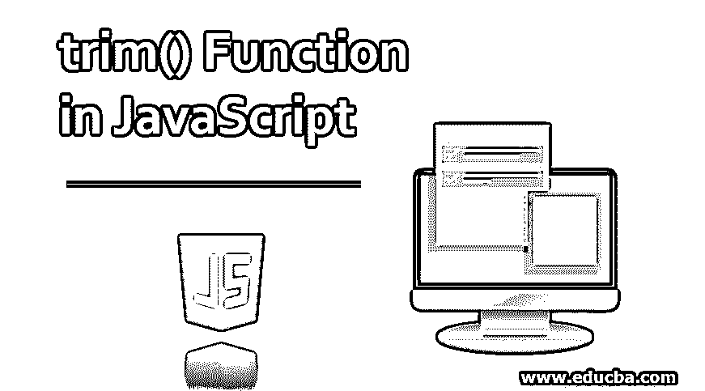
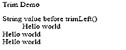
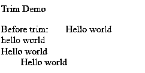
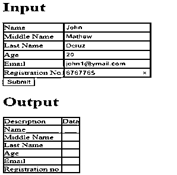
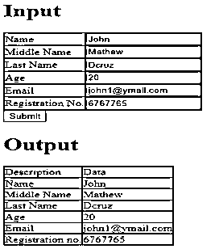

# JavaScript 中的 trim()函数

> 原文：<https://www.educba.com/trim-function-in-javascript/>




## JavaScript 中 trim()函数介绍

[JavaScript 中的‘trim()’函数用于从目标字符串变量中修剪](https://www.educba.com/what-is-javascript/)空格。空白包括以字符串形式附加在左右两端的空格。它还可以修剪制表符、不间断空格和所有换行符，如回车、换行符。Trim 函数返回一个新的字符串值，该值是经过修剪的字符串。该函数不接受任何参数。trim()函数不影响字符串或字符串变量的实际值。还有两个函数与 trim()函数相关联，这两个函数是 trimLeft()和 trimRight()，分别用于从左侧和右侧修剪空白。这两个功能不经常使用，因为有些浏览器不支持这些功能。

**语法:**

<small>网页开发、编程语言、软件测试&其他</small>

```
Str.trim();
```

Str 是一个必须被修整的目标字符串。它返回一个新的字符串。

### 实现 trim()函数的示例

让我们看一些用 JavaScript 实现 trim()函数的例子:

#### 示例#1

这是实现 trim()的第一个基本示例，如下所示。

**代码:**

```
<!DOCTYPE html>
<html>
<head>
<meta charset="ISO-8859-1">
<title>Insert title here</title>
</head>
<body>
<p>Trim Demo</p>
<script>
var String1 = " hello world ";
document.write("Before trim:"+String1+ "<br \>");
var String2 = String1.trim();
document.write(String2 + "<br \>");
</script>
</body>
</html>
```

**输出:**


在上面的示例中，变量 String1 被赋值为“hello world ”,并在字符串的两边添加了一些空格。在下一行中，我们对 String1 变量应用了 trim()，经过修剪的字符串数据存储在 String2 变量中。

#### 实施例 2

这是下面给出的第一个实现 trimLeft()函数的基本例子。

**代码:**

```
<!DOCTYPE html>
<html>
<head>
<meta charset="ISO-8859-1">
<title>Insert title here</title>
</head>
<body>
<p>Trim Demo</p>
<script>
var String1 = " Hello world ";
var String2 = String1.trim();
var String3 = " Hello world ";
document.write("String value before trimLeft()<br \>");
document.write(String3+ "<br \>");
var String4 =String3.trimLeft();
document.write(String2 + "<br \>");
document.write(String4 + "<br \>");
</script>
</body>
</html>
```

**输出:**




在上面的示例程序中，我们将 trimLeft()应用于变量 String3，该变量修剪左侧空白并将结果字符串存储在 String4 中。如上图所示，应用 trimLeft()之前和应用 trimLeft()之后显示的输出 String3 值。在应用函数 trimLeft()之前，它显示了添加了空格的 String3 值。

#### 实施例 3

这是实现 trimRight()函数的第一个基本示例，如下所示。

**代码:**

```
<!DOCTYPE html>
<html>
<head>
<meta charset="ISO-8859-1">
<title>Insert title here</title>
</head>
<body>
<p>Trim Demo</p>
<script>
var String1 = " hello world ";
var String2 = String1.trim();
var String3 = " Hello world ";
var String5 =" Hello world ";
document.write("Before trim:"+String3+ "<br \>");
var String4 =String3.trimLeft();
var String6 =String5.trimRight();
document.write(String2 + "<br \>");
document.write(String4 + "<br \>");
document.write(String6 + "<br \>");
</script>
</body>
</html>
```

**输出:**




考虑上述程序的输出，我们将 trimRight()应用于变量 String5，然后应用 trimRight()字符串值，并在左右两边添加空格。trimRight()只是删除右边的空格，并将结果值存储在 String6 变量中。您可以在输出 String6 变量中观察到，只有通过删除右侧的空格才能显示该变量。

#### 实施例 4

下面的示例在应用 trim()方法从 textbox 读取值时创建了一个注册表单。

**代码:**

```
<!DOCTYPE html>
<html lang="en">
<head>
<meta charset="utf-8">
<title>Get Text Input Field Value in JavaScript</title>
<script type="text/javascript" src=" " charset="UTF-8"></script></head>
<body>
<form action=" " method="post">
<h1>Input</h1>
<table border="1" cellpadding="0" cellspacing="0">
<tr>
<td>Name</td>
<td><input type="text" id="sFname"></td>
</tr>
<tr>
<td>Middle Name</td>
<td><input type="text" id="sMname"></td>
</tr>
<tr>
<td>Last Name</td>
<td><input type="text" id="sLname"></td>
</tr>
<tr>
<td>Age</td>
<td><input type="text" id="age"></td>
</tr>
<tr>
<td>Email</td>
<td><input type="text" id="email"></td>
</tr>
<tr>
<td>Registration No.</td>
<td><input type="text" id="regNo"></td>
</tr>
</table>
<input type="button" onclick="show_records()" value="Submit">
<h1>Output</h1>
<table border="1" cellpadding="0" cellspacing="0">
<tr>
<td>Description</td>
<td>Data</td>
</tr>
<tr>
<td>Name</td>
<td id="print_sFname"></td>
</tr>
<tr>
<td>Middle Name</td>
<td id="print_sMname"></td>
</tr>
<tr>
<td>Last Name</td>
<td id="print_sLname"></td>
</tr>
<tr>
<td>Age</td>
<td id="print_age"></td>
</tr>
<tr>
<td>Email</td>
<td id="print_email"></td>
</tr>
<tr>
<td>Registration no.</td>
<td id="print_regNo"></td>
</tr>
</table>
</form>
<script>
function show_records(){
var sFname = document.getElementById("sFname").value;
sFname = sFname.trim();
document.getElementById("print_sFname").innerHTML =sFname;
var sMname = document.getElementById("sMname").value;
sMname = sMname.trim();
document.getElementById("print_sMname").innerHTML =sMname;
var sLname = document.getElementById("sLname").value;
sLname = sLname.trim();
document.getElementById("print_sLname").innerHTML =sLname;
var sage = document.getElementById("age").value;
sage = sage.trim();
document.getElementById("print_age").innerHTML =sage;
var sMail = document.getElementById("email").value;
sMail = sMail.trim();
document.getElementById("print_email").innerHTML =sMail;
var srno = document.getElementById("regNo").value;
srno = srno.trim();
document.getElementById("print_regNo").innerHTML =srno;
}
</script>
</body>
</html>
```

**输出:**




提交输入后，输出将是，




### 结论

JavaScript 中有很多关于字符串的函数，但 trim()函数及其相关函数在动态 HTML 网页中起着重要作用。例如，如果网页使用文本框读取用户数据，用户可能会使用空格或制表符输入数据，在这种情况下，trim 起着重要的作用。String trim()及其相关函数不仅可以用于修剪，还可以用于各种目的。相比其他 web [开发编程语言](https://www.educba.com/best-programming-languages/) JavaScript trim()更容易使用。

### 推荐文章

这是 JavaScript 中 trim()函数的指南。这里我们讨论 JavaScript 中 trim()函数的介绍和语法，以及相应的例子。你也可以看看下面的文章来了解更多-

1.  [JavaScript 获取数组长度](https://www.educba.com/javascript-get-array-length/)
2.  [Javascript 扩展运算符](https://www.educba.com/javascript-merge-arrays/)
3.  [JavaScript 字符串替换](https://www.educba.com/javascript-string-replace/)
4.  [JavaScript 刷新页面](https://www.educba.com/javascript-refresh-page/)


