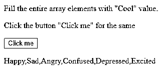
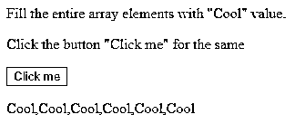
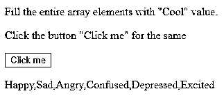
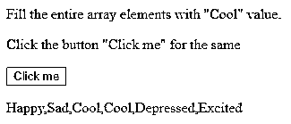

# JavaScript Fill()

> 原文：<https://www.educba.com/javascript-fill/>


## JavaScript Fill()简介

在 Javascript 中，array.fill()是一个用静态值填充数组的函数，从数组的起始索引到结束索引位置。该值可用于填充特定数组的一部分或整个数组。因为这个方法被认为是数组对象的一个方法，所以它的调用应该通过指定的数组类的实例来完成。而且，是有一定条件的。

*   如果起点为负，将考虑长度+起点。
*   如果结尾是负数，将考虑长度+结尾。
*   这是一个 mutator 方法，并且是有意泛型的。

### 句法

下面是 JavaScript fill()方法的语法。

<small>网页开发、编程语言、软件测试&其他</small>

```
ar.fill(val[, fill_strt [, fill_end]]);
```

这里，ar 是必须用特定值填充的数组。

这 3 个参数包括:

**瓦尔:**

*   必须用于填充每个数组元素的特定值。

**fill_strt:**

*   填充元素开始的索引位置。
*   如果该参数为负，填充顺序将相反。也就是说，索引位置从数组末尾开始。
*   默认值为 0。也就是说，如果没有给出这个参数，将认为是 0。

**填充 _ 结束:**

*   元素填充结束的索引位置。
*   不要包含结束元素。
*   如果该参数为负，填充顺序将相反。也就是说，索引位置从数组末尾开始。
*   默认值是这样的。长度。也就是说，如果没有给出该参数，将考虑长度。

**fill()方法的返回值:**

与其他方法不同，此方法不给出新数组。将返回旧数组的修改版本，其中包含指定的值。

### JavaScript 中 fill()方法是如何工作的？

现在，让我们借助一个例子来看看 fill()方法是如何工作的。假设有一个“季节”数组，其元素如下所示。

```
var seasons=['autumn', 'spring', 'summer', 'rainy', 'winter'];
```

在这个例子中，有五个季节作为元素。我们的目标是将数组的所有元素填充为**雨天**。为此，可以调用季节数组的 fill()方法，如下所示:

```
Seasons.fill("rainy")
```

如下所示的修改后的数组将返回所有元素为 **rainy** 的结果。

```
['rainy', 'rainy', 'rainy', 'rainy', 'rainy']
```

假设，我们正在使用负参数值编写 fill()方法。

```
var seasons=['autumn', 'spring', 'summer', 'rainy', 'winter'];
Seasons.fill("rainy",-3,-1)
```

输出将是一个修改后的数组，其值如下所示。

```
['autumn', 'spring', 'rainy', 'rainy', 'winter']
```

这是因为，当负值用作参数时，起始位置将是数组的末尾。这里，-3 到-1 的位置都换成了 rainy 这个词。替换时不会包括指定的最后一个索引。这就是位置-1 的元素没有被替换的原因。

### 在 Javascript 中实现 fill()的示例

实际理解编程语言总是更好。为此，让我们看看一些实用的样品。

#### 示例#1

Javascript 程序，使用 fill()方法用单词“cool”填充数组的所有元素。

**代码**:

```
<!DOCTYPE html>
<html>
<body>
<p>Fill the entire array elements with "Cool" value.</p>
<p>Click the button "Click me" for the same</p>
<button onclick="sample()">Click me</button>
<p id="demo"></p>
<script>
var emotions = ["Happy", "Sad", "Angry", "Confused", "Depressed", "Excited"];
document.getElementById("demo").innerHTML = emotions;
function sample() {
document.getElementById("demo").innerHTML = emotions.fill("Cool");
}
</script>
</body>
</html>
```

**输出:**

在执行代码时，将显示一个按钮，必须单击该按钮才能用单词 cool 填充数组元素。




单击按钮时，将调用包含 fill()方法的函数，并返回修改后的数组。可以看到数组的所有元素都是**凉**。




#### 实施例 2

Javascript 程序，使用 fill()方法用单词“cool”填充数组中特定位置的元素。

**代码**:

```
<!DOCTYPE html>
<html>
<body>
<p>Fill the entire array elements with "Cool" value.</p>
<p>Click the button "Click me" for the same</p>
<button onclick="sample()">Click me</button>
<p id="demo"></p>
<script>
var emotions = ["Happy", "Sad", "Angry", "Confused", "Depressed", "Excited"];
document.getElementById("demo").innerHTML = emotions;
function sample() {
document.getElementById("demo").innerHTML = emotions.fill("Cool", 2, 4);
}
</script>
</body>
</html>
```

**输出:**

在执行代码时，类似于上面的程序，将显示一个按钮。




单击按钮时，将调用包含 fill()方法的函数，并返回修改后的数组。可以看到，fill()方法中提到的位置的数组元素被替换为单词 cool。




#### 实施例 3

使用 fill()方法用另一个数字“99”填充数组中所有数值元素的 Javascript 程序。

**代码**:

```
<html>
<head>
<title>Example of Javascript</title>
</head>
<body>
<p>Fill the entire array elements with "99" value.</p>
<script>
//array of numbers
var numbers = ["1", "4", "56", "76"];
//print the values
document.write("The numbers are: " + numbers);
document.write("<br>");
//fill all elements with the value "99"
numbers.fill("99");
//print the values
document.write("The numbers are: " + numbers);
document.write("<br>");
</script>
</body>
</html>
```

**输出:**

在执行代码时，将调用包含 fill()方法的函数，并将返回一个修改后的数组，所有元素都为 99。


#### 实施例 4

Javascript 程序，使用 fill()方法和作为负值的参数，用数字“99”填充数组的数字元素。

**代码**:

```
<html>
<head>
<title>Example of Javascript</title>
</head>
<body>
<p>Fill the entire array elements with "99" value.</p>
<script>
//array of numbers
var numbers = ["1", "4", "56", "76"];
//print the values
document.write("The numbers are: " + numbers);
document.write("<br>");
//fill all elements with the value "99"
numbers.fill("99",-2, -1);
//print the values
document.write("The numbers are: " + numbers);
document.write("<br>");
</script>
</body>
</html>
```

**输出:**


执行代码时将调用包含 fill()方法的函数，并返回一个修改后的数组。由于参数为负，起始索引位于数组的末尾，并且仅替换位置-2(倒数第二个)的元素。

### 推荐文章

这是 JavaScript Fill()的指南。这里我们讨论 JavaScript fill()方法的工作原理并举例详细解释。您也可以看看以下文章，了解更多信息–

1.  [JavaScript 光标](https://www.educba.com/javascript-cursor/)
2.  [JavaScript 控制台日志](https://www.educba.com/javascript-console-log/)
3.  [JavaScript 工具提示](https://www.educba.com/javascript-tooltip/)
4.  [JavaScript 地图对象](https://www.educba.com/javascript-map-object/)


