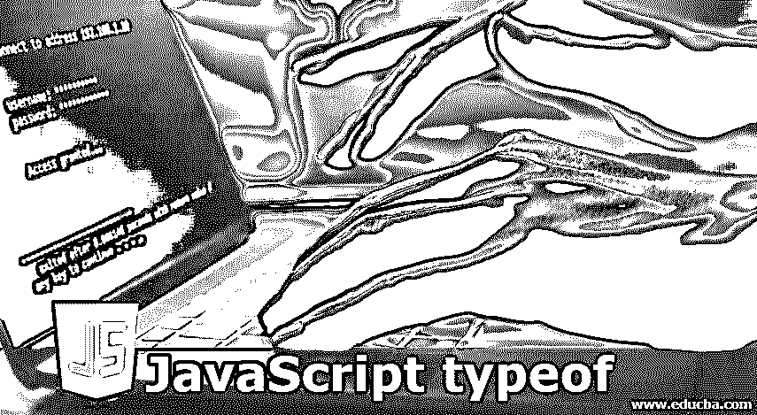
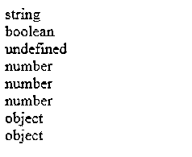
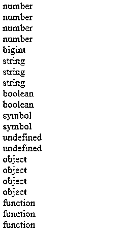

# JavaScript 类型 of

> 原文：<https://www.educba.com/javascript-typeof/>




## JavaScript 类型简介

任何程序的一个重要方面是检查它的类型系统和数据类型。使用 javascript，变量可以以“字符串”形式的数据类型开始，然后可以成为对象的引用，因此出现了单词“typeof ”,这是 javascript 中的一个关键字，它在被调用时返回数据类型或变量的类型，称为“类型检查”。这些操作数可以是字符串格式的对象、函数或变量。它可以用来验证函数参数，也可以用来检查变量是否已定义，这是检查数据类型的简单方法之一。因为 javascript 是动态类型语言，这意味着我们不能在声明变量时给变量赋值数据类型，因为变量不受限制，因为它的类型可以在程序运行时改变。

### 句法

以下是 javascript 类型的语法:

<small>网页开发、编程语言、软件测试&其他</small>

**语法:**

```
typeof <operand>
```

或者

```
typeof(operand)
```

#操作数可以是未赋值的对象、函数或变量。

由于 javascript 在整个程序执行过程中会改变类型，程序员很难跟踪这些变化，因此 typeof 运算符非常有用。

typeof 返回一些值，对象、布尔值、数字、字符串、函数、空值和未定义的值。让我们看看操作数的类型及其使用 type of 的结果。

| **操作数类型** | **使用类型的结果** |
| 布尔代数学体系的 | "布尔型" |
| 目标 | "对象" |
| 数字 | "数字" |
| 线 | "字符串" |
| 不明确的 | "未定义" |
| 空 | "对象" |

*NaN 将返回 number，尽管它不是一个数字，因为在计算时,“NaN”在技术上是一个数字数据类型，不能用实际数字表示。

*typeof null 值返回一个对象，但 ECMAScript 建议 typeof null 的结果为“null”，这是不被接受的。

### JavaScript 类型的示例

以下是 JavaScript 类型的示例:

#### 示例#1

**代码**:

```
<!DOCTYPE html>
<html>
<body>
<script>
document.write(typeof 'How are you?');
document.write("</br>");
document.write(typeof false);
document.write("</br>");
document.write(typeof undeclaredVariable);
document.write("</br>");
document.write(typeof -74.56);
document.write("</br>");
document.write(typeof 4E-9);
document.write("</br>");
document.write(typeof NaN);
document.write("</br>");
document.write(typeof null);
document.write("</br>");
document.write(typeof ["Hello", "how", "are", 25]);
</script>
</body>
</html>
```

**输出:**




#### 实施例 2

**代码**:

```
<!DOCTYPE html>
<html>
<body>
<script>
var a = 100;
var b = "Learn typeof operator";
result = (typeof b);
document.write("Result of b=> ");
document.write(result);
document.write("</br>");
result = (typeof a);
document.write("Result of a=> ");
document.write(result);
document.write("</br>");
</script>
</body>
</html>
```

**输出:**


在 ECMAScript2020 中，bigint、symbol、function 对象将分别返回“bigInt”、“symbol”和“function”。

#### 实施例 3

**代码**:

```
<!DOCTYPE html>
<html>
<body>
<script>
document.write(typeof Math.LN2);
document.write("</br>");
document.write(typeof Infinity);
document.write("</br>");
document.write(typeof Number('10'));
document.write("</br>");
document.write(typeof Number('eduCBA'));
document.write("</br>");
document.write(typeof 44n);
document.write("</br>");
document.write(typeof '');
document.write("</br>");
document.write(typeof `hello how are you`);
document.write("</br>");
document.write(typeof '1');
document.write("</br>");
document.write(typeof Boolean(1));
document.write("</br>");
document.write(typeof !!(1));
document.write("</br>");
document.write(typeof Symbol());
document.write("</br>");
document.write(typeof Symbol('foo'));
document.write("</br>");
document.write(typeof declaredButUndefinedVariable);
document.write("</br>");
document.write(typeof undefined);
document.write("</br>");
document.write(typeof {a: 19});
document.write("</br>");
document.write(typeof new Date());
document.write("</br>");
document.write(typeof new Boolean(false));
document.write("</br>");
document.write(typeof new Number(18));
document.write("</br>");
document.write(typeof function(){});
document.write("</br>");
document.write(typeof class A {});
document.write("</br>");
document.write(typeof Math.cos);
</script>
</body>
</html>
```

**输出:**




使用 new 运算符:在这里，所有不带函数构造函数的构造函数都将由 int 类型的“object”产生。

#### 实施例 4

**代码**:

```
<!DOCTYPE html>
<html>
<body>
<script>
let str = new String('eduCBA');
let num = new Number(10);
let fun = new Function();
document.write(typeof fun);
document.write("</br>");
document.write(typeof str);
document.write("</br>");
document.write(typeof num);
</script>
</body>
</html>
```

**输出:**


括号对于确定表达式的类型/数据类型很重要。

#### 实施例 5

**代码**:

```
<!DOCTYPE html>
<html>
<body>
<script>
let x = 45;
document.write(typeof x + ' Hello eduCBA');
document.write("</br>");
document.write(typeof (x + ' Hello eduCBA'));
</script>
</body>
</html>
```

**输出:**


**类型的缺点**

在 ECMAScript2015 出现之前，typeof 总是为任何值返回字符串。同样对于未声明的标识符，typeof 返回“undefined”。由于添加了块大小的 let 和 const 语句，在声明 let 和 const 之前在块中使用 typeof 将引发“引用错误”。在初始化完成之前，块范围的变量处于“死区”中，因此如果被访问，将抛出一个错误。让我们看一个演示相同的例子。

#### 实施例 6

**代码**:

```
<!DOCTYPE html>
<html>
<body>
<script>
document.write(typeof yconstVariable);
typeof yconstVariable;
document.write(typeof newClass);
document.write(typeof x);
let xletVariable;
const yconstVariable = 'hello';
class newClass{};
</script>
</body>
</html>
```

**输出:**


同样，xletVariable 和 newClass{}也不能在初始化前访问。

typeof <variable>或 typeof( <variable>)将返回相同的结果，即未定义。这样就没有区别了。</variable></variable>

#### 实施例 7

**代码**:

```
<!DOCTYPE html>
<html>
<body>
<script>
document.write(typeof(20));
document.write("</br>");
document.write(typeof 20);
</script>
</body>
</html>
```

**输出:**


typeof 对于在访问之前检查函数中变量的类型很有用，并且还可以确保在用户试图在代码中访问变量之前定义该变量，这可以防止类似“引用错误”的错误

让我们用不同数据类型的变量定义一个对象，并对该对象执行 typeof 操作。

#### 实施例 8

**代码**:

```
<!DOCTYPE html>
<html>
<body>
<script>
const person = {
name: 'Karthick',
age: 25,
company: 'eduContact'
};
document.write(typeof (person));
</script>
</body>
</html>
```

**输出:**


#### 实施例 9

检查两个具有 NaN 值的变量是否相等。

**代码**:

```
<!DOCTYPE html>
<html>
<body>
<script>
const xVariable = NaN;
const yVariable = NaN;
document.write(xVariable === yVariable);
</script>
</body>
</html>
```

**输出:**


### 结论

在本文中，我们学习了 javascript 数据类型、如何执行类型检查以及 typeof 运算符的使用。我们还看到了如何确保代码不会出现“引用错误”以及它为什么会出现。学习 ECMA Javascript 2020 标准的新数据类型，如“bigInt”、“symbol”和“function”。

### 推荐文章

这是一个 JavaScript 类型的指南。这里我们讨论如何执行类型检查以及 typeof 运算符的用途。您也可以看看以下文章，了解更多信息–

1.  [JavaScript 字符串长度](https://www.educba.com/javascript-string-length/)
2.  [JavaScript 事件](https://www.educba.com/javascript-events/)
3.  [Javascript 原型](https://www.educba.com/javascript-prototype/)
4.  [JavaScript 设置类](https://www.educba.com/javascript-set-class/)


