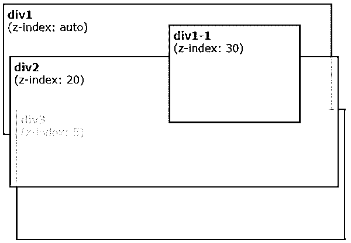
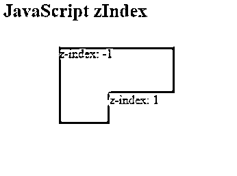
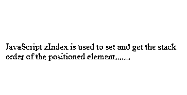
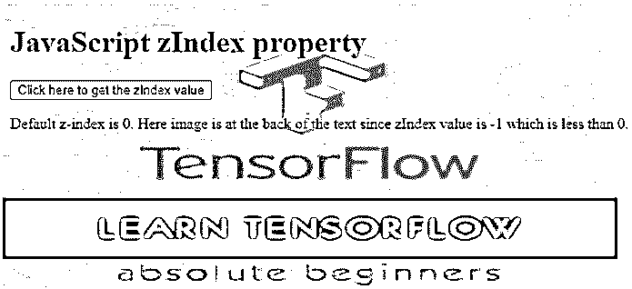
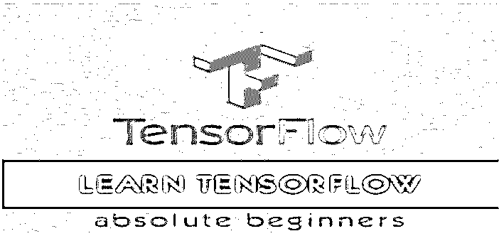

# JavaScript z 索引

> 原文：<https://www.educba.com/javascript-z-index/>


## JavaScript z-index 简介

我们看到许多网站的横幅、文本、对话框等元素相互重叠。这可以通过使用 zIndex 概念来实现。JavaScript zIndex 是一个属性，用于设置或获取定位元素的堆栈顺序。根据 zIndex 值，元素被定位在另一个元素的前面或后面。zIndex 越大，目标元素位于 zIndex 相对较低的另一个元素之前。让我们更深入地了解这个概念，理解这个 JavaScript zIndex 是如何工作的。

### JavaScript z 索引的语法

要返回 zIndex 属性:

<small>网页开发、编程语言、软件测试&其他</small>

```
var z = object.style.zIndex;
```

要将 zIndex 属性设置为元素:

```
object.style.zIndex = auto|inherit|number|initial;
```

将属性值定义为“auto”是默认值，这将堆栈顺序设置为等于父元素。“number”根据值设置堆栈顺序，最重要的是不允许负数。“inherit”将从父元素继承 zIndex 值。

*   z-index:自动；//关键字值；
*   z 指数:5；//整数值；
*   z 索引:-2；//负整数值，降低元素的优先级。
*   z-index:初始；//全局值，如 inherit、unset 等。

在复杂的 web 应用程序中，与元素堆叠相关的问题成为 web 开发人员的一大难题，因此这个 JavaScript zIndex 属性在相应地设置元素时非常有用。

在开始 zIndex 属性的实现之前，我们需要知道另一个相关的概念，即堆叠元素的层次结构。

*   假设网页是三维的，那么 zIndex 值/属性定义了元素的 z 坐标；也称为堆叠顺序。
*   基于属性的大小，该关闭将是用户的元素。
*   zIndex 值空间不是平面的，而是分层的，即元素使用 zIndex 值创建堆叠上下文，该值成为其他后代的根值。
*   让我们考虑具有后代的文档体:div1、div2。，div3，div1-1，…div1-1 是 div1 的子代。

div1 的 zIndex 值:自动，div2: 20，div3: 5，div1-1: 30。

*   创造 zIndex 的元素创造了堆叠概念，为儿童的 zIndex 值奠定了基础。

### JavaScript z-index 示例

下面是一些例子:

#### 示例#1

我们将考虑上面提到的文档体的例子。

**代码:**

```
<html>
<style>
div {
box-sizing: border-box;
border: 2px solid black;
padding: 5px;
position: absolute;
font-family: Verdana;
}
.div1, .div2, .div3 {
width: 500px;
height: 200px;
}
.div1-1 {
width: 200px;
height: 150px;
}
.div1 {
left: 10px;
top: 10px;
background-color: rgba(220, 210, 170, 0.9);
}
.div1-1 {
left: 250px;
top: 30px;
background-color: rgba(210, 170, 170, 0.9);
z-index: 30;
}
.div2 {
left: 20px;
top: 90px;
background-color: rgba(220, 170, 210, 0.9);
z-index: 20;
}
.div3 {
left: 30px;
top: 170px;
background-color: rgba(170, 220, 210, 0.9);
z-index: 5;
}
</style>
<body>
<div class="div1">
<strong>div1</strong>
<br/>
(z-index: auto)
<div class="div1-1">
<strong>div1-1</strong>
<br/>
(z-index: 30)
</div>
</div>
<div class="div2">
<strong>div2</strong>
<br/>
(z-index: 20)
</div>
<div class="div3">
<strong>div3</strong>
<br/>
(z-index: 5)
</div>
</body>
</html>
```

**输出:**




上面的 CSS 分别显示带有 zIndex 的 div。

#### 实施例 2

**代码:**

```
<!DOCTYPE html>
<html>
<head>
<h2>JavaScript zIndex</h2>
<style>
.zindex1 {
z-index: -1;
background-color: #00F8;
width: 150px;
height: 100px;
position: absolute;
top: 80px;
left: 80px;
}
.zindex2 {
z-index: 1;
background-color: yellow;
width: 150px;
height: 100px;
position: absolute;
top: 140px;
left: 145px;
}
</style>
</head>
<body>
<div class="zindex2">z-index: 1</div>
<div class="zindex1">z-index: -1</div>
</body>
</body>
</html>
```

**输出:**




#### 实施例 3

**代码:**

```
<!DOCTYPE html>
<html>
<head>
<style>
p {
margin: 0;
position: absolute;
top: 50%;
left: 50%;
transform: translate(-50%, -50%);
}
div{
margin: auto;
position: absolute;
top:0;
left: 0;
right: 0;
bottom: 0;
}
div:first-child {
background-color: yellow;
width: 300px;
height: 150px;
z-index: -5;
}
div:last-child {
width: 280px;
height: 120px;
z-index: -1;
background-color: lightblue;
}
</style>
</head>
<body>
<div>
</div>
<p>JavaScript zIndex is used to set and get the stack order of the positioned element.......</p>
<div>
</div>
</body>
</html>
```

**输出:**




#### 实施例 4

**代码:**

```
<!DOCTYPE html>
<html>
<body>
<h1>JavaScript zIndex property</h1>

<button type="button" onclick="zIndexFunction()">Click here to get the zIndex value</button>
<p>Default z-index is 0\. Here image is at the back of the text since zIndex value is -1 which is less than 0.</p>
<script>
function zIndexFunction() {
alert(document.getElementById("img").style.zIndex);
}
</script>
</body>
</html>
```

**输出:**







让我们将 image 的 zIndex 值从-1 更改为大于 0 的值。

#### 实施例 5

**代码:**

```
<!DOCTYPE html>
<html>
<head>
<style>
.dashed-box {
position: relative;
z-index: 5;
border: dashed;
height: 8em;
margin-bottom: 1em;
margin-top: 2em;
}
.bluebox {
position: absolute;
z-index: 7;
background: lightblue;
width: 70%;
left: 60px;
top: 4em;
}
.yellowbox {
position: absolute;
z-index: 6;
background: yellow;
width: 20%;
left: 65%;
top: -25px;
height: 7em;
opacity: 0.9;
}
</style>
</head>
<h2>JavaScript zIndex representation</h2>
<body>
<div class="dashed-box">Dashed box zIndex 5
Blue box zIndex 7
Yellow Box zIndex 6
</div>
</body>
</html>
```

**输出:**


这里，虚线框的 zIndex 小于黄色框的 zIndex，因此黄色框位于虚线框的顶部。蓝色方框也是一样，zIndex 大于黄色方框，因此显示在黄色方框的上方。您可以尝试更改 zIndex 值，看看这些框是如何相互重叠的。

### 结论

至此，我们结束了 JavaScript zIndex 的概念。zIndex 属性有助于在 web 应用程序中避免元素重叠，并完美地显示每个元素，而不会使网站看起来笨拙。为了进一步理解 zIndex 概念，我们也看到了堆叠层次结构概念。也看到了一些对我们有用的例子，也可以通过改变 zIndex 值来尝试这些例子。

### 推荐文章

这是一个 JavaScript z-index 的指南。在这里，我们还将讨论 javascript z-index 的介绍和语法，以及不同的示例和代码实现。您也可以看看以下文章，了解更多信息–

1.  [JavaScript onkeyup](https://www.educba.com/javascript-onkeyup/)
2.  [JavaScript 随机](https://www.educba.com/javascript-random/)
3.  [JavaScript test()](https://www.educba.com/javascript-test/)
4.  [JavaScript JSON](https://www.educba.com/javascript-json/)


