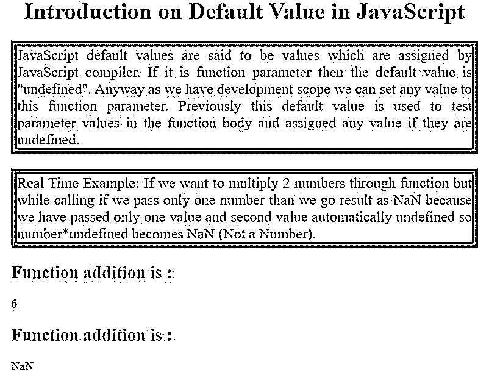
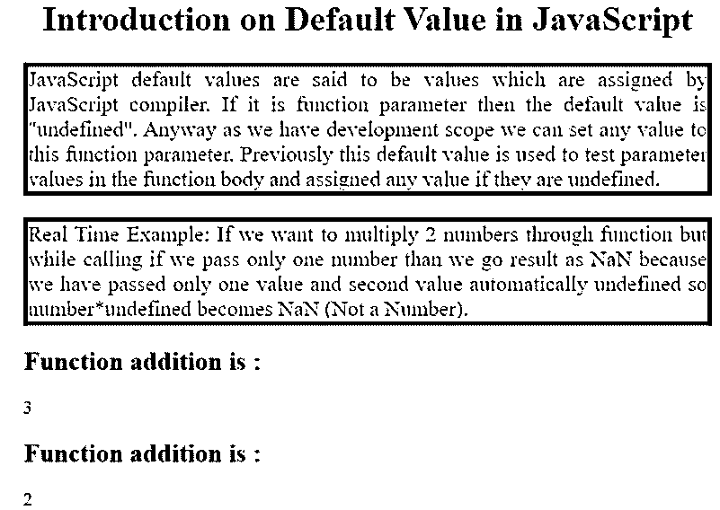
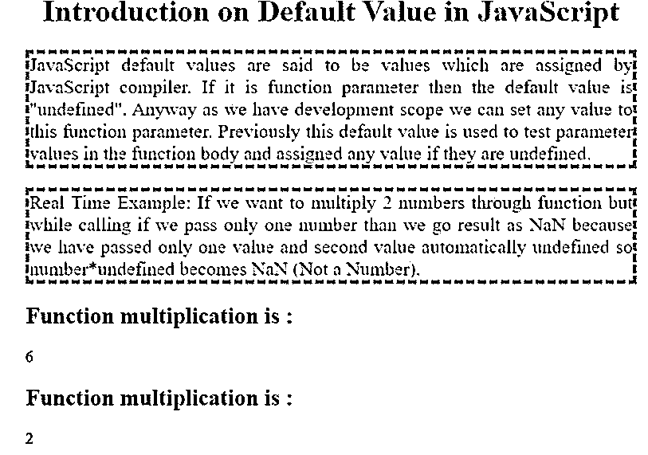

# JavaScript 默认值

> 原文：<https://www.educba.com/javascript-default-value/>


## JavaScript 默认值介绍

JavaScript 默认值是由 JavaScript 编译器指定的值。如果是函数参数，则默认值为“未定义”。无论如何，由于我们有开发范围，我们可以为这个函数参数设置任何值。以前，该默认值用于测试函数体中的参数值，如果参数值未定义，则赋予任意值。

**实时示例:**如果我们想通过函数将两个数字相乘，但在调用时，如果我们只传递一个数字，那么我们得到的结果是 NaN，因为我们只传递了一个值，第二个值自动未定义，所以 number*undefined 变成 NaN(不是数字)。

<small>网页开发、编程语言、软件测试&其他</small>

### JavaScript 中的默认值是如何工作的？

其工作基于所需的值和通过函数分配的值。假设函数需要 5 个参数，但是如果我们只分配了 3 个，那么 JavaScript 编译器分配的其余值是未定义的。

**语法:**

```
function functionName(a,b,c,d) {
return a*b*c*d;
}
functionName(1,2,3,4)  // 24
functionName(1,2,3)     // NaN
```

### JavaScript 默认值的示例

下面是提到的例子:

#### 示例#1

添加默认功能参数。

**代码:**

```
<!DOCTYPE html>
<html>
<title>Default Value</title>
<!--CSS Styles-->
<style>
p
{
border: ridge 8px red;
font-size: 20px;
color: navy;
text-align: justify;
}
h1
{
color: gray;
text-align:center;
}
</style>
<body>
<div>
<h1>Introduction on Default Value in JavaScript</h1>
<p>JavaScript default values are said to be values which are assigned by JavaScript compiler. If it is function parameter then the default value is "undefined". Anyway as we have development scope we can set any value to this function parameter. Previously this default value is used to test parameter values in the function body and assigned any value if they are undefined.</p>
<p>Real Time Example: If we want to multiply 2 numbers through function but while calling if we pass only one number than we go result as NaN because we have passed only one value and second value automatically undefined so number*undefined becomes NaN (Not a Number).
</p>
</div>
<!--JavaScript Logic-->
<script>
function getAddition(a,b,c) {//function definition
return a+b+c;
}
var add1=getAddition(1,2,3);//Passing all 3 values
var add2=getAddition(1,2);//Passing 2 values and one more undefined
document.write("<h2 style='color:red'>Function addition is :</h2>"+add1);//displaying the output in the browser
document.write("<h2 style='color:red'>Function addition is :</h2>"+add2);//displaying the output in the browser
</script>
</body>
</html>
```

**输出:**




#### 实施例 2

将默认功能参数设置为用户值。

**代码:**

```
<!DOCTYPE html>
<html>
<title>Default Value</title>
<!--CSS Styles-->
<style>
p
{
border: solid 4px blue;
font-size: 20px;
color: fuchsia;
text-align: justify;
}
h1
{
color: red;
text-align:center;
}
</style>
<body>
<div>
<h1>Introduction on Default Value in JavaScript</h1>
<p>JavaScript default values are said to be values which are assigned by JavaScript compiler. If it is function parameter then the default value is "undefined". Anyway as we have development scope we can set any value to this function parameter. Previously this default value is used to test parameter values in the function body and assigned any value if they are undefined.</p>
<p>Real Time Example: If we want to multiply 2 numbers through function but while calling if we pass only one number than we go result as NaN because we have passed only one value and second value automatically undefined so number*undefined becomes NaN (Not a Number).
</p>
</div>
<!--JavaScript Logic-->
<script>
function getAddition(a,b) {//function definition
b = (typeofb !== 'undefined') ?  b : 1
return a+b;
}
var add1=getAddition(1,2);//Passing all 2 values
var add2=getAddition(1);//Passing 1 value and one more undefined
//if value undefined then it automatically set it to 1
document.write("<h2 style='color:green'>Function addition is :</h2>"+add1);//displaying the output in the browser
document.write("<h2 style='color:green'>Function addition is :</h2>"+add2);//displaying the output in the browser
</script>
</body>
</html>
```

**输出:**




#### 实施例 3

带有某些值的乘法函数参数。

**代码:**

```
<!DOCTYPE html>
<html>
<title>Default Value</title>
<!--CSS Styles-->
<style>
p
{
border: dashed 4px gray;
font-size: 20px;
color: fuchsia;
text-align: justify;
}
h1
{
color: red;
text-align:center;
}
</style>
<body>
<div>
<h1>Introduction on Default Value in JavaScript</h1>
<p>JavaScript default values are said to be values which are assigned by JavaScript compiler. If it is function parameter then the default value is "undefined". Anyway as we have development scope we can set any value to this function parameter. Previously this default value is used to test parameter values in the function body and assigned any value if they are undefined.</p>
<p>Real Time Example: If we want to multiply 2 numbers through function but while calling if we pass only one number than we go result as NaN because we have passed only one value and second value automatically undefined so number*undefined becomes NaN (Not a Number).
</p>
</div>
<!--JavaScript Logic-->
<script>
function getMultiplication(a,b=2,c=1) {//function definition
return a*b*c;
}
var mul1=getMultiplication(1,2,3);//Passing all 3 values
var mul2=getMultiplication(1,2,undefined);//Passing 2 values and one more undefined value passed
document.write("<h2 style='color:blue'>Function multiplication is :</h2>"+mul1);//displaying the output in the browser
document.write("<h2 style='color:blue'>Function multiplication is :</h2>"+mul2);//displaying the output in the browser
</script>
</body>
</html>
```

**输出:**




### 推荐文章

这是一个 JavaScript 默认值的指南。在这里我们讨论它是如何工作的？和示例。它们由 JavaScript 编译器分配。如果函数没有任何值，编译器会自动分配默认值。您也可以看看以下文章，了解更多信息–

1.  JavaScript 中的[对象](https://www.educba.com/object-in-javascript/)
2.  [JavaScript getelement byid()](https://www.educba.com/javascript-getelementbyid/)
3.  [JavaScript 键盘事件](https://www.educba.com/javascript-keyboard-events/)
4.  [JavaScript lastIndexOf()](https://www.educba.com/javascript-lastindexof/)


