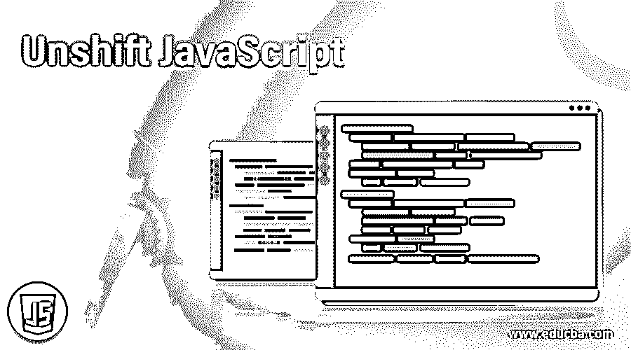
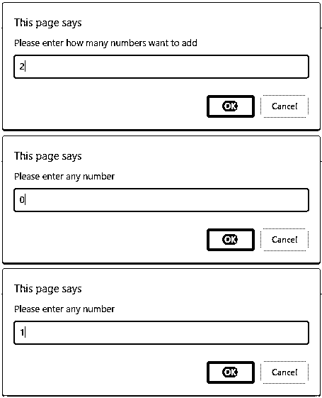
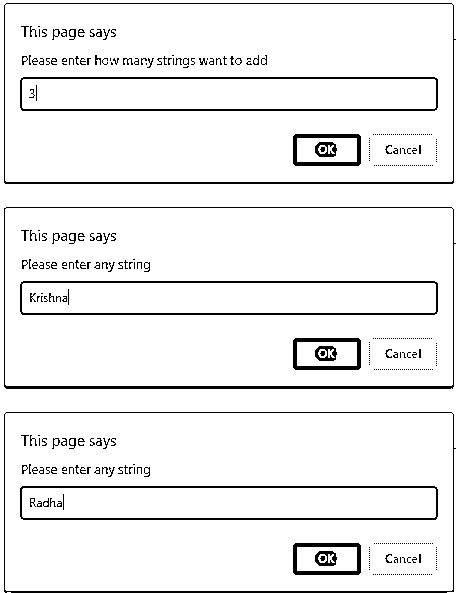
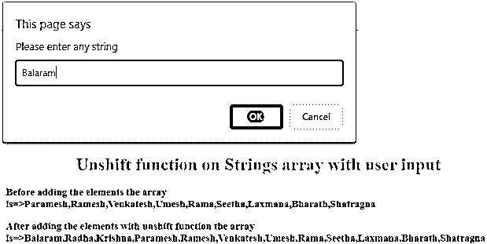
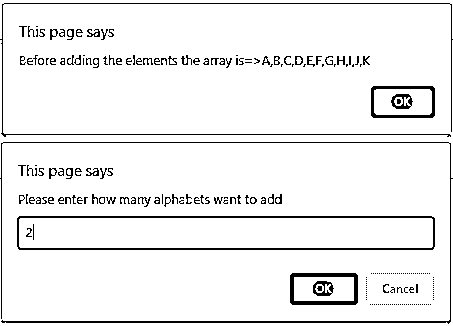
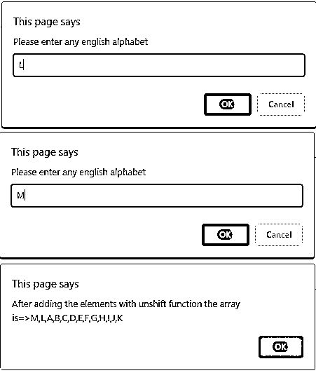

# 取消转移 JavaScript

> 原文：<https://www.educba.com/unshift-javascript/>




## Unshift JavaScript 简介

JavaScript unshift 是一个函数，用于数组。unshift()用于将一个或多个元素添加到给定数组的开始处。每当我们向数组列表中添加任何元素时，现有的数组大小都会自动增加。我们可以比较 unshift()函数和 push()函数，区别在于 push()函数是在数组的末尾添加元素，而 unshift()是在数组的开头添加元素。

**实时场景:**我们在数组中有 1000 条记录，如果我们不使用普通的 push 函数在数组的开头添加元素，那么使用这个 push()函数我们必须迭代所有的值并在开头添加它们。为了减少这个障碍，开发人员想出了 unshift()函数来在数组的开头添加元素。

<small>网页开发、编程语言、软件测试&其他</small>

**优点:**不需要任何额外的操作我们就可以在数组的开头添加元素。

### unshift()函数在 JavaScript 中是如何工作的？

使用 unshift()函数应用的数组列表值集，然后按照给定的顺序在数组起始处添加元素。

**语法:**

```
var unshiftArray=[value1,value2,value3,.....];
unshiftArray.unshift(values);
```

**说明:**首先用一些值创建数组。对创建的数组应用 unshift()方法。

### 实现 Unshift JavaScript 的示例

以下是实现 unshift javascript 的示例:

#### 1.应用于数字数组的非移位函数

**代码:**

```
<!DOCTYPE html>
<html>
<head>
<title>Unshift  Array</title>
<!--CSS Styles-->
<style>
h3
{
color:green;
}
h1
{
color:blue;
text-align: center;
}
</style>
</head>
<body>
<h1>Unshift function with numbers</h1>
<script>
function getMyUnshiftArray()//line1
{
var numberArray=[10,15,20,25,30,35,40,45,50,55,60,65,70,75,80,85,90,95,100];//line2
document.write("<h3>Before adding the elements the array is=>"+numberArray+"</h3>");//line3
numberArray.unshift("0","5");//line4
document.write("<h3>After adding the elements with unshift function the array is=>"+ numberArray +"</h3>");//line5
}
getMyUnshiftArray();//line6
</script>
</body>
</html>
```

**输出:**


**说明:**

*   Line1 调用函数，getMyUnshiftArray()为非移位数组。
*   第 2 行是带有一些数值的数组定义。
*   第 3 行显示的是在使用 unshift()函数添加元素之前的数组。
*   第 4 行对数组编号应用了 unshift 函数。
*   第 5 行显示应用非移位功能后的输出。
*   第 6 行正在调用函数 getMyUnshiftArray()。

#### 2.对用户输入的数字数组应用非移位功能。

**代码:**

```
<!DOCTYPE html>
<html>
<head>
<title>Filter Array</title>
<!--CSS Styles-->
<style>
h3
{
color:brown;
}
h1
{
color:orange;
text-align: center;
}
</style>
</head>
<body>
<h1>Unshift function with numbers</h1>
<script>
function getMyUnshiftArray()//line1
{
var numberArray=[2,3,4,5,6,7,8,9,10,11,12,13,14,15,16,17];//line2
document.write("<h3>Before adding the elements the array is=>"+numberArray+"</h3>");//line3
var input = prompt("Please enter how many numbers want to add");//line4
for(var n=0;n<input;n++)
{
var number = prompt("Please enter any number");//line5
numberArray.unshift(number);//line6
}
document.write("<h3>After adding the elements with unshift function the array is=>"+numberArray+"</h3>");//line7
}
getMyUnshiftArray();//line8
</script>
</body>
</html>
```

**输出:**




**说明:**

*   Line1 调用函数，getMyUnshiftArray()为非移位数组。
*   第 2 行是带有一些数值的数组定义。
*   第 3 行显示的是在使用 unshift()函数添加元素之前的数组。
*   第 4 行用于要求用户输入想要添加多少个数字。
*   第 5 行用于向用户询问每个号码。
*   第 6 行对数组编号应用了 unshift 函数。
*   第 7 行显示应用非移位功能后的输出。
*   第 8 行正在调用函数 getMyUnshiftArray()。

#### 3.使用用户输入对字符串数组应用的 Unshift 函数。

**代码:**

```
<!DOCTYPE html>
<html>
<head>
<title>Filter Array</title>
<!--CSS Styles-->
<style>
h3
{
color:navy;
}
h1
{
color:skyblue;
text-align: center;
}
</style>
</head>
<body>
<h1>Unshift function on Strings array with user input</h1>
<script>
function getMyUnshiftArray()//line1
{
var stringArray=["Paramesh","Ramesh","Venkatesh","Umesh","Rama","Seetha","Laxmana","Bharath","Shatragna"];//line2
document.write("<h3>Before adding the elements the array is=>"+stringArray+"</h3>");//line3
var input = prompt("Please enter how many strings want to add");//line4
for(var n=0;n<input;n++)
{
var names = prompt("Please enter any string");//line5
stringArray.unshift(names);//line6
}
document.write("<h3>After adding the elements with unshift function the array is=>"+stringArray+"</h3>");//line7
}
getMyUnshiftArray();//line8
</script>
</body>
</html>
```

**输出:**







**说明:**

*   Line1 调用函数，getMyUnshiftArray()为非移位数组。
*   第 2 行是带有一些字符串值的数组定义。
*   第 3 行显示的是在使用 unshift()函数添加元素之前的数组。
*   第 4 行要求用户输入想要添加多少个字符串。
*   第 5 行用于向用户询问每个字符串。
*   第 6 行对数组字符串应用了 unshift 函数。
*   第 7 行显示应用非移位功能后的输出。
*   第 8 行正在调用函数 getMyUnshiftArray()。

#### 4.Unshift 函数应用于数字数组。

**代码:**

```
<!DOCTYPE html>
<html>
<head>
<title>Filter Array</title>
<!--CSS Styles-->
<style>
h1
{
color:red;
text-align: center;
}
</style>
</head>
<body>
<h1>Unshift function on Strings array with user input</h1>
<script>
function getMyUnshiftArray()//line1
{
var stringArray=["A","B","C","D","E","F","G","H","I","J","K"];//line2
alert("Before adding the elements the array is=>"+stringArray);//line3
var input = prompt("Please enter how many alphabets want to add");//line4
for(var n=0;n<input;n++)
{
var names = prompt("Please enter any english alphabet");//line5
stringArray.unshift(names);//line6
}
alert("After adding the elements with unshift function the array is=>"+stringArray);//line7
}
getMyUnshiftArray();//line8
</script>
</body>
</html>
```

**输出:**







**说明:**

*   Line1 调用函数，getMyUnshiftArray()为非移位数组。
*   第 2 行是带有一些字符串值的数组定义。
*   在使用 unshift()函数添加元素之前，第 3 行在警告框上显示数组。
*   第 4 行要求用户输入想要添加多少个字母。
*   第 5 行用于向用户询问每个字母。
*   第 6 行对数组字符串应用了 unshift 函数。
*   应用非移位功能后，Line7 在警告框上显示输出。
*   第 8 行正在调用函数 getMyUnshiftArray()。

### 结论

JavaScript 的 unshift 函数用于在任何数组的开头添加元素。我们可以添加数字、字符串和日期等。到数组。不需要任何额外的功能来在数组的开头添加元素。

### 推荐文章

这是一个卸载 JavaScript 的指南。在这里，我们讨论它是如何通过正确的示例代码来实现的。您也可以浏览我们的其他相关文章，了解更多信息——

1.  [JavaScript 中的多态性](https://www.educba.com/polymorphism-in-javascript/)
2.  [Javascript InnerHTML](https://www.educba.com/javascript-innerhtml/?source=leftnav)
3.  [JavaScript SetInterval](https://www.educba.com/javascript-setinterval/?source=leftnav)
4.  [JavaScript 弹出框](https://www.educba.com/javascript-popup-box/?source=leftnav)


