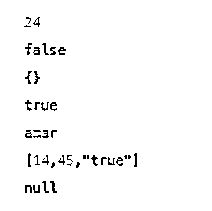
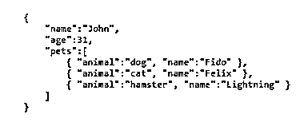

# JSON 解析器

> 原文：<https://www.educba.com/json-parser/>

## JSON 解析器简介

JSON 解析器解析返回 JavaScript 对象的 JSON 字符串。解析 JSON 是通过遵循一些提到的规范将 JSON 字符串转换成 JSON 对象。因此基于 JSON 对象内容，结果可以是字符串、映射或数组等。

**语法:**

<small>网页开发、编程语言、软件测试&其他</small>

`JSON.parse(string, function)`

Arguments 'string '是一个必需的参数，其中字符串以 JSON 格式编写。

Reviver 函数是一个可选参数，用于转换结果。如果此 reviver 函数返回一个有效值，则 item 值将被一个转换后的值替换。如果 reviver 返回 undefined，则删除该项目。

**例如:**

`var obj = JSON.parse('{ "employeeName":"Amar", "age":36, "city":"Paris"}');`

如果要解析的字符串不是有效的 JSON，则会引发 SyntaxError 异常。

JSON 语法是 JS 语法的子集。

### JSON 解析器的工作原理

Javascriptobject，JS 中定义了属性和值对的数据类型，JSON 是数据交换格式化程序。在各种程序中被格式化的一串字符，以便于通信，返回对应于 JSON 文本/字符串的对象。

**例如:**

`varjsonSample = ‘{“employeeName”: “Amar”}’;
varobj = JSON.parse(jsonStr);
console.log(obj.employeeName); // prints “Amar”
console.log(jsonSample.employeeName); // prints undefined`

当我们解析 JSON 时，string 被转换成 JSON 对象，可以在代码的任何地方使用。这里，在解析之前，它是一个字符串，所以数据不能被编码。在解析时，in 被转换成 JS 对象，这使得访问代码中的任何地方成为可能。

### JSON 解析器的例子

下面是提到的例子:

#### 示例#1

**代码:**

`constjsonSample = '{"result":false, "count":24}';
constobj = JSON.parse(jsonSample);
console.log(obj.count);
console.log(obj.result);
console.log(JSON.parse('{}'));
console.log(JSON.parse('true'));
console.log(JSON.parse('"amar"'));
console.log(JSON.parse('[14, 45, "true"]'));
console.log(JSON.parse('null'));
//console.log(JSON.parse('[11, 22, 33, 44, ]'));
//console.log(JSON.parse('{"dob" : 34, }'));
//console.log(JSON.parse("{'age': 10}"));`

**输出:**

注释行会出错。

#### 实施例 2

**代码:**

`<!DOCTYPE html>
<html>
<body>
<h2>Parsing from JSON String</h2>

</body>
</html>`

**输出:**

#### 实施例 3

**代码:**

`<!DOCTYPE html>
<html>
<body>
<h2>Conversion of JSON string to date object</h2>

</body>
</html>`

**输出:**

因此，这里的 Date 函数检索 IST 印度标准时间中的出生日期。JSON 中不允许使用日期对象，因此我们把它写成一个字符串，然后转换或解析成一个对象。

#### 实施例 4

**代码:**

`<!DOCTYPE html>
<html>
<body>
<h2>Conversion of JSON string to function using parse</h2>

</body>
</html>`

**输出:**

因为函数是不允许的，所以我们把函数作为一个字符串包含进来，然后把它解析成一个函数。函数失去了作用域，eval()可以用来转换回函数。

#### 实施例 5

**代码:**

`<!DOCTYPE html>
<html>
<body>
<h2>Conversion of string to Date object using Reviver</h2>

</body>
</html>`

**输出:**

#### 实施例 6

**代码:**

`<!DOCTYPE html>
<html>
<body>
<h2>Using XMLHttpRequest to retrieve contents in a file</h2>

The content is in JSON format, and can easily be converted to a JavaScript object

Open <a href="json_demo.txt" target="_blank">json_demo.txt</a>

</body>
</html>`

**输出:**

单击 josn_demo.txt，将显示以下阵列。在数组上使用 JSON.parse 时，解析器返回 JavaScript 数组而不是对象。

### 结论

正如我们举例说明的 JSON 解析的所有类型的例子一样，将日期字符串解析为对象、函数、数组、未定义的值。在从服务器接收数据时，数据是以字符串的形式存在的，有时这个字符串可能包含多个嵌入的字段。要使用每个字段，我们将无法在字符串格式中使用，因此输入字符串被解析，以便在字符串中使用嵌入字段变得容易。我们已经了解了 JSON.parser 的含义及其工作原理。JSON.parser 的概念是读取输入数据并将其解释给对象。因此，解析数据对于找出输入字符串中的任何嵌入数据是有用的。

### 推荐文章

这是一个 JSON 解析器的指南。在这里，我们讨论 JSON 解析器的介绍，并结合编程示例进行更好的理解。您也可以看看以下文章，了解更多信息–

1.  [Java 中的 JSON](https://www.educba.com/json-in-java/)
2.  [JSON 是什么？](https://www.educba.com/what-is-json/)
3.  [SQL 中的 JSON](https://www.educba.com/json-in-sql/)
4.  [C#创建 JSON 对象](https://www.educba.com/c-sharp-create-json-object/)

