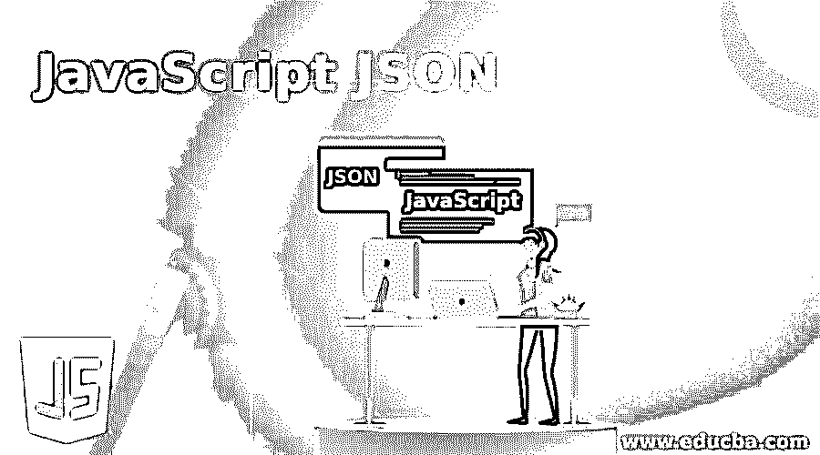

# JavaScript JSON

> 原文：<https://www.educba.com/javascript-json/>




## JavaScript JSON 的定义

JavaScript 中的 JSON 是一种格式或结构，用于在服务器和网页之间同时存储和传输数据，反之亦然。JavaScript JSON 是交换数据格式的一种非常简单的形式，缩写为 JavaScript Object Notation。它不依赖于任何语言，这意味着它独立于任何语言，并且非常兼容。它非常用户友好，易于理解，因为格式和结构是不言自明的。JavaScript 对象符号负责派生实际的 JavaScript Json 格式语法。

**语法:**

<small>网页开发、编程语言、软件测试&其他</small>

编写任何 JSON 数据都没有特定的语法，因为它被认为是用户友好和用户可理解的，因此，编造了一些约束或规则来获取 JavaScript JSON 数据:

*   数据必须与名称和值对的正确格式保持一致
*   数据格式必须正确使用逗号。
*   花括号的使用应该是恰当的，尤其是对于它所包含的对象。
*   数组必须用方括号来表示。

为了让 JSON 语法更加清晰，下面是它的表示:

```
Vr_txt = '{ "Fruits" : [' +
'{ "first_fruit":"Apple" , "last_fruit":"Orange" },' +
'{ "first_fruit":"Banana" , "last_fruit":"Chicoo" },' +
'{ "first_fruit":"kiwi" , "last_fruit":"Guava" } ]}';
```

### JSON 在 JavaScript 中是如何工作的？

顾名思义，JavaScript Object Notation 是一种负责将所有数据从网页传输和存储到 web 服务器的格式，反之亦然。它是如何发生的，JSON 数据的格式是从 JavaScript 对象符号中导出的，该符号为用户提供了增强的和可理解的数据格式，其中程序员可以理解语言格式，以便在执行 JavaScript 对象时更深入地了解网页或服务器中存在的数据信息，JavaScript 对象是负责使整个 JSON 结构和格式可重用的主要组件。这种形式的 JSON 格式是独立于语言的，被大多数语言支持，也是大多数程序员的首选。整个 JSON 格式几乎是相似的，或者可以说是代码库的克隆形式，稍有不同的是，它主要由丰富形式的文本组成，有了这种能力，它有助于将 JSON 数据转换成传统的本地 JavaScript 对象。

接下来关注 JSON 数据，它主要负责获取 JavaScript 实际对象属性。它使用双引号来表示所描述的引号中的任何形式的数据。JSON Objects 也是用于 JSON 工作的组件之一，JSON 主要用花括号写，包含多个名称和值对。后跟 JSON 数组，这些数组是在方括号内编写和声明的。JavaScript JSON 中的每个对象都被视为一条记录，其中包含检索任何必要数据所需的所有必要数据，从程序员的角度来看，这些数据是进一步研究或实现所必需的。使用 JSON 数据最重要也是最好的一点是，JSON 数据用于从 web 服务器读取数据，并在 web 页面中显示数据。JavaScript 利用了所有用于将字符串转换成 JavaScript 对象的内置函数和方法。引用的方法是 JSON.parse()，用于将字符串转换成 JavaScript 对象。使用 JSON 语法带来的最大好处是，源自 JavaScript 对象符号的 JSON 语法很少使用任何额外的软件来使 JSON 在 JavaScript 中工作。

**注意:**应该记住的一个重要方面是，JSON 和 JavaScript 是两个完全不同的概念，JSON 主要用于提供顺序和保存数组、对象、字符串、布尔和空流线等组件。虽然和 JavaScript 有些关系，但不代表一定会相似，只是不同而已。所以，澄清一些 JSON 格式的数据不是 JavaScript，这仅仅是一个误解。

### JavaScript JSON 的方法

JavaScript 支持一些内置方法，用于将数据对象转换为 JSON 格式的数据，以便程序员重用和理解。因此，JavaScript 对象的转换过程主要采用两种方法，即:

```
JSON.parse(text[, reviver])
JSON.stringify(value[, replacer[, space]])
```

**# JSON.parse(text[，reviver])**

JSON 格式中的 Parse 方法主要用于将任何字符串格式的文本解析为 JSON，方法是选择转换值及其属性，从而根据需要返回值。JSON 语法中的任何违规或更改(包括数据更改)或添加任何额外的不必要数据都可能导致语法错误。传递给 parse()方法的 reviver 参数表示，它将允许用户或程序员解释用于替代其他类型的数据类型或任何特定形式的数据类型的 replacer 类型。

**# JSON.stringify(value[，replacer[，space]])**

Java 中的 stringify 方法()用于返回对应于特定值的 JSON 字符串，并且可能只包括某些或特定的属性值，这些属性值将由用户以用户定义的方式使用。但是有一个约定俗成的事实，所有未定义的实例都会以某种方式被替换为 null，并且所有其他不受支持的本地数据类型都会被突出显示。传递给参数的 replacer 参数用于指定与该方法相关的任何其他行为。

#### 例子

这个例子演示了 JSON 数据，可以使用这两种方法中的任何一种来获得。

**代码:**

```
{
"Vegetables": {
"Potato": {
"name": "Potato",
"pref_vegetable": "about:type",
"Types": {
"1": {
"Type_1": "Carbohydrate",
"quality": "good",
"quantity": "3kg"
}
}
}
}
}
```

### 结论

JavaScript JSON 是一种轻量级格式，对浏览器来说是一种非常友好和兼容的格式。它帮助最终用户以简单易懂的格式获得更多相关和有用的信息，这增强了 JSON 数据格式，并使其成为 JavaScript 最重要和最基本的组件。

### 推荐文章

这是一个 JavaScript JSON 的指南。这里我们也讨论 JSON 在 javascript 中的定义和工作原理。以及方法和示例。您也可以看看以下文章，了解更多信息–

1.  [JavaScript 数组映射()](https://www.educba.com/javascript-array-map/)
2.  [JavaScript getElementsByTagName()](https://www.educba.com/javascript-getelementsbytagname/)
3.  JavaScript 中的[对象](https://www.educba.com/object-in-javascript/)
4.  [JavaScript 键盘事件](https://www.educba.com/javascript-keyboard-events/)


