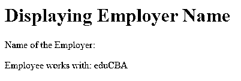

# JavaScript 自调用函数

> 原文：<https://www.educba.com/javascript-self-invoking-functions/>


## JavaScript 自调用函数简介

JavaScript 中有很多有趣的特性。其中之一是自调用函数。您可能没有听说过这个词，但是在您的日常程序中使用过这个特性。你可能甚至不知道如何谷歌它。这种奇怪的 JavaScript 术语会让您在日常软件开发中习惯。JavaScript 自调用函数是无名的自执行函数，定义后立即调用。这些自调用的函数是人为的，这些函数在后跟( )时会自动执行。如果没有( )，函数就不能自调用。

### 句法

下面是语法:

<small>网页开发、编程语言、软件测试&其他</small>

```
(function() {
// body of the function
})();
```

这对括号将括号内的代码转换为表达式:

```
function() { …. }
```

第二对括号继续对函数的调用。

例如，下面是一个匿名函数，它的调用:

```
(function(){
console.log("Look, this article is on self-invoking functions");
})();
```

这类似于命名一个函数并调用它，

```
function sample() {
console.log("Look, this article is on self-invoking functions ");
}
sample();
```

尽管您可能会发现这里有细微的变化，但是函数的内容是相同的，并且两种变化都会立即执行。一旦函数被定义，它将被立即调用。这在初始化、添加事件监听器等方面非常有用。在 jQuery 中，不使用文档。准备好了，使用了一个自调用函数。

这些函数被称为立即调用函数表达式，即生命函数或自执行函数。包装这些函数的目的是控制其成员的可见性。您可能会想，为什么我们需要使用这些自调用函数。所以，让我们深入探讨一下。

### 为什么自调用函数有效？

在 JavaScript 中，每个函数都有自己的作用域。以此为例，在函数内部使用' var '定义的变量不能在外部访问。通过用匿名函数包围应用程序，我们在函数周围创建了一个作用域，其中声明的变量只能由该函数访问。我们可以将变量声明为在函数外部可访问，但默认情况下，我们没有这个特性适用于她。让我们来看看 JavaScript 自调用函数的一些关键点。

*   只执行一次，不要让全局名称空间被持续一生的 crud 所堆积。
*   为了便于执行初始化逻辑，我们可以只执行一次初始化，因为在执行后我们将失去对函数的引用。
*   我们有两种自调用函数的语法变体，如下所示:

**道格拉斯·克洛克福特的诗:**

```
(function () {
// body
}());
Alternative 'dog balls'
(function () {
// body
})();
```

*   参数也可以传递给这些自我调用的函数，一般来说，对全局对象的引用是作为参数传递的。
*   当函数变大，用户需要滚动参数时，不应该传递太多的参数。
*   这种自调用函数主要用于变量作用域。默认情况下，在自调用函数中声明的变量仅对自调用函数中的代码可用。
*   不关心在 JavaScript 的另一个代码块中如何声明或命名变量。

### JavaScript 自调用函数的例子

以下是 JavaScript 自调用函数的示例:

#### 示例#1

**代码:**

```
<!DOCTYPE html>
<html>
<body>
<h2>Nameless Functions that are invoked automatically</h2>
<p id="demo"></p>
<script>
(function () {
var sample = "Hi, Today we will see what is JavaScript Self Invoking Functions";
document.getElementById("demo").innerHTML = sample;
})();
</script>
</body>
</html>
```

**输出:**


#### 实施例 2

带参数的匿名函数

**代码:**

```
<!DOCTYPE html>
<html>
<body>
<h2>Nameless Functions with arguments that are invoked automatically</h2>
<p id="demo"></p>
<script>
(function(sample){
document.write(sample);
})("Lets connect together for a great learning at eduCBA");
</script>
</body>
</html>
```

**输出:**


#### 实施例 3

普通函数和自调用函数的区别。

**代码:**

```
<!DOCTYPE html>
<html>
<head>
<title>
Let us see difference between a normal function and self invoked function
</title>
</head>
<body>
<h1 style="color: red">
Normal Function Vs Self Invoked Function
</h1>
<b>
Will be able to see the syntax difference here
</b>
<p>
Present Date and Time:

</p>
<script type="text/javascript">
(function () {
date = new Date().toString();
document.querySelector('.output').textContent
= date;
})();
function dateSample() {
date = new Date().toString();
document.write("Normal Function date here ", date);
}
dateSample();
</script>
</body>
</html>
```

**输出:**


#### 实施例 4

**代码:**

```
<!DOCTYPE html>
<html>
<head>
<title>
</title>
</head>
<body>
<h1 style="color: red">
Displaying Employer Name
</h1>
<p>
Name of the Employer:
</p>
<script type="text/javascript">
varemployeeName = "eduCBA";
(function (employerName) {
function display(employerName)
{
document.write("Employee works with: " + employerName);
}
display(employerName);
})(employeeName);
</script>
</body>
</html>
```

**输出:**




### 自调用函数/匿名函数的优势

*   因为这些函数是未命名的或匿名的，所以即使不使用任何标识符或闭包，也可以立即调用函数的表达式，并且不会破坏作用域。
*   这些匿名函数是传递给需要返回函数的高阶函数的参数。如果函数只使用一次，使用自调用函数会更容易，因为与命名函数相比，它在语法上是轻量级的。
*   这些函数也接受参数，但是不应该传递太多参数，因为不推荐这样做。即使参数的名称更简单，代码也会看起来复杂而笨拙。
*   用于创建 JavaScript 中不存在的人工名称空间。
*   大多数情况下，模块化模式是使用自调用函数实现的，其中我们保存返回的函数对象的引用。

### 结论

至此，我们结束了我们的主题“JavaScript 自调用函数”，我们已经看到了它的含义以及它是如何在编码中使用的。举例说明了如何使用匿名函数，也看到了命名函数和匿名/自调用函数之间的区别。这些函数可以帮助我们创建一个作用域，防止污染全局命名空间。也用于在创建对象之前初始化值。我们已经列出了几个优点，这将有助于获得对该特性的简要概述。你们仍然可以去尝试使用这些自调用函数的各种其他方法。

### 推荐文章

这是一个 JavaScript 自调用函数的指南。这里我们讨论 JavaScript 自调用函数的介绍，以及它是如何工作的，并给出了例子和代码实现。您也可以浏览我们推荐的其他文章，了解更多信息——

1.  [JavaScript 字符串格式与方法](https://www.educba.com/javascript-string-format/)
2.  [JavaScript 中匿名函数是如何工作的？](https://www.educba.com/javascript-anonymous-function/)
3.  [Javascript 嵌套函数介绍](https://www.educba.com/javascript-nested-functions/)
4.  [JavaScript 日期函数(示例)](https://www.educba.com/javascript-date-function/)


