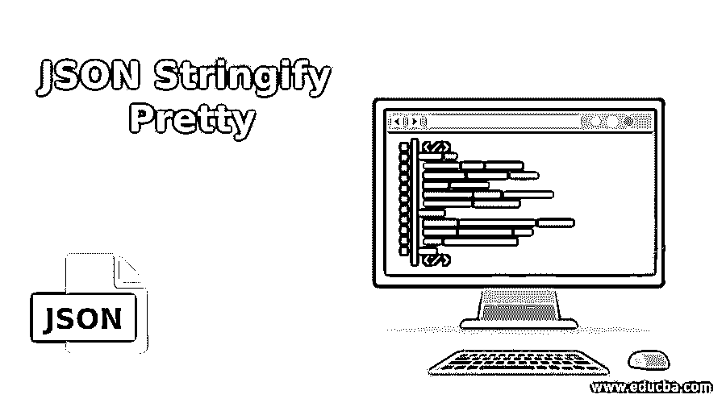
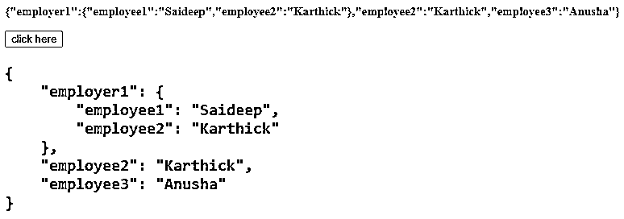
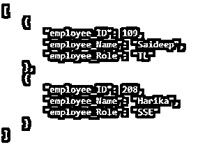

# JSON Stringify 漂亮

> 原文：<https://www.educba.com/json-stringify-pretty/>




## JSON Stringify Pretty 简介

JSON Stringify Pretty 有助于美化 JSON 数据并打印出来。“漂亮”修饰 JSON 内容,“打印”打印修饰后的 JSON 内容。PrettyPrint 是一个帮助将各种格式转换成文本文件或任何可读格式的应用程序。格式约定可用于调整定位、间距、颜色对比、形状和大小以及许多其他修改，以便用户能够查看和理解内容。这些编程语言的漂亮打印机也被称为美化器。

### 语法和参数

json stringify pretty 的语法和参数是:

<small>网页开发、编程语言、软件测试&其他</small>

**语法:**

```
JSON.stringify(value, replace, space)
```

**参数:**

有 3 个这样的参数，

*   **值:**需要转换成 JSON 字符串的值
*   **Replacer:** 可以改变字符串化过程的可选函数。如果值为 NULL 或未提供，则对象的所有属性都包含在结果字符串中。
*   **Space:** 一个可选参数，用于控制最终字符串中的间距，该字符串是使用 JSON.stringify()生成的。这个参数打印 JSON 并设置空间。

### JSON Stringify 漂亮的例子

下面是一些例子:

#### 示例#1

**代码:**

```
<!DOCTYPE html>
<html>
<head>
</head>
<body>
<script>
let text = {
name: "A",
age: 35,
address: {
street: "32, MVP Colony",
city: "Vizag"
}
}
document.write(JSON.stringify(text, null, 5))
</script>
</body>
</html>
```

**输出:**


#### 实施例 2

**代码:**

```
<!DOCTYPE html>
<html>
<body>
<h1>With <em>space</em> Parameter</h1>
<p>For each white space, let us insert 5 space characters</p>
<pre id="demo"></pre>
<script>
var obj = { "name":"Sai", "age":"23", "city":"Chennai"};
var text = JSON.stringify(obj, null, 5);
document.getElementById("demo").innerHTML = text;
</script>
</body>
</html>
```

**输出:**


##### 空间参数

用于在输出 JSON 时插入空格的字符串或数字对象。如果是一个数字，它表示用作空白的空格字符的数量。默认情况下，该值上限为 10，如果该值小于 1，则不包括空格。

如果 object 是一个字符串，则字符串本身被用作空白，如果没有提供值或为空，则不向输出 JSON 添加空格。这个 space 参数用于美化 JSON。

#### 实施例 3

在这个例子中，我们给出了一个 JSON 对象，并试图用漂亮的方式打印出来，即易于阅读。通过使用

```
元素，我们可以使 JSON 数据变得漂亮，
```

**代码:**

```
<!DOCTYPE html>
<html>
<head>
<body>
</head>
<p id="SAMPLE_UP" style=
"font-size: 15px; font-weight: bold; color: blue">
</p>
<button onclick="sample_Run();">
click here
</button>
<pre id="SAMPLE_DOWN" style=
"color:green; font-size: 20px; font-weight: bold;">
</pre>
<script>
var sample_up = document.getElementById("SAMPLE_UP");
var sample_down = document.getElementById("SAMPLE_DOWN");
var obj = {
"employer1": {
"employee1": "Saideep",
"employee2": "Karthick"
},
"employee2": "Karthick",
"employee3": "Anusha"
};
sample_up.innerHTML = JSON.stringify(obj);
function sample_Run() {
sample_down.innerHTML = JSON.stringify(obj, undefined, 4);
}
</script>
</body>
</html>
```

**输出:**

我们已经声明了一个 JSON 对象并将它存储到一个变量中，正如我们之前在 JSON.stringify()上读到的，使用这个方法将 JS 对象转换成字符串。这里我们使用空间大小为 4，JSON.stringify(obj，replacer，space)将 JS 对象转换为格式美观的字符串。




#### 实施例 4

**代码:**

```
<!DOCTYPE html>
<html>
<head>
<body>
</head>
<p id="SAMPLE_UP" style=
"font-size: 15px; font-weight: bold; color: blue">
</p>
<button onclick="sample_Run();">
click here
</button>
<pre id="SAMPLE_DOWN" style=
"color:green; font-size: 20px; font-weight: bold;">
</pre>
<script>
var sample_up = document.getElementById("SAMPLE_UP");
var sample_down = document.getElementById("SAMPLE_DOWN");
var obj = {
"employer1": {
"employee1": "Saideep",
"employee2": "Karthick"
},
"employee2": "Karthick",
"employee3": "Anusha" ,
"employee4": "Harika",
};
sample_up.innerHTML = JSON.stringify(obj);
function sample_Run() {
sample_down.innerHTML = JSON.stringify(obj,
['employee2', 'employee4'], 4);
}
</script>
</body>
</html>
```

**输出:**

这里我们指定打印对象的属性。


我们也可以用 Python 来做 JSON Stringify Pretty，

*   Json 模块 dumps()可以用来打印 JSON 数据。
*   dumps()方法从 JSON 对象返回 JSON 字符串
*   这里我们将使用 indent 参数来定义字符串输出的缩进级别。

#### 实施例 5

**代码:**

```
import json
json_data = '[{"employee_ID":109,"employee_Name":"Saideep","employee_Role":"TL"},' \
'{"employee_ID":208,"employee_Name":"Harika","employee_Role":"SSE"}]'
json_object = json.loads(json_data
json_str = json.dumps(json_object, indent=4)
print(json_str)
```

**输出:**




json.loads()用于从 json 字符串创建 json 对象。

Json.dumps()方法接受 Json 对象并返回 json 字符串，indent 参数用于指定输出字符串的缩进。

### 结论

我们已经看到了 JSON Pretty 是什么，以及它在 Javascript 和 Python 中是如何工作的。对于 Javascript，它使用

```
标签，而在 Python 中，它使用 loads()和 dumps()方法。还用 JS 和 Python 举例说明了 JSON Pretty。Pretty 可以美化 JSON 输出的大小、颜色、缩进。JSON string 将对象转换为字符串，并根据用户需求修饰 JSON 数据。
```

### 推荐文章

这是一个 JSON Stringify Pretty 的指南。在这里，我们还讨论了 json stringify pretty 的介绍、语法和参数，以及不同的例子和代码实现。您也可以看看以下文章，了解更多信息–

1.  [C#创建 JSON 对象](https://www.educba.com/c-sharp-create-json-object/)
2.  [SQL 中的 JSON](https://www.educba.com/json-in-sql/)
3.  [JSON vs SOAP](https://www.educba.com/json-vs-soap/)


