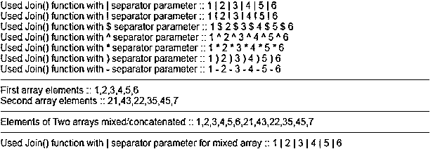

# JavaScript join()

> 原文：<https://www.educba.com/javascript-join/>


## JavaScript join()简介

JavaScript join()是内置的函数或方法，用于将数组元素连接成一个字符串。字符串元素将由指定的分隔符和 join()分隔，分隔符默认值是普通的逗号“，”。Join()方法与 JavaScript 编程代码中指定的特定数组一起使用。简单地说，我们可以说 join()方法或函数将指定数组中的所有元素连接成一个字符串。该字符串将是存储数组元素的新字符串。

**语法:**

<small>网页开发、编程语言、软件测试&其他</small>

```
Array.join(separator1)
```

**参数:**

*   join()函数或方法的分隔符参数:
*   array.join()方法的 Separator 参数是可选的。我们可以忽略这一点，或者我们可以考虑/使用它作为一个参数。默认情况下，分隔符的值是逗号“，”。

**返回值:**返回一个字符串，其中可能包含一些数组元素的集合。

### JavaScript join()方法是如何工作的？

JavaScript join()方法或函数通过组合一个或多个数组的元素来工作，并存储为一个字符串值。它主要在只有一个参数“separator1”的帮助下工作。这个函数/方法主要用于 ECMAScript 1。JavaScript array.join()方法只对不同浏览器的不同类型版本有效。Join()函数或方法适用于 chrome 1.0、Internet Explorer 5.5 版本、Firefox 1.0 版本、所有 safari 浏览器版本、所有 opera 浏览器版本等。

### 实现 JavaScript join()的示例

下面是提到的例子:

#### 示例#1

在下面的示例中，数组中的三个字符串元素被连接，结果存储在一个字符串变量中。这是一个非常简单的 JavaScript 程序，借助 join()函数。这里首先在和标签内部，

**代码:**

```
<!DOCTYPE html>
<html>
<body>
<script>
var arr11=["EDUCBA", "online", "courses"]
var result11=arr11.join()
document.write(result11);
</script>
</body>
</html>
```

**输出:**


#### 实施例 2

这是下面的例子，用不同类型的分隔符实现字符串连接类型的函数。起初，html 标记只是用来在 JavaScript 程序代码运行之前打印一些文本。在

**代码:**

```
<html>
<head>
<title>This is Array join Method of JavaScript</title>
</head>
<body>
<script type = "text/javascript">
var arr11 = new Array("First EDUCBA","Second Online","Third Courses");
var str11 = arr11.join();
document.write("str : " + str11 );
var str11 = arr11.join(", ");
document.write("<br />str : " + str11 );
var str11 = arr11.join(" + ");
document.write("<br />str : " + str11 );
var str11 = arr11.join(" @ ");
document.write("<br />str : " + str11 );
var str11 = arr11.join(" % ");
document.write("<br />str : " + str11 );
var str11 = arr11.join(" & ");
document.write("<br />str : " + str11 );
</script>
</body>
</html>
```

**输出:**


#### 实施例 3

这是字符串的实现示例，仅在数组的字符串元素之间连接了空格" "元素，并使其看起来像一个大的字符串元素。这里，在

**代码:**

```
<html>
<head>
<title>This is the join Method of JavaScript</title>
</head>
<body>
<script type = "text/javascript">
var arr11 = new Array("eduCBA", "is", "a", "leading", "global", "provider", "of", "skill", "based", "education");
var str11 = arr11.join(" ");
document.write("str : " + str11 );
</script>
</body>
</html>
```

**输出:**


#### 实施例 4

这是创建两个数组的示例。对于第一个数组，使用不同类型的分隔符参数。然后在 document.write()函数的帮助下打印两个数组元素。然后混合两个数组，并将结果存储在第一个数组变量“a”中。然后借助" | "分隔符元素作为分隔符元素加入到 join()函数中，对包含两个数组元素的大数组求和。你可以查看下面这个程序的输出，这样你就会明白 JavaScript 编程语言中 join()函数的简单代码。

**代码:**

```
<script>
function func() {
var a = [ 1, 2, 3, 4, 5, 6 ];
document.write("Used Join() function with | separator parameter :: ");
document.write(a.join(' | '));
document.write("<br>");
document.write("Used Join() function with ! separator parameter :: ");
document.write(a.join(' ! '));
document.write("<br>");
document.write("Used Join() function with $ separator parameter :: ");
document.write(a.join(' $ '));
document.write("<br>");
document.write("Used Join() function with ^ separator parameter :: ");
document.write(a.join(' ^ '));
document.write("<br>");
document.write("Used Join() function with * separator parameter :: ");
document.write(a.join(' * '));
document.write("<br>");
document.write("Used Join() function with ) separator parameter :: ");
document.write(a.join(' ) '));
document.write("<br>");
document.write("Used Join() function with - separator parameter :: ");
document.write(a.join(' - '));
document.write("<hr>");
var b = [21, 43, 22, 35, 45, 7];
document.write(" First array elements ::  " + a + " <br>");
document.write(" Second array elements ::  " + b );
document.write("<hr>");
var primes = a.concat(b);
document.write("Elements of Two arrays mixed/concatenated :: " + primes);
document.write("<hr>");
document.write("Used Join() function with | separator parameter for mixed array :: ");
document.write(a.join(' | '));
}
func();
</script>
```

**输出:**




### 结论

我希望您已经了解了 JavaScript join()方法或函数的定义以及它的语法和参数解释，JavaScript join()或 JavaScript array.join()函数/方法如何与 join()方法的各种示例一起工作，以便更好、更容易地理解这个概念。

### 推荐文章

这是 JavaScript join()的指南。在这里，我们讨论 JavaScript join()的介绍，包括语法、工作原理和要实现的示例。您也可以浏览我们的其他相关文章，了解更多信息——

1.  [JavaScript 空数组](https://www.educba.com/javascript-empty-array/)
2.  [JavaScript 字符串编号](https://www.educba.com/javascript-string-to-number/)
3.  [JavaScript 通过类获取元素](https://www.educba.com/javascript-get-element-by-class/)
4.  [JavaScript 风格可见性](https://www.educba.com/javascript-style-visibility/)


