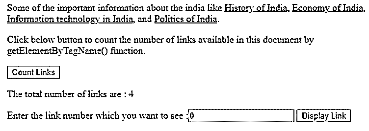
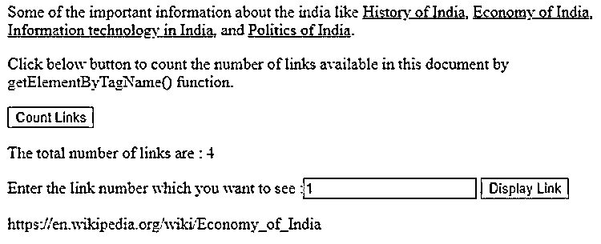
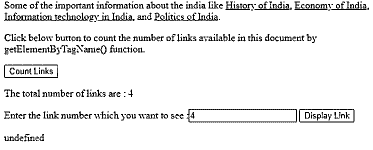

# JavaScript getElementsByTagName()

> 原文：<https://www.educba.com/javascript-getelementsbytagname/>


## JavaScript getElementsByTagName()简介

JavaScript getElementsByTagName()函数用于按照元素在文档中出现的顺序返回给定标记名的所有元素。getElementsByTagName()函数是 JavaScript 的内置函数。这是 DOM 元素或者文档对象的一个函数，所以调用为 document.getElementsByTagName()。

**语法:**

<small>网页开发、编程语言、软件测试&其他</small>

```
document.getElementsByTagName("tagname");
```

**参数:**

*   **标记名:**标记名参数是一个字符串参数，它指定了我们要获取的元素的标记名。该参数是必需的，不是可选的。

这个函数的返回值是一个由所有 html 元素集合组成的数组，这些元素与指定的标记名相匹配。返回数组按照元素在文档中出现的顺序存储元素。

### JavaScript getElementsByTagName()的示例

下面给出了所提到的例子:

#### 示例#1

我们将使用 getElementsByTagName()函数，通过在该函数中指定“li”标记名来计算文档中可用的列表元素的数量。

**代码:**

```
<!DOCTYPE html>
<head>
<title> This is an example for getElementsByTagName() function </title>
</head>
<body>
<h3> The List of Fruits are :</h3>
<ul>
<li> Apple </li>
<li> Banana </li>
<li> Orange </li>
</ul>
<p> Here we are going to count total number of fruits by getElementByTagName() function.</p>
<button onclick = "countFun()"> Count Fruits</button>
<script>
function countFun(){
var n = document.getElementsByTagName("li");
alert("The total number of fruits are : "+n.length);
}
</script>
</body>
</html>
```

**输出:**


**一旦我们点击“计数水果”按钮，输出是:**


在上面的代码或文档中，创建了元素(水果)的列表，并创建了按钮来计算可用水果的列表，一旦我们单击此按钮，它将调用其中的 countFun()函数，调用 to document . getelementsbytagname(" li ")函数，该函数返回所有" Li "元素的数组。从这个返回数组中，输出“li”元素的总数，如上面的代码所示。

#### 实施例 2

我们将使用 getElementsByTagName()函数，通过在该函数中指定“a”标记名来计算文档中可用的链接元素的数量。

**代码:**

```
<!DOCTYPE html>
<head>
<title> This is an example for getElementsByTagName() function </title>
</head>
<body>
<p> Some of the important information about the india like
<a href ="https://en.wikipedia.org/wiki/History_of_India">History of India</a>,
<a href = "https://en.wikipedia.org/wiki/Economy_of_India">Economy of India</a>,
<a href = "https://en.wikipedia.org/wiki/Information_technology_in_India">Information technology in India</a>, and
<a href = "https://en.wikipedia.org/wiki/Politics_of_India">Politics of India</a>.</p>
<p> Click below button to count the number of links available in this document by getElementByTagName() function.</p>
<button onclick = "countFun()">Count Links</button>
<p id="txt"></p>
<script>
function countFun(){
var n = document.getElementsByTagName("a");
document.getElementById("txt").innerHTML ="The total number of links are : "+n.length;
}
</script>
</body>
</html>
```

**输出:**


**一旦我们点击“计数水果”按钮，输出是:**


在上面的代码中，文档包含一些链接来打印按钮创建的链接数，一旦我们单击这个按钮，它就被调用到 countFun()函数，在这里它调用 document . getelementsbytagname(" a ")函数，该函数返回所有" a "元素的数组，然后打印文档中可用的链接总数。

#### 实施例 3

我们将使用 getElementsByTagName()函数来计算文档中可用的链接元素的数量，并根据链接在文档中的顺序显示指定的链接。

**代码:**

```
<!DOCTYPE html>
<head>
<title> This is an example for getElementsByTagName() function </title>
</head>
<body>
<p> Some of the important information about the india like
<a href ="https://en.wikipedia.org/wiki/History_of_India">History of India</a>,
<a href = "https://en.wikipedia.org/wiki/Economy_of_India">Economy of India</a>,
<a href = "https://en.wikipedia.org/wiki/Information_technology_in_India">Information technology in India</a>, and
<a href = "https://en.wikipedia.org/wiki/Politics_of_India">Politics of India</a>.</p>
<p> Click below button to count the number of links available in this document by getElementByTagName() function.</p>
<button onclick = "countFun()"> Count Links</button>
<p id="txt"></p>
Enter the link number which you want to see :<input type="number" id="linkno" value="0">
<button onclick="linkFun()">Display Link</button>
<p id="demo"></p>
<script>
function countFun(){
var n = document.getElementsByTagName("a");
document.getElementById("txt").innerHTML ="The total number of links are : "+n.length;
}
function linkFun() {
var x = document.getElementById("linkno").value;
var n = document.getElementsByTagName("a");
document.getElementById("demo").innerHTML = n[x];
}
</script>
</body>
</html>
```

**输出:**


**如果我们点击“计数链接”按钮，输出是:**




**假设我们想查看文档中的第二个可用链接，那么我们将输入 1 并单击“显示链接”按钮，输出为:**




**假设我们希望看到文档中的第 5 个链接，那么我们将输入 4 并单击“显示链接”按钮，输出结果是:**




与上面第 5 个链接(数组 4 的索引)的输出一样，输出显示未定义，因为文档只包含 4 个链接，这意味着 document . getelementsbytagname(" a ")的返回数组包含所有这些" a"(link)元素，从索引 0 到 3 开始存储。

请注意，我们可以使用通配符(' * ')返回文档中所有 html 标记元素的集合，如下所示:

```
var n = document.getElementsByTagName("*");
```

要返回指定元素中的所有 html 标记元素，就像要返回 Div 对象中所有标记的集合一样:

```
var n= divOb.getElementsByTagName("*");
```

### 结论

getElementsByTagName()函数是 JavaScript 中的一个内置函数，用于根据给定的标记名按照元素在文档中出现的顺序返回所有元素。

### 推荐文章

这是 JavaScript getElementsByTagName()的指南。在这里，我们讨论 JavaScript getElementsByTagName()的介绍，并通过例子来更好地理解。您也可以看看以下文章，了解更多信息–

1.  JavaScript 中的 light box
2.  [JavaScript 表单事件](https://www.educba.com/javascript-form-events/)
3.  [JavaScript forEach()](https://www.educba.com/javascript-foreach/)
4.  [JavaScript 对象构造器](https://www.educba.com/javascript-object-constructors/)


